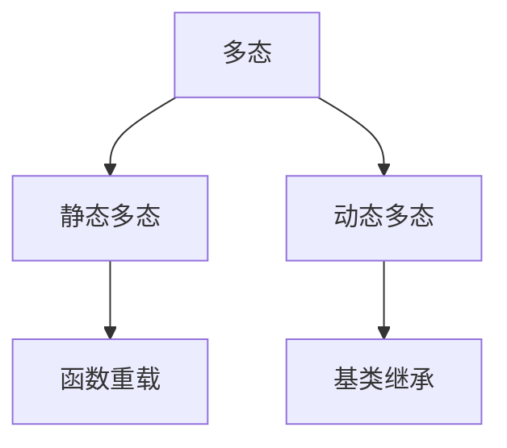
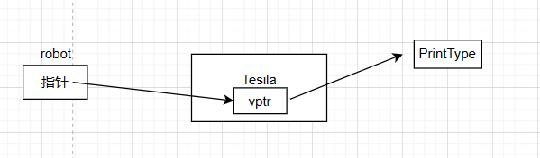

### 1.多态
多态是 `C++` 显示多重功能的属性,多态分为静态多态和动态动态


其中较复杂的就是动态多态,利用虚函数和继承来实现类对象的多重表现.
动态多态的实现是由编译器的晚捆绑决定的,早捆绑实在编译之前就捆绑,而晚捆绑则是再调用方法时才会进行捆绑,对于晚捆绑的方法必须使用关键字`virtual`声明.


---
### 2.虚函数
在类内函数的添加上 `virtual` 关键字,就可以将其声明为虚函数(仅仅是添加了晚捆绑而已),就可以用该函数实现多态,注意只有虚函数存在多态,如果没有声明为虚函数,即使你再子类中重写了该方法,父基类在调用时仍然会调用父类的方法,而非子类的重写方法;具有虚函数的类称为基类.例如

```C++
#include<iostream>

class robot{
    public:
    // 多态时会调用子类方法
    virtual void PrintType(){
        std::cout<<"the type :robot"<<std::endl;
    }

    // 调用时会覆盖子类
    void test(){
        std::cout<<"robot test"<<std::endl;
    }
};

class Tesila:public robot{
    public:
    // 父类调用子类
    virtual void PrintType(){
        std::cout<<"the type :Tesila"<<std::endl;
    }
    void test(){
        std::cout<<"Tesila test"<<std::endl;
    }


};

void test(robot& r){
    // 父基类调用子类方法实现多态
    r.PrintType(); // the type :Tesila
    r.test();// robot test
}
int main(){
    // 子类
    Tesila a;
    test(a);
    return 0;
}
```

多态的实现其实也是由指针实现,由`父类指针 --> 子类指针-->虚函数头`,对于一个或者多个虚函数,则是通过编译器生成虚函数表和虚函数指针,虚函数指针则是指向这个虚函数表,通过虚函数表上的虚函数实现多态。
<center>

</center>

在多态处理对象时,必须用指针传递或者引用传递,如果使用值传递,会导致程序在运行时复制一个基类,然后调用基类的方法,所以必须使用指针传递或者引用传递.
```C++
// right
void test(robot& r){
}
// wrong
void test(robot r){
}
```

对于多个虚函数示例,我们在这个示例中,对基类多生成了答应尺寸和答应坐标的函数.
```C++
#include <iostream>
class robot
{
public:
    // 多态时会调用子类方法
    virtual void PrintType()
    {
        std::cout << "the type :robot" << std::endl;
    }

    virtual void PrintSize()
    {
        std::cout << "base class without size" << std::endl;
    }
    virtual void PrintLocation()
    {
        std::cout << "base class without location" << std::endl;
    }
    // 调用时会覆盖子类
    void test()
    {
        std::cout << "robot test" << std::endl;
    }
};

class Tesila : public robot
{
public:
    // 父类调用子类
    virtual void PrintType()
    {
        std::cout << "the type :Tesila" << std::endl;
    }
    virtual void PrintSize()
    {
        std::cout << "size :" << size << std::endl;
    }
    virtual void PrintLocation()
    {
        std::cout << "location"
                  << "x :" << x << " y :" << y 
                  << std::endl;
    }
    void test()
    {
        std::cout << "Tesila test" << std::endl;
    }

    int x, y;
    int size;
};

void test(robot &r)
{
    r.PrintType(); // the type :Tesila
    r.PrintSize(); // size :5
    r.PrintLocation(); // locationx :3 y :4
    r.test(); // robot test
}
int main()
{
    Tesila a;
    a.x = 3;
    a.y = 4;
    a.size = 5;
    test(a);
    return 0;
}
```
总结一下基类的特点:
* 有虚函数,并且基类自己实现了虚函数的内容
* 允许有自己的方法和变量属性
* 传值时必须时引用传递或者指针传递
* 可以直接创建对象


---
### 3.纯虚函数和抽象基类
当将虚函数右方设为 `0` 时,则称为纯虚函数,例如
```C++
virtual void print() = 0;
```

纯虚函数必须在派生类中重写实现;抽象基类则是存在至少一个纯虚函数的基类,这种抽象基类会提供纯虚接口而不提供实现,实现则是由派生类完成,如果派生类并没有实现纯虚函数那么派生类仍然是一个纯虚函数.抽象基类不可以直接创建对象,但是它可以有基类的非虚函数的实现,提供一些其他的功能.例如
```C++
// 虚基类
class robot{
    public:
    // 接口
    virtual void print() = 0;
    // 虚函数
    virtual char* type(){
       return "robot";
    }
    // 自己的方法
    void test(){
        std::cout<<"test"<<std::endl;
    }
};


class Indoor:public robot{
    public:
    // 实现纯虚函数(必须)
    virtual void print(){
        std::cout<<"the Indoor robot"<<std::endl;
    }
    // 虚函数实现
    virtual char* type(){
        return "Indoor";
    }
    // 方法调用
    void test(){
        std::cout<<"Indoor test"<<std::endl;
    }
};
```


抽象基类的特点:
* 不允许创建抽象基类的对象
* 抽象基类必须要有一个或者多个纯虚函数
* 必须使用引用传递或者指针传递
* 运行有自己的方法和属性

#### 4.基类重载问题
对于纯虚函数,派生类必须重写,那么就不存在纯虚函数重载;对于虚函数,有两种重载:
* 返回值类型转换(非多态)
这种是不允许的,会报错
* 在派生类中如果重载了该虚函数(输入参数不同,返回值不同)
当多态使用时(基类调用子类的基类方法),则会调用基类的方法而不是子类,只有当对象明确是派生类时,该重载方法才会生效,此时这个重载虚函数可以是为派生类的基类虚函数。
```C++
#include <iostream>
class robot{
    public:
    // 纯虚函数
    virtual void print() const =0;
    // 虚函数
    virtual char* type(){
       return "robot";
    }
    void test(){
        std::cout<<"test"<<std::endl;
    }
};
class Indoor:public robot{
    public:
    // 纯虚函数必须重写
    virtual void print() const {
        std::cout<<"the Indoor robot"<<std::endl;
    }
    virtual char* type(int a){
        std::cout<< a <<std::endl;
        return "Indoor";
    }
    void test(){
        std::cout<<"Indoor test"<<std::endl;
    }
};
void example(robot& a){
    a.print(); // the Indoor robot
    std::cout<< a.type(10)<<std::endl; // error
    a.test(); // Indoor test
}
int main(){
    Indoor a;
    example(a);
    return 1;
}
```

当然返回值也有特例,比如你的返回值原本是一个基类指针(引用),而你将其改成了基类的派生类指针(引用)也是可以作用的,例如
```C++
// 第一个抽象基类
class Camera{
    public:
    virtual char* type() const = 0;
};


// 第二个抽象基类
#include <iostream>
class robot{
    public:
    // 返回设备类型
    virtual Camera* CameraType() = 0;
};


// 派生类
class Indoor:public robot{
    public:
    // 类内对象 派生类
    class Pinhole:public Camera{
        public:
        virtual char* type() const{
            return "Pinhole";
        }
    };

    Pinhole cam;

    // 重载函数将返回值类型改为原类型的派生类
    virtual Pinhole* CameraType() {
        return &cam;
    }
};

void example(robot& a){
    std::cout<< a.CameraType()->type()<<std::endl; // Pinhole
}
int main(){
    Indoor a;
    example(a);
    return 1;
}
```


其实这也是多态在产生作用,通过基类指针指向派生类.


---
### 5.虚析构函数
对于虚基类,如果他有堆上的内存的指针,必须要使用虚析构将其释放,这样派生类才会重写析构函数,因为当`delete` 基类时,如果析构函数并不是虚析构,那么它并不会调用派生类的析构函数,只有当析构函数为虚函数时,利用多态的虚函数表来调用派生类的析构函数.
纯虚析构函数是一个`C++` 合法,但是由于纯虚函数的抽象基类不能创建抽象基类的对象,所以在基类析构时,会从`派生类-->基类` 这样进行析构,所以必须为抽象基类提供一个函数体.重点
* 虚基类必须提供虚析构函数
为了派生类的析构
* 纯虚函数必须提供函数体
为了析构的完整性


---
### 6.总结
对于虚基类和抽象基类的总结如下
* 抽象基类最好全部都是虚函数(可以拥有自己的方法,但最好少一点)
* 对于虚基类,实现虚析构,虚函数
* 对于多态功能传递,只能使用引用传递和指针传递
* 继承虚函数的基类可以通过设置纯虚函数成为抽象基类.