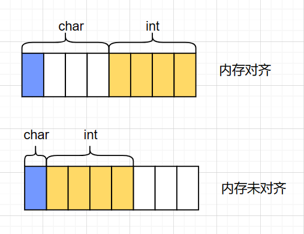

#### 1.内存对齐

看如下的代码
```C++
//32位系统
#include<stdio.h>
struct{
    int x;
    char y;
}s;

int main()
{
    printf("%d\n",sizeof(s));  // 输出8
    return 0;
}
```

理论上，32位系统下，int占4byte，char占一个byte，那么将它们放到一个结构体中应该占4+1=5byte；但是实际上，通过运行程序得到的结果是8 byte，这就是内存对齐所导致的,因为对于32位系统,它的每块内存是 32/8 = byte 的,所以32位系统以 4byte内存对齐。如图



---
#### 2.为什么要内存对齐
为什么要字节对齐,其实是为了速度快,因为cpu读取内存时是一块一块的读的并不会去检查所有字节,所以如果将每块的内存对齐,就会加快速度,那么对于线性代数库,它的速度要求是非常大的,所以大多数的线性代数库都是内存对齐的.
假如没有内存对齐机制，数据可以任意存放，现在一个int变量存放在从地址1开始的联系四个字节地址中，该处理器去取数据时，要先从0地址开始读取第一个4字节块,剔除不想要的字节（0地址）,然后从地址4开始读取下一个4字节块,同样剔除不要的数据（5，6，7地址）,最后留下的两块数据合并放入寄存器.这需要做很多工作.


---
#### 3.内存对齐规则
每个特定平台上的编译器都有自己的默认“对齐系数”（也叫对齐模数）。`gcc`中默认`#pragma pack(4)`，可以通过预编译命令`#pragma pack(n)，n = 1,2,4,8,16`来改变这一系数。
有效对其值：是给定值`#pragma pack(n)`和结构体中最长数据类型长度中较小的那个。有效对齐值也叫对齐单位。
* 结构体第一个成员的偏移量（`offset`）为0，以后每个成员相对于结构体首地址的 `offset` 都是该成员大小与有效对齐值中较小那个的整数倍，如有需要编译器会在成员之间加上填充字节。
* 结构体的总大小为 有效对齐值 的整数倍，如有需要编译器会在最末一个成员之后加上填充字节。

```C++
//32位系统
#include<stdio.h>
struct
{
    int i;    
    char c1;  
    char c2;  
}x1;

struct{
    char c1;  
    int i;    
    char c2;  
}x2;

struct{
    char c1;  
    char c2; 
    int i;    
}x3;

int main()
{
    printf("%d\n",sizeof(x1));  // 输出8
    printf("%d\n",sizeof(x2));  // 输出12
    printf("%d\n",sizeof(x3));  // 输出8
    return 0;
}
```

#### 4.代码调用
##### 4.1 栈上对齐
`C++11` 提供了`alignas` 和 `alignof` 用于栈空间内存对齐

```C++
// 指定16字节对齐
struct alignas(16) example {
  char a;
  int b;
} A;
```

栈上的内存是由编译器指定的，通过预编译选项可以告诉编译器需要对齐的字节数，进行对齐。也就是说对于栈上的内存，我们只需要通过关键字指定需要对齐的字节数，编译器会自动对齐。对于C++内置类型，char，int，float，double等不需要指定对齐的字节数，编译器默认会根据类型对齐。
但函数的参数是个**例外**，如果函数的参数需要内存对齐，不要通过传值的方式，而是通过引用或者指针的方式。
```C++
// 错误
void func(A a, int b) {}
// 正确
void func(const A* a, int b) {}
void func(const A& a, int b) {}
```

因为值传递会为实参复制一个形参,将这个形参传递进去,而形参的内存有可能没有对齐,引用传递和指针传递则是直接传递形参.

##### 4.2 堆空间对齐
堆上的内存就相对比较麻烦，因为堆上的内存通过malloc返回，数据的字节数是由自己申请，
```C++
struct bar {
  A a;
  int b;
} BAR;

BAR b;  // 内存对齐
BAR* b = new BAR();
```
A是16字节对齐，因此申明变量由于是栈上分配内存，编译器会自动16字节对齐，如果是`new`出来的对象，不是由编译器分配，而是由`new`动态分配，因此没法保证16字节对齐。如果要对齐，只能重构`BAR`的`new`方法，采用`aligned_alloct`申请对齐的内存。


---
#### 5.解决方案
实际上`c++ 17`提供了`aligned_alloc`对齐的内存申请，因此如果是`c++17`，你可以不用考虑上述问题，但函数的参数还是需要注意，`c++20`引入了`assume_aligned` 这样函数的参数也解决了。也就是说编译器和语法越来越方便，可以让用户更少的考虑内存对齐的问题，从而变得更加高效。

