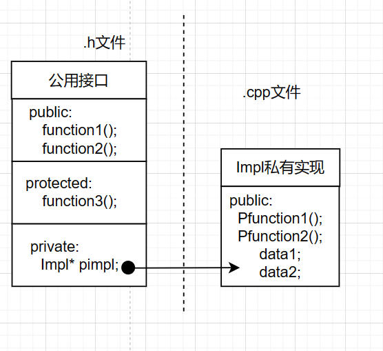
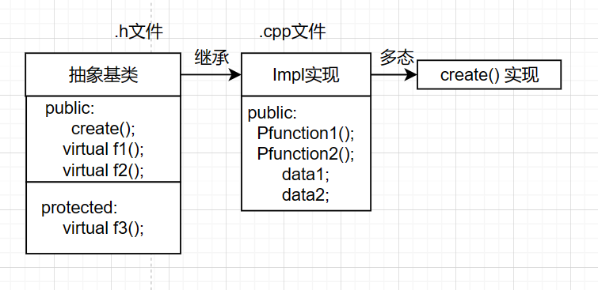

### 1.简介
Pimpl(pointer to implementation, 指向实现的指针)是一种常用的，用来对“类的接口与实现”进行解耦的方法但是Pimpl并不是严格意义上的设计模式(它是受制于C++特定限制的变通方案)，这种惯用法可以看作桥接设计模式的一种特例。


在`.h` 文件中声明方法,并且在类内声明`impl` 类型,在`.cpp` 文件中,用`impl` 实现在`.h` 中的方法,然后将原类型调用 `impl` 的方法,其优点如下
在类中使用Pimpl惯用法，具有如下优点：
* 降低耦合
* 信息隐藏
* 降低编译依赖，提高编译速度
* 接口与实现分离


---
### 2.案例
#### 2.1 第一种方法 - 内嵌指针
Pimpl技巧可以避免在头文件中暴露私有细节，因此是促进API接口与实现保持完全分离的重要机制,内嵌指针的方法如下
<center>

</center>

假如我们要设计一书籍类Book，Book包含目录属性，并提供打印书籍信息的对外接口，Book设计如下：
```C++ 
class Book
{
public:
  void print();
 
private:
  std::string  m_Contents;
};
```

`Book`的使用者只需要知道`print()`接口，便可以使用`Book`类，看起来一切都很美好。 然而，当某一天，发现`Book`需要增加一标题属性，对`Book`类的修改如下：
```C++
class Book
{
public:
  void print();
 
private:
  std::string  m_Contents;
  std::string  m_Title;
};
```

虽然使用`print()`接口仍然可以直接输出书籍的信息，但是`Book`类的使用者却不得不重新编译所有包含`Book`类头文件的代码。 
为了隐藏`Book`类的实现细节，实现接口与实现的真正分离，可以使用`Pimpl`方法。 
我们依然对`Book`类提供相同的接口，但`Book`类中不再包含原有的数据成员，其所有操作都由`BookImpl`类实现，通过内嵌 `BookImpl` 指针实现。如下代码
```C++
// .h 文件
class Book
{
public:
  Book();
  ~Book();
  void print();
private:
  class BookImpl;  // Book实现类的前置声明
  BookImpl* pimpl; //或者 std::unique_ptr<BookImpl> pimpl;
};
// ----------------------------------
// .cpp 文件
class Book::BookImpl
{
public:
  void print();
 
private:
  std::string  m_Contents;
  std::string  m_Title;
};
// book 实现
Book::Book(){
    ....
}
Book::~Book(){
    ....
}
Book::print(){
    // 调用 bookimpl 的方法
    pimpl->print();
}
// bookimpl 实现
Book::BookImpl::print(){
    ....
}
```

像`Book`类这样使用`Pimpl`的类，往往被称为`handle class`，`BookImpl`类作为实现类，被称为`implementation class`。

为简单实现起见，`Book`类省略了复制构造函数和复制赋值函数。在实际应用中，一般有两种可选方案解决`Book`的复制和赋值的语义问题。

a.禁止复制类
```C++

class Book
{
public:
  Book();
  ~Book();
  void print();
 
private:
  // 禁止复制类
  Book(const Book&);
  const Book &operator = (const Book &);
 
  class BookImpl;  // Book实现类的前置声明
  BookImpl* pimpl;
};

```

b.显示定义复制语义 
如果希望用户能够复制采用`Pimpl`的对象，就应该声明并定义自己的复制构造函数和复制赋值函数。它们可以执行对象的深拷贝，即创建对象的副本，而非复制指针。

#### 2.2 第二种方法 - 多态
我们可以定义个抽象基类,但是定义一个返回对象智能指针的`create` 函数(在 `.cpp` 实现),在基类实现抽象基类中所定义的方法,并且用create函数返回一个派生类的智能指针,实现多态.




```C++
// .h  文件
class robot {
    public:
    // 静态函数创建指针
    static std::shared_ptr<robot> create(const int a);

    // 纯虚函数 --> 方法
    virtual void run() const = 0;

    virtual std::string name() const = 0;
};

// --------------------------------------------
// .cpp 文件
class DogRobot:public robot{
    public:
    // 实现构造函数
    DogRobot(){
        data = 0;
    }
    DogRobot(const int& a){
        data = a;
    }
    // 实现方法
    virtual void run() const{ 
        std::cout<<"the dog robot start to run !"<<std::endl;
    }
    virtual std::string name() const{
        return "Dog robot " + std::to_string(data);
    }
    private:
    int data;

};
// 实现抽象基类的 create 函数
std::shared_ptr<robot> robot::create(const int a){
    // 返回派生类指针
    return std::make_shared<DogRobot>(a);
}
```

多态在作为引用传递时也可以作用,但是在这里最好不要这样,首先,如果你的 `create` 是返回引用值,如下
```C++
robot& robot::create(const int a){
    ...
}
```

那么问题来了,你是怎么去返回呢?一种是创建临时对象或者局部可行域的对象返回,另一种就是创建堆上内存再返回;很明显只有后者是可行的,因为第一种临时对象或者局部可行域的对象是在 `create` 函数上临时的,返回后栈上就自动回收了;
所以只有在堆上申请指针内存才可以,但是这种方法就只能返回智能指针了,因为你如果返回引用或者指针,你怎么去回收呢？或者有这一种
```C++
robot& robot::create(const int a){
    DogRobot* d = new DogRobot(a);
    return *d;
}
```

而使用如下
```C++
    robot& a = robot::create(5);
    std::cout<< a.name()<<std::endl;
    // 方法调用
    // 释放内存
    delete &a;
```

但是问题又来了,这样写法不仅丑陋而且丑陋,裸指针都比它好,而裸指针返回一般都用智能指针返回(就不用管理内存).第二种的使用方法为
```C++
std::share_ptr<robot> r = robot::create();
std::cout<< r->name()<<std::endl;
```
  
