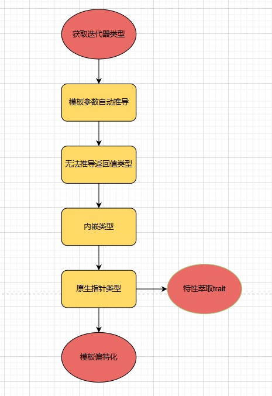
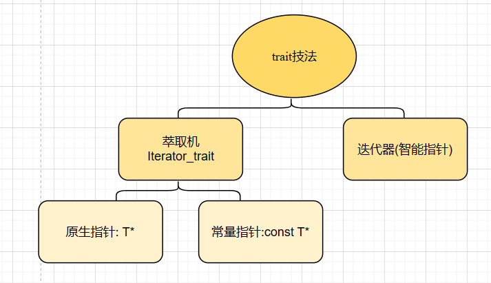
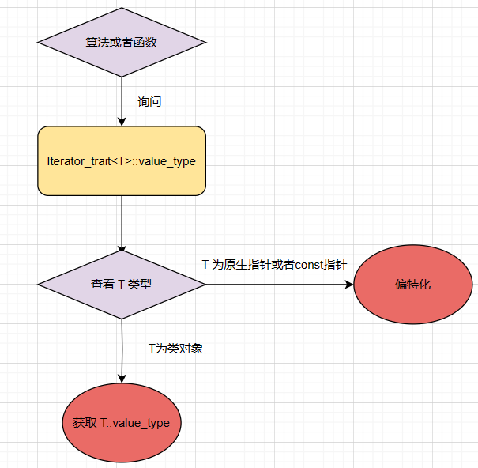

### 1.介绍
stl的六脉神剑
<center>

</center>

在 STL 编程中，容器和算法是独⽴设计的，容器⾥⾯存的是数据，⽽算法则是提供了对数据的操作，在算法操作数
据的过程中，要⽤到迭代器，迭代器可以看做是容器和算法中间的桥梁.


---
### 2.迭代器模式
迭代器实际也是一种智能指针,只是这种智能指针对数据结构有针对性,迭代器的数据类型称为迭代器的 `value_type` ,尽管在模板函数中我们可以把 `T` 作为函数的返回值,但是问题是⽤户需要调⽤的是 `func` ,可能类型导致不同,那我们可以设置一种内嵌类型比如
```C++
template<typename T>
class MyIter {
public:
    typedef T value_type; //内嵌类型声明
    MyIter(T *p = 0) : m_ptr(p) {}
    T& operator*() const { return *m_ptr;}
private:
    T *m_ptr;
};
//--------------------------------------------------
/* 迭代器函数
注意: 这里的模板是类 MyIter
而 typename MyIter::value_type 则是在告诉编译器MyIter::value_type 是一个类型,这是必须的 */
template<typename MyIter>
typename MyIter::value_type Func(MyIter iter) {
    return *iter;
}
int main(){
    MyIter<double> iter(new (3.14));
    // 参数类型自动推导
    // MyIter<double> -> T = double -> value_type=T = double
    std::cout<< Func(iter) << std::endl;// Func<MyIter<double>>(iter)
}
```

注意对于参数是模板的函数,可以通过类型推导来隐式传参,不必再显示将模板类型标明；同时我们注意到,当要用到模板类的内嵌类型时,我们需要用`typename` 来明确告诉编译器这是一个内嵌类型,内嵌类型可以作为参数获取其他的变量.
上⾯的解决⽅案看着可⾏，但其实呢，实际上还是有问题，这⾥有⼀个隐晦的陷阱：实际上并不是所有的迭代器都是 `class type` ，原⽣指针也是⼀种迭代器，由于原⽣指针不是` class type` ，所以**没法为它定义内嵌型别**。
```C++
int* p = new int(40);
Func(p);//error
```

问题:如果是原生指针作为输入,但是原生指针并没有`value_type`,所以就会导致返回值类型错误.
这就是`参数推导机制` + `内嵌类型机制` 的联合作业.


---
### 3.特性"萃取"traits
#### 3.1 Partial specialization（模板偏特化）
所谓偏特化是指如果⼀个 `class template` 拥有⼀个以上的 `template` 参数，我们可以针对其中某个（或多
个，但不是全部） `template` 参数进⾏特化，一个简略的例子如下
```C++
//此泛化版本的 T 可以是任何类型
template <typename T>
class C {...}; 

// 特化版本，仅仅适⽤于 T 为“原⽣指针”的情况，是泛化版本的限制版
// 当使用到 C<T*> 时,参数类型就是它在作用.
template <typename T>
class C<T*> {...};
```
所谓特化，就是特殊情况特殊处理，第⼀个类为**泛化版本**， `T` 可以是任意类型，第⼆个类为**特化版本**;除了偏特化还有全特化,就是将所有的模板类型特化后特殊处理,是第⼀类的特殊情况，只针对原⽣指针,第二个例子如下
```C++
// 模板类
template<class D,class T>
class test{
    public:
    using value_type =  D;
    D data_1;
    T data_2;
};

// 偏特化
template<class D>
class test<D,int*>{
    public:
    using value_type = D;
    D data_1;
    int* data_2;
};
// 全特化
template<>
class test<int,int*>{
    public:
    using value_type = int;
    int data_1;
    int* data_2;
};
// 迭代器函数
template<class test>
typename test::value_type func(test a){
    std::cout<< *a.data_2 <<std::endl;
    return a.data_1;
}

int main(int argc, char *argv[])
{
    // 偏特化
    test<double,int*> a;
    a.data_1 = 100;
    int b = 10;
    a.data_2 = &b;
    func(a);
    // 全特化
    test<int,int*> c;
    c.data_1 = 100;
    int d = 5;
    c.data_2=&d;
    func(c);
    return 1;
}
```

特化并不意味着可以使用单一类型,只是你创建跟特化类型相关的类型,它会自动转到特化类型处理,原类型为 `test<D,T>` ,特化类型为 `test<D,int>` ,那么你在创建类型 `test<double,int>` 类型时就会转到特化类型处理.


#### 3.2 萃取特化
所谓萃取特化,则是将迭代器萃取
```C++
// 迭代器
template<typename _Tp>
class Iterator{
    public:
    typedef _Tp value_type;
    Iterator():data(nullptr){}
    
    Iterator(_Tp* _data):data(_data){}

    _Tp& operator*() const{
        return *data;
    }

    private:
    _Tp* data;
};
```

萃取器
```C++
// 泛函模板
template<typename Iterator>
class Iterator_traits{
    public:
    using value_type = typename Iterator::value_type ;
};

// 原生指针的偏特化
template<typename T>
class Iterator_traits<T*>{
    public:
    using value_type =  T ;
};
```

迭代器函数
```C++
template<class Iterator>
typename Iterator_traits<Iterator>::value_type func(Iterator iter){
    return *iter;
}
```

可以看到,输入仍然是`指针`,但是返回类型确实萃取器的返回类型,萃取器通过泛函模板返回智能指针的数值类型,特化模板返回原生指针的数值类型.其流程如下图

<center>

</center>

#### 3.3 const偏特化
通过偏特化添加⼀层中间转换的 `traits` 模板 `class`，能实现对原⽣指针和迭代器的⽀持，有的读者可能会继续追
问：对于指向常数对象的指针⼜该怎么处理呢？⽐如下⾯的例⼦
```C++
// 类型是 const int 常数而非可变的原生指针
iterator_traits<const int*>::value_type
```


报错例子如下
```C++
template<typename Iterator>
typename iterator_traits<Iterator>::value_type func(Iterator iter) {
    //等同于 const int tmp;
    typename iterator_traits<Iterator>::value_type tmp;
    // 编译 error ,tmp 是常量不能赋值
    tmp = *iter;
    return tmp;
}
int val = 666 ;
const int *p = &val;
func(p); // 这时函数⾥对 tmp 的赋值都将是不允许的
```

正确做法是为 `const T*` 也做一个偏特化,
```C++
//特化const
template<typename T>
struct iterator_traits<const T*> {
    //得到 T ⽽不是 const T
    typedef T value_type; 
}
```

此时
```C++
template<typename Iterator>
typename iterator_traits<Iterator>::value_type func(Iterator iter) {
    //等同于 T tmp 而非 const T tmp;
    typename iterator_traits<Iterator>::value_type tmp;
    tmp = *iter;
    return tmp;
}
int val = 666 ;
const int *p = &val;
func(p);
```

#### 3.4 总结
`trait` 编程技法其实就是 `参数推导机制` + `内嵌类型机制` + `偏特化机制` 的综合,目的就是实现智能指针访问和原生指针,常量指针的使用,那么理一下头绪

<center>

</center>


对于函数或者算法
<center>

</center>

