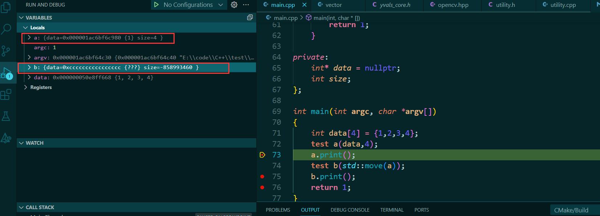
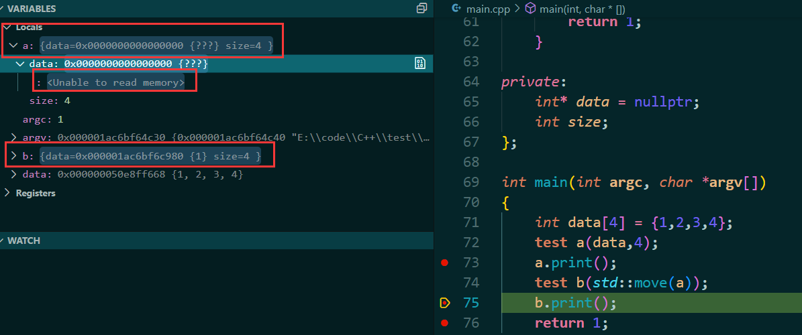

### 1.左值和右值
左值可以取地址、位于等号左边；而右值没法取地址，位于等号右边。
比如一个对象就是左值,一个常量就是右值.
```C++
int a  = 10; 
/*
* a 是一个左值,可以取地址
* 10 是一个右值,不可以取地址
*/


// ---------------------------------
class test;
test  a = test();
/*
* a 是一个左值,可以取地址
* test() 是一个右值,临时对象不可以取地址
*/

```

---
### 2.引用
#### 2.1左右值引用
```C++
int a = 10;
// --------
int& b = a; //左值引用
int&& c = 10; //右值引用
```


#### 2.2 const 引用的特殊性
引用是变量的别名，由于右值没有地址，没法被修改，所以左值引用无法指向右值。但是常量可以左值引用常量,属于特殊形式.
```C++
const int & d = 10;
```

`const`左值引用不会修改指向值，因此可以指向右值，这也是为什么要使用`const T&`作为函数参数的原因之一,例如 `std::vector::push_back`
```C++
void push_back (const value_type& val);
```

#### 2.3 右值引用
再看下右值引用，右值引用的标志是&&，顾名思义，右值引用专门为右值而生，可以指向右值，不能指向左值：
```C++
int &&ref_a_right = 5; // ok
 
int a = 5;
int &&ref_a_left = a; // 编译不过，右值引用不可以指向左值
 
ref_a_right = 6; // 右值引用的用途：可以修改右值
```


---
### 3.左右值转换
将左值转换为右值,通过 `std::move` 接口
```C++
int a = 5; // a是个左值
int &ref_a_left = a; // 左值引用指向左值
int &&ref_a_right = std::move(a); // 通过std::move将左值转化为右值，可以被右值引用指向
```

右值引用能指向右值，本质上也是把右值提升为一个左值，并定义一个右值引用通过std::move指向该左值
```C++
int &&ref_a = 5;
ref_a = 6; 
 
等同于以下代码：
 
int temp = 5;
int &&ref_a = std::move(temp);
ref_a = 6;
```

被声明出来的**左、右值引用都是左值**。 因为被声明出的左右值引用是有地址的，也位于等号左边。
```C++
// 形参是个右值引用
void change(int&& right_value) {
    right_value = 8;
}
 
int main() {
    int a = 5; // a是个左值
    int &ref_a_left = a; // ref_a_left是个左值引用
    int &&ref_a_right = std::move(a); // ref_a_right是个右值引用

    // -----------------------
    change(a); // 编译不过，a是左值，change参数要求右值
    change(ref_a_left); // 编译不过，左值引用ref_a_left本身也是个左值
    change(ref_a_right); // 编译不过，右值引用ref_a_right本身也是个左值
    // -----------------------
    change(std::move(a)); // 编译通过
    change(std::move(ref_a_right)); // 编译通过
    change(std::move(ref_a_left)); // 编译通过
 
    change(5); // 当然可以直接接右值，编译通过
     
    cout << &a << ' ';
    cout << &ref_a_left << ' ';
    cout << &ref_a_right;
    // 打印这三个左值的地址，都是一样的
}
```

右值引用既可以是左值也可以是右值，如果有名称则为左值，否则是右值。作为函数返回值的 && 是右值，直接声明出来的 && 是左值。

* 从性能上讲，左右值引用没有区别，传参使用左右值引用都可以避免拷贝。
* 右值引用可以直接指向右值，也可以通过std::move指向左值；而左值引用只能指向左值(const左值引用也能指向右值)。
* 作为函数形参时，右值引用更灵活。虽然const左值引用也可以做到左右值都接受，但它无法修改，有一定局限性。
```C++
void f(const int& n) {
    n += 1; // 编译失败，const左值引用不能修改指向变量
}

void f2(int && n) {
    n += 1; // ok
}

int main() {
    f(5);
    f2(5);
}
```

应用场景:
#### 3.1 移动语义
右值引用和std::move被广泛用于在STL和自定义类中实现移动语义，避免拷贝，从而提升程序性能。


`std::move` 的兄弟 `std::forward`  可以支持将左右值转换为左右值
```C++
int a = 0;
int&& ref_a = std::forward<int&&>(a); //左值换右值
// --------------------------------
void test(int&& a){
    int& p = std::forward<int&>(a); //右值换左值
}
```


---
### 4.深度解析
右值引用就是`Rust`中的所有权转移,对于请看下面的代码
```C++ {.line-numbers}
class test
{
public:
    // 默认初始化
    test() : size(0)
    {}
    // 有参构造函数
    test(int* _data,int _size):size(_size){
        data = new int[size];
        for (int i = 0; i < size; i++)
        {
            *(data + i) = *(_data + i);
        }
    }
    // 深拷贝
    test(const test &a){
        size = a.size;
        data = new int[size];
        for (int i = 0; i < size; i++)
        {
            *(data + i) = *(a.data + i);
        }
    }

    // 移动构造函数
    test(test&& a){
        data = a.data;
        size = a.size;
        a.data =nullptr;
    }


    ~test(){
        // 删除内存
        if(data !=nullptr){
            delete[] data;
        }
    }

    // 测试打印
    int print()
    {
        if(data ==nullptr) return -1;
        std::cout << "the size" << this->size << std::endl;
        for(int i = 0 ;i<size;i++){
            std::cout<<"data : "<<i<<" th :"<<*(data + i)<<std::endl;
        }
        return 1;
    }

private:
    int* data = nullptr;
    int size;
};


int main(int argc, char *argv[])
{
    int data[4] = {1,2,3,4};
    test a(data,4);
    a.print(); // 断点
    test b(std::move(a));
    b.print(); //断点
    return 1; //断点
}
```

如图


第一个断点时,`a` 的内存还在,`b` 的内存还未开辟,看下一个断点


可以看到,`b` 完全的将 `a` 的指针数据和`size` 数据转移到自身上,而`a`也在没有数据了,这就是所有权转移,通过移动构造函数和 `std::move` 将一个变量的所有权转移给另一个所有权.

---
### 5.总结
对于传值有以下心得
* 对于类对象最好使用左值引用传递或者指针传递
* 对于临时对象最好使用右值引用传递
* 对于常数,使用值传递


