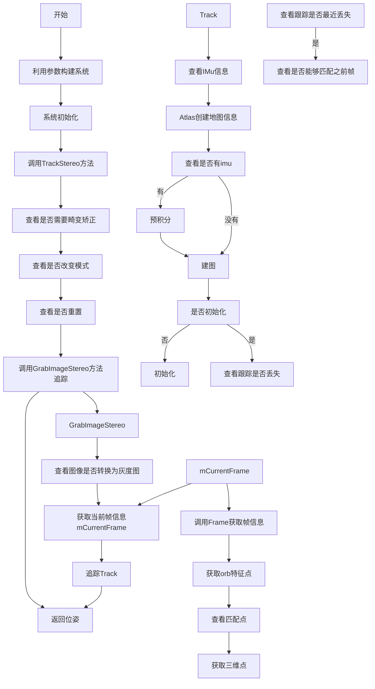

### 1.代码架构
orbslam3的项目目录为
```xml
ORBSlam3
    - CMakeLists.txt
    - src
        - System.cc
        ...
    - include
        -System.h
        ...
    - Examples
        - Mono
        - Stereo
        - ...
    - ThirdParty
        - DBow2
            -...
            - CMakeLists.txt
        - Sophus
            -...
            - CMakeLists.txt
        - g2o
            -...
            - CMakeLists.txt
    

```


---

### 2.介绍
#### 2.1 基础介绍
在项目目录中 `src` , `include` 分别承载了 `orbslam3` 库的所有源代码和头文件,来用于生成动态库, `Examples` 则是适用于不同硬件的示例,`ThirdParty` 则是 `ORBSlam3` 依赖的第三方库.

#### 2.2 CMakeLists.txt
顶层 `CMakeLists.txt` 的代码如下
```shell

cmake_minimum_required(VERSION 2.8)
project(ORB_SLAM3)


# 设置一些选项
set(...)
# 包含cmake文件
include(...)

# 调用cmake中的函数或者宏
    ...

# 添加一些cmake模块
LIST(APPEND CMAKE_MODULE_PATH ${PROJECT_SOURCE_DIR}/cmake_modules)

# 查找库
find_package(OpenCV)
find_package(Eigen3 REQUIRED)
find_package(Pangolin REQUIRED)
find_package(realsense2)

# 头文件包含
include_directories(
    ${PROJECT_SOURCE_DIR}
    ${PROJECT_SOURCE_DIR}/include
    ${PROJECT_SOURCE_DIR}/include/CameraModels
    ${PROJECT_SOURCE_DIR}/Thirdparty/Sophus
    ${EIGEN3_INCLUDE_DIR}
    ${Pangolin_INCLUDE_DIRS}
)

# 生成依赖库
add_library(${PROJECT_NAME} SHARED
# src文件夹的源代码
    src/System.cc
    ...
# include文件夹的文件
    include/System.h
    ...
)

# 链接
target_link_libraries(${PROJECT_NAME}
    ${OpenCV_LIBS}
    ${EIGEN3_LIBS}
    ${Pangolin_LIBRARIES}
    ${PROJECT_SOURCE_DIR}/Thirdparty/DBoW2/lib/libDBoW2.so
    ${PROJECT_SOURCE_DIR}/Thirdparty/g2o/lib/libg2o.so
    -lboost_serialization
    -lcrypto
)


# Build examples
add_executable(rgbd_tum
        Examples/RGB-D/rgbd_tum.cc)
target_link_libraries(rgbd_tum ${PROJECT_NAME})

# 其他例子
...

```


在上述例子中,第三方库中的 `DBow2,Sophus,g2o` 的对待方式是不同的, 
* `DBow2` 只用它的动态链接库 `.so` 被链接到 `ORBSlam3` 上去了
* `g2o` 只用它的动态链接库 `.so` 被链接到 `ORBSlam3` 上去了(和`DBow2`一致).
* `Sophus` 这是一个 `header-only` 库,所以只要用`include_directories`包含即可

由于 `${PROJECT_SOURCE_DIR}` 就是当前文件夹的目录路径,所以在包含第三方库的头文件的时候直接使用 `include"ThirdParty/${lib}/xxx.h"` 即可.
第三方库的`CMakeLists.txt` 文件只是用于生成 `.so` 动态链接库,没有什么好说的.


---
### 3.代码流程
#### 3.1 双目
