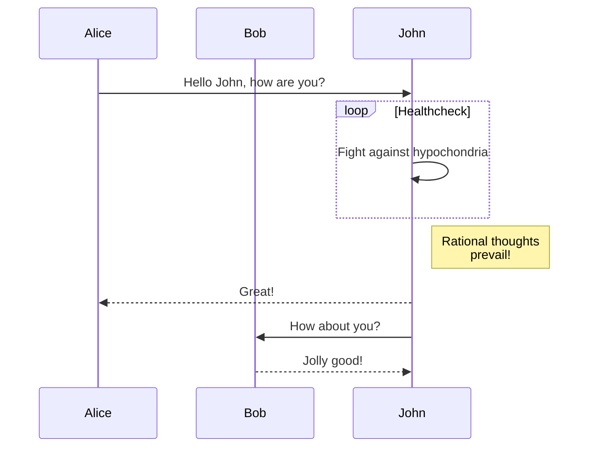
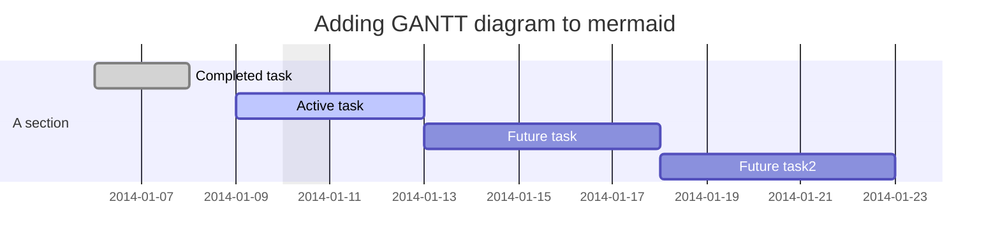
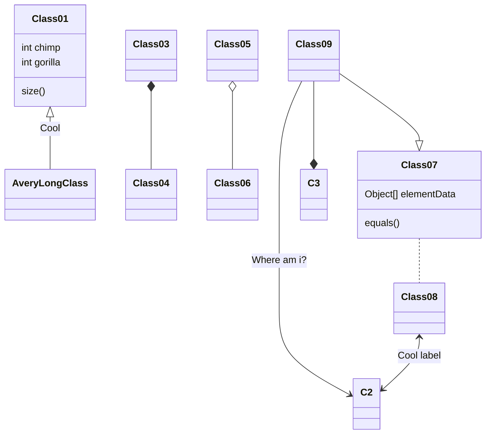
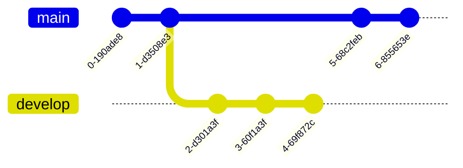

### 一.介绍
Mermaid 允许你使用文本和代码创建图表和可视化。Mermaid 是一个基于 JavaScript 的图表绘制工具，它使用 Markdown 启发的文本定义和渲染器来创建和修改复杂的图表。 Mermaid 的主要目的是帮助文档跟上开发的步伐。

图表和文档会耗费开发者宝贵的时间，并且很快就会过时。 但没有图表或文档会破坏生产力并损害组织学习。
Mermaid 通过使用户能够创建易于修改的图表来解决这个问题，它也可以成为生产脚本（和其他代码段）的一部分。

### 二.示例
#### 1.序列图

这种类型与 `Tcp` 的协议类似.

#### 2.甘特图

#### 3.类图

#### 4.git 图

注意