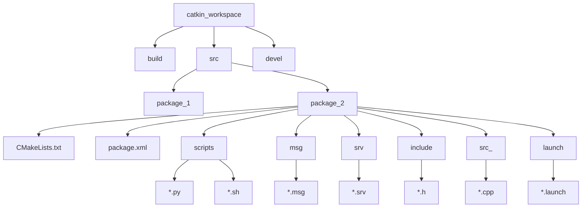

### 1.工作空间
即对于一个项目的工作空间,常见的目录格式如下
```shell 
WorkSpace --- 自定义的工作空间

    |--- build:编译空间，用于存放CMake和catkin的缓存信息、配置信息和其他中间文件。

    |--- devel:开发空间，用于存放编译后生成的目标文件，包括头文件、动态&静态链接库、可执行文件等。

    |--- src: 源码

        |-- package：功能包(ROS基本单元)包含多个节点、库与配置文件，包名所有字母小写，只能由字母、数字与下划线组成

            |-- CMakeLists.txt 配置编译规则，比如源文件、依赖项、目标文件

            |-- package.xml 包信息，比如:包名、版本、作者、依赖项...(以前版本是 manifest.xml)

            |-- scripts 存储python文件

            |-- src 存储C++源文件

            |-- include 头文件

            |-- msg 消息通信格式文件

            |-- srv 服务通信格式文件

            |-- action 动作格式文件

            |-- launch 可一次性运行多个节点 

            |-- config 配置信息

        |-- CMakeLists.txt: 编译的基本配置

```

按照至顶向下的流程图描述为：



---

### 2.package.xml
该文件定义有关软件包的属性，例如软件包名称，版本号，作者，维护者以及对其他catkin软件包的依赖性。请注意，该概念类似于旧版 rosbuild 构建系统中使用的manifest.xml文件。示例
```xml {.line-numbers}
<?xml version="1.0"?>
<package format="2">
  <!--名称-->
  <name>show_pose</name>
  <!--版本-->
  <version>0.0.0</version>
  <!--描述-->
  <description>The show_pose package</description>

  <!--作者邮箱-->
  <maintainer email="ros@todo.todo">ros</maintainer>

  <!--许可证-->
  <license>TODO</license>

  <!--构建工具-->
  <buildtool_depend>catkin</buildtool_depend>
  <!--依赖库-->
  <build_depend>roscpp</build_depend>
  <build_depend>std_msgs</build_depend>
  <build_depend>turtlesim</build_depend>
  <!--需要导入的依赖-->
  <build_export_depend>roscpp</build_export_depend>
  <build_export_depend>std_msgs</build_export_depend>
  <build_export_depend>turtlesim</build_export_depend>
  <!--运行依赖-->
  <exec_depend>roscpp</exec_depend>
  <exec_depend>std_msgs</exec_depend>
  <exec_depend>turtlesim</exec_depend>
  <!--导入其他工具-->
  <export>
  <!--其他工具-->
  </export>
</package>

```