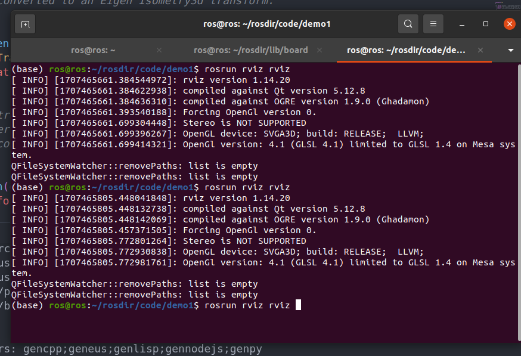
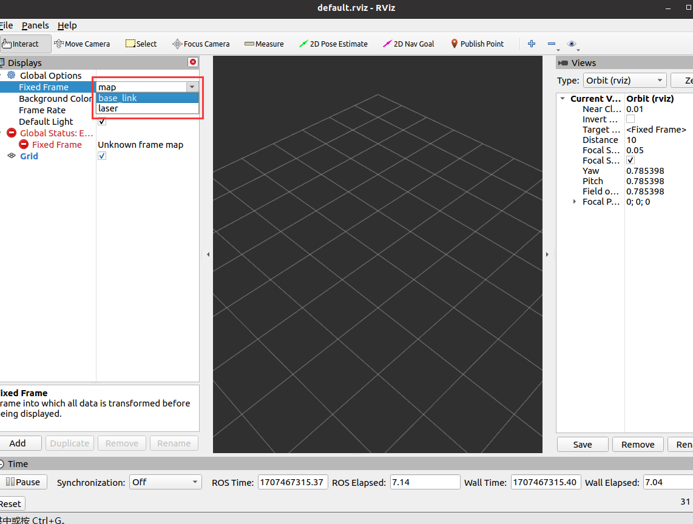
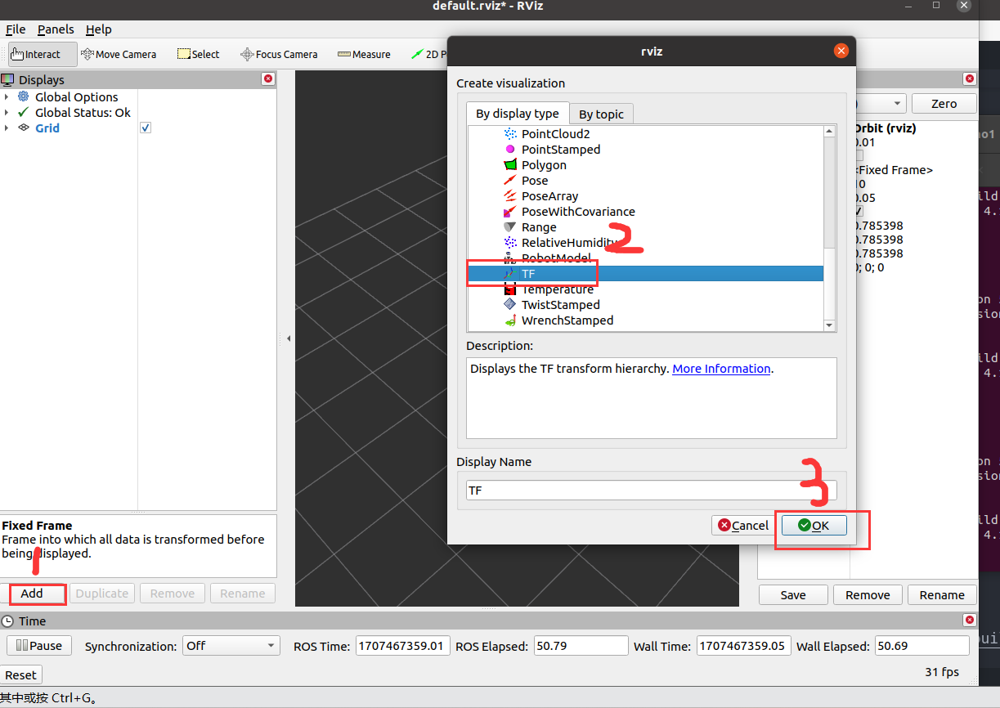
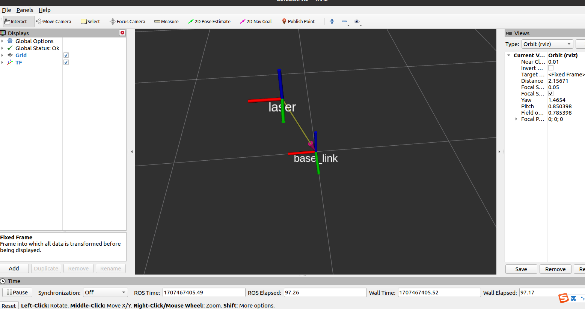

### 1.简介
所谓静态坐标变换，是指两个坐标系之间的相对位置是固定的。

### 2.实例
需求描述:
现有一机器人模型，核心构成包含主体与雷达，各对应一坐标系，坐标系的原点分别位于主体与雷达的物理中心，已知雷达原点相对于主体原点位移关系如下: x 0.2 y0.0 z0.5。当前雷达检测到一障碍物，在雷达坐标系中障碍物的坐标为 (2.0 3.0 5.0),请问，该障碍物相对于主体的坐标是多少？

通过话题发布实现,创建功能包
```shell
catkin_create_pkg tf_test  tf2 tf2_ros tf2_geometry_msgs roscpp rospy std_msgs geometry_msgs
```


#### 2.1 发布方代码
```C++
/* 
    静态坐标变换发布方:
        发布关于 laser 坐标系的位置信息 

    实现流程:
        1.包含头文件
        2.初始化 ROS 节点
        3.创建静态坐标转换广播器
        4.创建坐标系信息
        5.广播器发布坐标系信息
        6.spin()
*/
// 1.包含头文件
#include "ros/ros.h"
#include "tf2_ros/static_transform_broadcaster.h"
#include "geometry_msgs/TransformStamped.h"
#include "tf2/LinearMath/Quaternion.h"

int main(int argc, char *argv[])
{
    setlocale(LC_ALL,"");
    // 2.初始化 ROS 节点
    ros::init(argc,argv,"static_brocast");
    // 3.创建静态坐标转换广播器
    tf2_ros::StaticTransformBroadcaster broadcaster;
    // 4.创建坐标系信息
    geometry_msgs::TransformStamped ts;
    //----设置头信息
    ts.header.seq = 100;
    ts.header.stamp = ros::Time::now();
    ts.header.frame_id = "base_link";
    //----设置子级坐标系
    ts.child_frame_id = "laser";
    //----设置子级相对于父级的偏移量
    ts.transform.translation.x = 0.2;
    ts.transform.translation.y = 0.0;
    ts.transform.translation.z = 0.5;
    //----设置四元数:将 欧拉角数据转换成四元数
    tf2::Quaternion qtn;
    qtn.setRPY(0,0,0);
    ts.transform.rotation.x = qtn.getX();
    ts.transform.rotation.y = qtn.getY();
    ts.transform.rotation.z = qtn.getZ();
    ts.transform.rotation.w = qtn.getW();
    // 5.广播器发布坐标系信息
    broadcaster.sendTransform(ts);
    ros::spin();
    return 0;
}
```


#### 2.2 订阅方代码
```C++
/*  
    订阅坐标系信息，生成一个相对于 子级坐标系的坐标点数据，转换成父级坐标系中的坐标点

    实现流程:
        1.包含头文件
        2.初始化 ROS 节点
        3.创建 TF 订阅节点
        4.生成一个坐标点(相对于子级坐标系)
        5.转换坐标点(相对于父级坐标系)
        6.spin()
*/
//1.包含头文件
#include "ros/ros.h"
#include "tf2_ros/transform_listener.h"
#include "tf2_ros/buffer.h"
#include "geometry_msgs/PointStamped.h"
#include "tf2_geometry_msgs/tf2_geometry_msgs.h" //注意: 调用 transform 必须包含该头文件

int main(int argc, char *argv[])
{
    setlocale(LC_ALL,"");
    // 2.初始化 ROS 节点
    ros::init(argc,argv,"tf_sub");
    ros::NodeHandle nh;
    // 3.创建 TF 订阅节点
    tf2_ros::Buffer buffer;
    tf2_ros::TransformListener listener(buffer);

    ros::Rate r(1);
    while (ros::ok())
    {
    // 4.生成一个坐标点(相对于子级坐标系)
        geometry_msgs::PointStamped point_laser;
        point_laser.header.frame_id = "laser";
        point_laser.header.stamp = ros::Time::now();
        point_laser.point.x = 1;
        point_laser.point.y = 2;
        point_laser.point.z = 7.3;
    // 5.转换坐标点(相对于父级坐标系)
        //新建一个坐标点，用于接收转换结果  
        //--------------使用 try 语句或休眠，否则可能由于缓存接收延迟而导致坐标转换失败------------------------
        try
        {
            geometry_msgs::PointStamped point_base;
            point_base = buffer.transform(point_laser,"base_link");
            ROS_INFO("转换后的数据:(%.2f,%.2f,%.2f),参考的坐标系是:",point_base.point.x,point_base.point.y,point_base.point.z,point_base.header.frame_id.c_str());

        }
        catch(const std::exception& e)
        {
            // std::cerr << e.what() << '\n';
            ROS_INFO("程序异常.....");
        }


        r.sleep();  
        ros::spinOnce();
    }


    return 0;
}
```


#### 2.3 结果查看


利用rostopic echo 或者  打开 rviz 可视化,这里就介绍rviz可视化方法,
##### a.打开rviz


##### b.设置地图坐标系



##### c.添加tf的坐标变换


##### d.结果



### 3.总结
代码中我们发现tf的发布消息类型是 geometry_msgs的 TransformStamped ,并且我们要设置它自己坐标系 `header` 的 `frame_id,seq,stamp` ,还要设置它的子坐标系的id `child_frame_id` .并且可以看到,发布的信息在发布之前会经过处理，而处理的函数则是利用tf的数据结构处理好后再复制给发布的信息。

视觉slam的坐标发布可以通过发布多个静态坐标来达到相似的效果，但是会导致内存飙升.

### 4.附注
由于静态坐标的便用性,tf_ros专门给了一个节点程序`static_transform_publisher`用于生成静态坐标系,其中坐标系参数作为命令函数输入
```shell
rosrun  tf2_ros static_transform_publisher 1 2 3 4 5 6 /source_name /target_name
```

其中 $1,2,3$ 是平移向量, $4,5,6$ 是旋转向量:模为旋转角度,单位向量是旋转轴,`source_name` 是源坐标系名 `target_name` 是目标坐标系名.