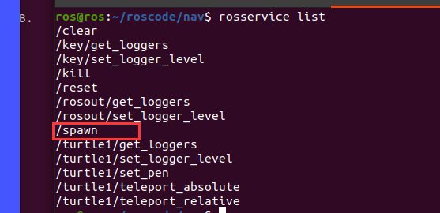

### 1.案例介绍
乌龟命令可以通过服务通信项服务端添加小乌龟,添加多个小乌龟,所以我们需要通过服务通信添加小乌龟

### 2.先验信息查询
```
rosservice list
```

查询服务端和客户端的服务响应,得到服务表
<center>

</center>

得到相关消息
```shell
rosservice info /spawn 

--- 输出 ---
Node: /turtle1
URI: rosrpc://ros:42329
Type: turtlesim/Spawn
```

得到消息类型
```shell
rossrv info turtlesim/Spawn

--- 输出 ---
float32 x
float32 y
float32 theta
string name
---
string name
```


那么我们得到消息类型为 `turtlesim/Spawn` ,而该消息的属性有他的位置信息和名称,接下来就可以做相关操作了.

### 3.实操
#### 3.1 命令行
```shell
rosservice call /spawn "x: 1.0
y: 3.0
theta: 0.0
name: 'turtle2'" 
--- 输出 ---
name: "turtle2"
```

其中 `rosservice call` 则是向服务端的 `/spawn` 服务申请一个属性为 `"x: 1.0
y: 3.0
theta: 0.0
name: 'turtle2'"` 的服务.类似于 `rostopic pub`.

#### 3.2 代码
```C++ {.line-numbers}
#include "ros/ros.h"
#include "turtlesim/Spawn.h"

int main(int argc,char* argv[]){
    // 添加节点
    ros::init(argc,argv,"add_turtle");
    // 乌龟名
    std::string turtle_name ="";
    if(argc > 1){
        turtle_name+= argv[1];
    }


    // 节点句柄初始化
    ros::NodeHandle node;
    // 客户端申请
    ros::ServiceClient client = node.serviceClient<turtlesim::Spawn>("/spawn");

    // 等待 /spawn 服务
    ros::service::waitForService("/spawn");

    // 添加一个乌龟
    turtlesim::Spawn first;
    //设置属性
    first.request.name = turtle_name;
    first.request.x = 5;
    first.request.y = 6;
    first.request.theta = 0.3;

    // 开始 call 服务端
    if(client.call(first)){
        // 成功了打印返回的名称
        ROS_INFO("add turtle successfully , the name is : %s",first.response.name.c_str());
    }else{
        // 失败了就gg
        ROS_INFO("add turtle fault");
    }

    return 0;
}
```

由于我们用了`argv[1]`作为参数设为乌龟名称,所以在运行时需要提供命令行参数
```shell
cd ${wk_space}
catkin_make
rosrun  ${pkg_name} ${node_exec} ${turtle_name}
```