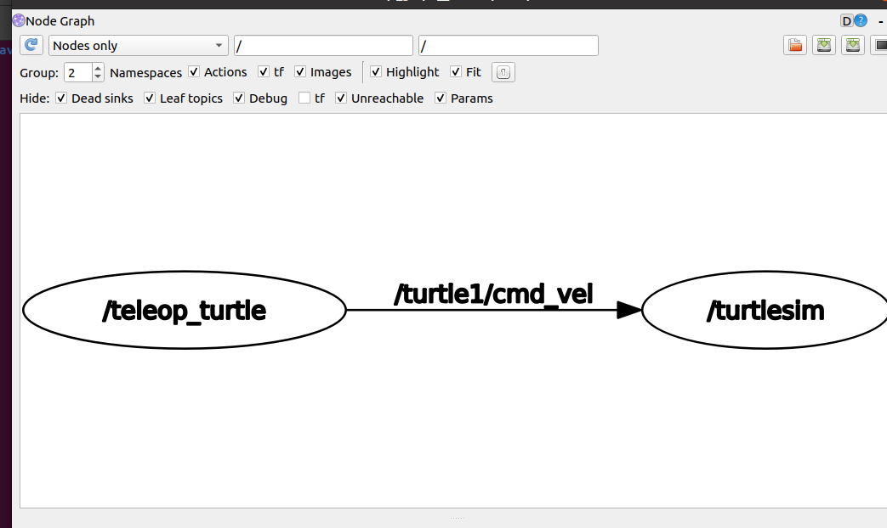
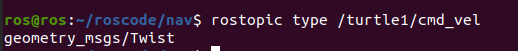
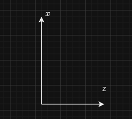

#### 1.案例介绍
通过设置输出话题我们将`turtlesim` 的小乌龟进行圆周运动,首先我们要知道小乌龟是如何运动的,我们先通过运行,命令得到它的消息机制

#### 2.消息机制获取.
为了获取消息数据,我们需要获得相关话题,那么一般流程如下

* 启动两个消息传递的节点
* 用 `rqt_graph` 查看两个节点的话题名称 `${topic_name}`
* 使用 `rostopic info ${topic_name}` 来获取话题的消息名称 `${msg_name}`
* 使用 `rosmsg info ${msg_name}` 获得消息信息.
* 利用获取的消息进行分析然后写代码.

实操
```shell
## 启动小乌龟
rosrun turtlesim turtlesim_node

---
## 启动控制小乌龟的按键
rosrun turtlesim turtle_teleop_key 
```

通过 `rqt_graph` 查看节点之间的话题话题连接,得到如图
<center>

</center>

得到话题 `/turtle1/cmd_vel`,查看话题的信息有哪些
```shell
## 查看传递的消息
rostopic info /turtle1/cmd_vel 
# 或者
rostopic type /turtle1/cmd_vel 

```


得到话题传递的消息为
<center>

</center>

看到为 `geometry_msgs/Twist` ,利用 
```
rosmsg info geometry_msgs/Twist
```

得到它的属性
```
geometry_msgs/Vector3 linear
  float64 x
  float64 y
  float64 z
geometry_msgs/Vector3 angular
  float64 x
  float64 y
  float64 z
```

其中 `linear` 是线性速度, `angular` 是角度,一般是三维的,但是由于小乌龟是二维的所以`linear` 只有 `x` ,`angular` 只有`z` 可以用.
<center>

</center>

如图, `x` 是运动速度, `z` 是角度速度,`x` 与 `z` 是垂直的.所以只要 `x` ,`z` 只有不同时为 $0$ ,那么小乌龟就是再做圆周运动

#### 3.实现
##### 3.1 命令行

```shell
rostopic pub /turtle1/cmd_vel -r 10 geometry_msgs/Twist "linear:
  x: 1.0
  y: 0.0
  z: 0.0
angular:
  x: 0.0
  y: 0.0
  z: 1.0" 
```

其中 `pub` 说明以 `/turtle1/cmd_vel` 为发布话题, `-r 10` 以频率 `10Hz` 发布消息类型为 `geometry_msgs/Twist` 的消息 `linear:
  x: 1.0
  y: 0.0
  z: 0.0
angular:
  x: 0.0
  y: 0.0
  z: 1.0"` .


##### 3.2代码
我们只要提供话题 `/turtle1/cmd_vel` 的消息为 `geometry_msgs/Twist` 即可,并且使 $x,z$ 不为 $0$ 就可以让小乌龟做圆周运动.

```shell
## 创建功能包
catkin_create tur_nav roscpp std_msgs geometry_msgs
```

创建 `main.cc` 然后写代码
```C++{.line-numbers}
#include "ros/ros.h"
#include "geometry_msgs/Twist.h"

int main(int argc,char* argv[]){
    // 初始化节点
    ros::init(argc,argv,"move");

    // 传力节点
    ros::NodeHandle node;
    // 发布方实现
    ros::Publisher pub = node.advertise<geometry_msgs::Twist>("/turtle1/cmd_vel",10);

    // 初始化消息
    geometry_msgs::Twist message;
    // 设置线性速度和角速度
    message.linear.x= 0.0;
    message.linear.y= 1.0;
    message.linear.z= 0.0;
    message.angular.x= 0.0;
    message.angular.y= 0.0;
    message.angular.z= 1.0;

    // 设值发布频率
    ros::Rate r(10);

    // 开始发布
    while(ros::ok()){
        // 发布信息
        pub.publish(message);
        // 控制发布频率
        r.sleep();
        // 暂停
        ros::spinOnce();
    }
    return 0;
}
```

配置`CMakeLists.txt`,然后编译
```shell
cd ${workspace}
catkin_make
source ./devel/setup.bash
rosrun tur_nav ${exec_file}
``` 

然后查看小乌龟.


#### 4.总结

重要命令(顺序排放)
```shell
## 1.启动节点
rosrun ${pkg} ${node}

## 2.查看节点连接
rosrun rqt_graph rqt_graph

## 3.查看话题
rostopic info ${topic_name}

## 4.查看消息
rosmsg info ${msg_name}
```

注意如果不是话题通信的话,比如服务通信或者参数服务器通信,我们还需要 `rosservice,rossrv,rosparam` 等命令查看`srv` 和 `param` 参数,从而来设置输出.