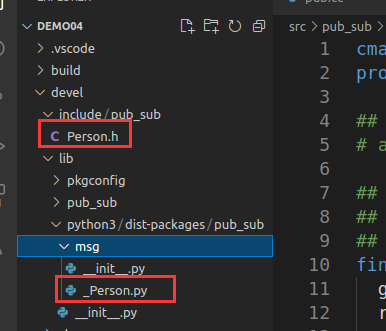
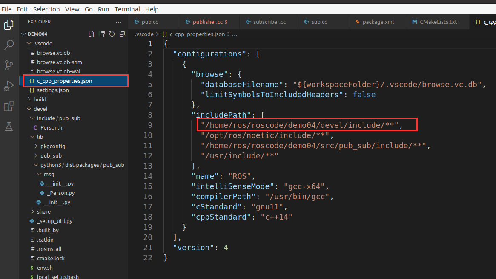

### 1.话题通信
主要成员:
* master:管理者
* talker:发布话题者
* listener:订阅话题者


---
### 2. 流程
a.需求: 实现基本的话题通信，一方发布数据，一方接收数据,实现的关键点:
* 发送方
* 接收方
* 数据(此处为普通文本)
  
PS: 二者需要设置相同的话题.

b.发布者:
* 包含头文件 
* 初始化 ROS 节点:命名(唯一)
  * `ros::init(argc,argv,node)`
* 实例化 ROS 句柄
  * `ros::NodeHandle`
* 实例化 发布者 对象
  * `ros::NodeHandle::advertisze`
* 组织被发布的数据，并编写逻辑发布数据
  * `ros::Publisher::pub`


c.订阅者
* 包含头文件 
* 初始化 ROS 节点:命名(唯一)
  * `ros::init(argc,argv,node)`
* 实例化 ROS 句柄
  * `ros::NodeHandle`
* 实例化 订阅者 对象
  * `ros::NodeHandle::subscribe`
* 处理订阅的消息(回调函数)
  * `callback`
* 设置循环调用回调函数
  * `ros::spin`


例程:
发布者:
```C++ {.line-numbers}
// 1.包含头文件 
#include "ros/ros.h"
#include "std_msgs/String.h" //普通文本类型的消息
#include <sstream>

int main(int argc, char  *argv[])
{   
    //设置编码
    setlocale(LC_ALL,"");

    //2.初始化 ROS 节点:命名(唯一)
    // 参数1和参数2 后期为节点传值会使用
    // 参数3 是节点名称，是一个标识符，需要保证运行后，在 ROS 网络拓扑中唯一
    ros::init(argc,argv,"talker");
    //3.实例化 ROS 句柄
    ros::NodeHandle nh;//该类封装了 ROS 中的一些常用功能

    //4.实例化 发布者 对象
    //泛型: 发布的消息类型
    //参数1: 要发布到的话题
    //参数2: 队列中最大保存的消息数，超出此阀值时，先进的先销毁(时间早的先销毁)
    ros::Publisher pub = nh.advertise<std_msgs::String>("chatter",10);

    //5.组织被发布的数据，并编写逻辑发布数据
    //数据(动态组织)
    std_msgs::String msg;
    // msg.data = "你好啊！！！";
    std::string msg_front = "Hello 你好！"; //消息前缀
    int count = 0; //消息计数器

    //逻辑(一秒10次)
    ros::Rate r(1);

    //节点不死
    while (ros::ok())
    {
        //使用 stringstream 拼接字符串与编号
        std::stringstream ss;
        ss << msg_front << count;
        msg.data = ss.str();
        //发布消息
        pub.publish(msg);
        //加入调试，打印发送的消息
        ROS_INFO("发送的消息:%s",msg.data.c_str());

        //根据前面制定的发送贫频率自动休眠 休眠时间 = 1/频率；
        r.sleep();
        count++;//循环结束前，让 count 自增
        //暂无应用
        ros::spinOnce();
    }
    return 0;
}
```

订阅者:
``` C++ {.line-numbers}
// 1.包含头文件 
#include "ros/ros.h"
#include "std_msgs/String.h"

void doMsg(const std_msgs::String::ConstPtr& msg_p){
    ROS_INFO("我听见:%s",msg_p->data.c_str());
    // ROS_INFO("我听见:%s",(*msg_p).data.c_str());
}
int main(int argc, char  *argv[])
{
    setlocale(LC_ALL,"");
    //2.初始化 ROS 节点:命名(唯一)
    ros::init(argc,argv,"listener");
    //3.实例化 ROS 句柄
    ros::NodeHandle nh;

    //4.实例化 订阅者 对象
    ros::Subscriber sub = nh.subscribe<std_msgs::String>("chatter",10,doMsg);
    //5.处理订阅的消息(回调函数)

    //     6.设置循环调用回调函数
    ros::spin();//循环读取接收的数据，并调用回调函数处理

    return 0;
}
```


---
### 3.自定义信息
流程:
* 在功能包下定义 `msg` 文件夹
* 在功能包的 `package.xml` 添加构建依赖和执行依赖
  * `  <build_depend>message_generation</build_depend>` ,`<exec_depend>message_runtime</exec_depend>`
* 修改在功能包下的 `CMakeLists.txt`,其中包括
  * `add_message_files`,`generate_messages`,`catkin_package`
* 编译,在`devel`的`include` 下发现`C++` 的消息类,在 `lib/pyhon3/msg` 下可以见到 `/python` 版本的消息类.

(1)定义 `msg` 文件
```shell
# code
cd ${pkg_name}
mkdir msg & cd msg
touch xxx.msg
```

在 `xxx.msg` 中定义类 `xxx` 的数据,基于`std_msgs`

(2) 在 `${pkg_name}/package.xml` 中添加依赖

```xml
# code
<build_depend>message_generation</build_depend>
<exec_depend>message_runtime</exec_depend>
```

(3)在 `${pkg_name}/CMakeLists.txt` ,中添加
```shell
# code
add_message_files(
  FILES
  xxx.msg
)
2.
generate_messages(
  DEPENDENCIES
  std_msgs // 消息依赖库,可以是其他依赖库
)
catkin_package(
#  INCLUDE_DIRS include
#  LIBRARIES pub_sub
 CATKIN_DEPENDS geometry_msgs roscpp std_msgs //全部的库
#  DEPENDS system_lib
)
```

(4)在文件中可以看到
<center>

</center>


---
### 4.消息使用
流程:
(1)在 `.vscode` 文件夹中,将`c_cpp_properties.json` 文件中的 `includePath` 添加头文件`./${wk_name}/devel/include/**`

<center>

</center>


(2)编写源码:
a.发布者
```C++ {.line-numbers} 
#include "ros/ros.h"
#include "std_msgs/String.h"
#include "pub_sub/Person.h"

int main(int argc,char* argv[]){
    ros::init(argc,argv,"publisher");
    ros::NodeHandle node;
    ros::Publisher  pub = node.advertise<pub_sub::Person>("topic",10);

    ros::Rate rate(1);

    pub_sub::Person John;
    John.age = 0;
    John.name = "John";
    John.height = 1.73;
    John.money = 500;
    while (ros::ok())
    {
        pub.publish(John);
        ROS_INFO("the person name : %s , age :%d , height :%.2f , money: %f .",John.name.c_str(),John.age,John.height,John.money);
        John.age ++;
        rate.sleep();
        ros::spinOnce();
    }
    return 1;
}
```


b.订阅者
``` C++ {.line-numbers}
#include "ros/ros.h"
#include "std_msgs/String.h"
#include "pub_sub/Person.h"

void func(const pub_sub::Person::ConstPtr &m)
{
    ROS_INFO("the person name : %s , age :%d , height :%.2f , money: %f .", m->name.c_str(), m->age, m->height, m->money);
}

int main(int argc, char *argv[])
{
    ros::init(argc, argv, "subscriber");
    ros::NodeHandle node;
    ros::Subscriber sub = node.subscribe<pub_sub::Person>("topic", 10, func);

    ros::spin();
    return 1;
}
```


(3)在 `${pkg_name}/CMakeLists.txt` 将源码的程序用 `add_dependencies()` 添加上依赖,代码如下
```shell
# code
add_dependencies(pub ${PROJECT_NAME}_generate_messages_cpp)
add_dependencies(sub ${PROJECT_NAME}_generate_messages_cpp)
```

这段代码可以理解为:`pub,sub` 依赖于 `${PROJECT_NAME}_generate_messages_cpp`,需要将`${PROJECT_NAME}_generate_messages_cpp` 提前编译.值得注意的是:收发两端必须位于同一个功能包下,否则`{PROJECT_NAME}` 不一致,就会导致依赖不同.这个时候需要将,消息头文件`xxx.h` 单独进行 `target_include_directories()` 进行链接.


(4)编译,环境变量生效,运行即可.
``` shell
#code
cd ${wk_name}
catkin_make
source ./devel/setup.bash
rosrun *
```