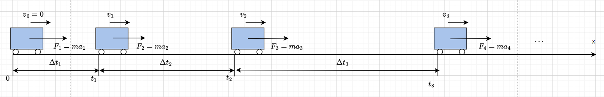
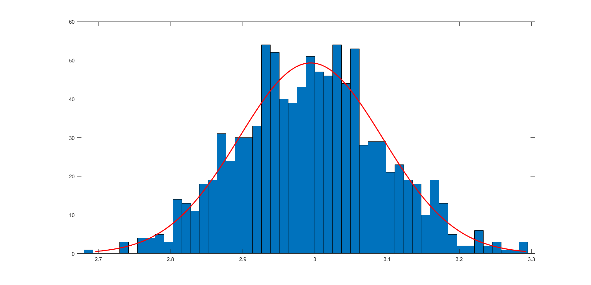
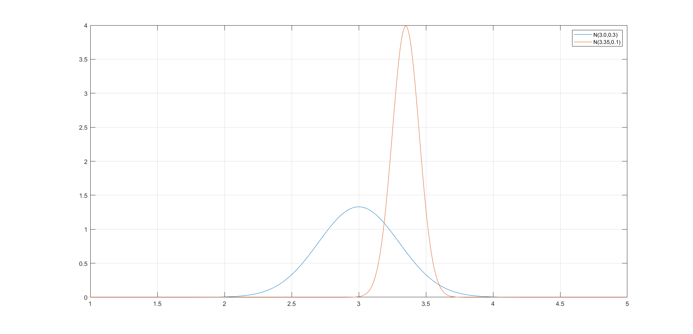

### 1.推导前的小故事
&emsp;&emsp;假设现在你有一个小车,小车屁股后面置有一个火箭推力器,可以操纵推力器给小球施加一个恒定向前的力 $F$.
&emsp;&emsp;现在有 $k$ 段不同的时间点 $t : \{0,t_1,t_2,\cdots ,t_k ,\cdots \}$, 两个时间段内的推力器近似一致 $F$,现在设第 $k$ 个时间段的速度为 $v : {0,v_1,v_2,\cdots ,v_k ,\cdots}$ ,而每个时间点的速度 $z :\{0,z_1,z_2,\cdots ,z_k,\cdots\}$ 使用测速器测量(有误差).
&emsp;&emsp;假设每段时间的力 $F: \{F_1,F_2,F_3\cdots , F_k ,\cdots \}$ 都是已知的,可控制的,初始速度也是已知的 $v_0 = 0$ ,同时设置每段时间的长为时间点的差 $\Delta t: t_1,(t_2 - t_1),\cdots , (t_k - t_{k+1}),\cdots$ .

根据理想情况有
$$\begin{align}
    v_{k+1}  &=  v_{k} + a_k \Delta t_k  \\
    z_{k} &= v_k 
\end{align}$$

&emsp;&emsp;由于小车的行驶道路并不是理想光滑的,是存在一些微小的干扰力的,则将其视为误差 $w \sim N(0,R): w_1,w_2,\cdots ,w_k,\cdots $,观测的 $z$ 的误差被建模为 $q \sim N(0,Q) : q_1,q_2,\cdots q_k,\cdots$,所以如果存在 $n$ (很多)个各平行空间的你在同一个时刻中进行该行动,结果都是不一样的,其分布类似于高斯分布,那么上式就可以写为
$$\begin{align}
    v_{k+1}  &=  v_{k} + a_k \Delta t_k + w_k \\
    z_{k} &= v_k + q_k
\end{align}$$

现在要求使用上述的已知信息求 $v_1,v_2,\cdots ,v_k,\cdots$ 的一个估计,这个估计必须在某些方面最优.假设有
$$\begin{align}
    v_k &- 真实值 \\
    \vec{v_k} &- 预测值 = v_{k-1} + a_{k - 1} \Delta t_{k-1} \\
    \tilde{v_k} &-最优估计值
\end{align}$$

现在我们想要得到这个最优估计值.这个推导的结果其实就是将方差变小,因为 $v_k$ 是 $w_k$ 存在关系的,所以如果你有很多过平行空间,每个平行空间都有一个 $v_k$ ,你将这个 $v_k$ 统计起来,他们是不一致的,其直方图分布如下图,

我们要做的就是将方差减小,

蓝色的直方图分布通过最优估计转换为橙色的直方图分布,取最顶点的值作为最优值(出现的次数最多).

---
### 2.简介
状态变量 $x \in R^{n \times 1} $ 输入变量 $u \in R^{m\times 1} $ 观测变量 $z \in R^{k\times 1}$,两个高斯白噪声噪声为 $w_k \sim N(0, R) , v_k \sim N(0,Q)$ 按照线性控制理论的理想情况(无噪声)
$$\begin{align}
    \begin{cases}
        x_{k+1} = Ax_k + Bu_{k}  \\
        z_{k} = Hx_k 
    \end{cases} \\
\end{align}$$

现实情况(有噪声)
$$\begin{align}
    \begin{cases}
        x_{k+1} = Ax_k + Bu_{k} + w_k \\
        z_{k} = Hx_k + v_k
    \end{cases} \\
\end{align}$$

假设我们可以得到观测量 $z_t$,控制输入 $u_t$,以及初始状态 $x_0$ ,并且了解噪声信息 $w_t,v_t$ 也就是他们的均值和方差 ,现在的任务是在以上的先验信息的情况下估计所有的状态变量 $x_t$.
简述为通过已知信息估计一个目标
$$\begin{align}
    x_0,\{z_0,z_1,\cdots \} ,\{u_0,u_1,\cdots\},\{R,Q\} \rightarrow \{x_1,x_2 \cdots \}
\end{align}$$

### 3.推导
卡尔曼滤波是通过将每次的状态变量的方差减少来达到更有效估计的方法,定义状态变量的相关值
$$\begin{align}
    x_k &\sim \text{真实值} \\
    \tilde{x}_k^- &\sim \text{状态预测值,先验估计值} \\
    \tilde{x}_k &\sim \text{最优状态估计值}
\end{align}$$

我们规定上值的评判标准为下式
$$\begin{align}
    \tilde{x}_k^- &= A\tilde{x}_{k-1} + Bu_{k-1} \\ 
    \tilde{x}_k &= \tilde{x}_k^- + K(z_k - H\tilde{x}_k^-)
\end{align}$$

其中 $K$ 就称为卡尔曼增益,上式可以说明状态预测值 $\tilde{x_k}^-$ 是真实值在无噪声情况下的预测,状态最优估计值则是预测值 $\tilde{x_k}^-$ 的增益.由上式定义误差
$$\begin{align}
    \tilde{e}_k^- &= x_k -  \tilde{x}_k^- \\
    \tilde{e}_k &= x_k - \tilde{x}_k\\
    P_k^- &= E[ \tilde{e}_k^-\tilde{e}_k^{-T}]\\ 
    P_k &= E[\tilde{e}_k\tilde{e}_k^{T}]
\end{align}$$

通过 $(2)(7)(8)$ 得到
$$\begin{align}
    \tilde{x}_k &= \tilde{x}_k^- + K(Hx_k + v_k - H\tilde{x}_k^-) \\
    &=\tilde{x}_k^- + KH(x_k - \tilde{x}_k^-) +Kv_k
\end{align}$$

两边各减一个 $x_k$,则有
$$\begin{align}
    \tilde{x}_k - x_k &=(\tilde{x}_k^- - x_k)+ KH(x_k - \tilde{x}_k^-) +Kv_k
\end{align}$$

再由 $(9)(10)$ 可知
$$\begin{align}
    \tilde{e}_k &= (I - KH)\tilde{e}_k^- - Kv_k
\end{align}$$

由此得到真实估计协方差为
$$\begin{align}
    P_k &= E[\tilde{e}_k\tilde{e}_k^{T}] \\
    &=E[\{(I - KH)\tilde{e}_k^- - Kv_k\} \{(I - KH)\tilde{e}_k^- - Kv_k\}^T]  \\
    &=E[(I - KH)\tilde{e}_k^-\tilde{e}_k^{-T}(I - KH)^T] - E[(I - KH)\tilde{e}_k^-v_k^TK^T] - E[Kv_k\tilde{e}_k^{-T}(I - KH)^T] + E[Kv_kv_k^TK^T] \\
    &=(I - KH)P_k^-(I - KH)^T +KRK^T
\end{align}$$

注意这里用到了 $E[v_k] = 0$ ,我们的任务是求一个 $K$,使得方差矩阵 $P_k$ 的某个可量化的性质最小,协方差矩阵的最重要的性质就是特征值决定方差大小,那么这里比较合适的目标函数为矩阵的迹 $Tr(P_k)$,那么问题转换为最优化问题
$$\begin{align}
    K = \underset{K}{\argmin} \; Tr(P_k) 
\end{align}$$

利用求导法则
$$\begin{align}
    \frac{\partial Tr(P_k)}{\partial K} = -2P_k^-H^T + 2K(HP_k^-H^T + R) = 0
\end{align}$$

那么最优的 $K$ 为
$$\begin{align}
    K = P_k^-H^T(HP_k^-H^T + R)^{-1}
\end{align}$$

并且引申出
$$\begin{align}
    P_k = (I - KH)P_k^-
\end{align}$$

为了计算 $P_k^-$ ,考虑式 $(11)$ ,并且
$$\begin{align}
    \tilde{e}_{k+1}^- &= x_{k+1} -  \tilde{x}_{k+1}^- \\
    &=Ax_k + Bu_k + w_k - (A\tilde{x}_k + Bu_k) \\
    &=A(x_k - \tilde{x}_k) + w_k \\
    &=A\tilde{e}_{k} + w_k
\end{align}$$

那么
$$\begin{align}
    P_{k + 1}^- &= E[(A\tilde{e}_{k} + w_k)(A\tilde{e}_{k} + w_k)^T] \\
    &=E[A\tilde{e}_{k}\tilde{e}_{k}^TA^T] + E[w_kw_k^T] \\
    &=AP_{k}A^T + R
\end{align}$$

由此得到所有的推到方式,状态预测
$$\begin{align}
    \tilde{x}_k^- = A\tilde{x}_k + Bu_k \\
    P_k^- = AP_kA^T + R
\end{align}$$

以及状态更新
$$\begin{align}
    K_k &= P_k^-H^T(HP_k^-H^T + R)^{-1} \\
    \tilde{x}_k &= \tilde{x}_k^- + K_k(z_k  - H\tilde{x}_k^-) \\
    P_k &=(I - K_kH)P_k^- 
\end{align}$$