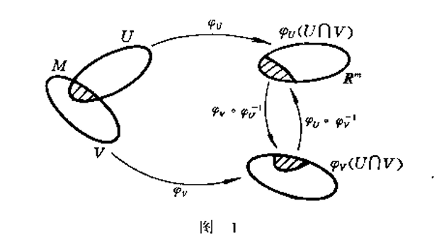

## 一.基本常识
### 1.Hausdorff 空间
定义:设 $X$ 是拓扑空间,如果对于任意的 $x,y \in X , x =\not ={y}$ ,存在两个开集 $U,V$ 使得 $x\in U , y \in V$  ,且 $U \cap V = \varnothing $ ,则称 $X$ 为 Hausdorff空间.

### 2. $m$ 维矢量空间
定义:在 $R^{m} = \left\{x = (x_1,x_2\cdots x_m) | x_i \in R , 1 \leq i\leq m\right\}$ 定义加法和数乘:

$$\begin{cases}
    (x + y)^{i} = x^i + y^i \\
    (\lambda x)^i = \lambda x^i 
\end{cases}$$

再定义欧氏度量 $d(x,y)$

$$\begin{align}
    d(x,y) &= \Vert x - y\Vert \\
    &= \sqrt{\sum_{i=1}^n (x_i - y_i)^2}
\end{align}$$

那么空间 $R^m$ 就有了拓扑性质,容易验证距离度量
(1) 正定性

$$\begin{align}
    d(x,y) \geq 0 ,d(x,y) \leftrightarrow x = y
\end{align}$$

(2) 对称性

$$\begin{align}
    d(x,y) = d(y,x) 
\end{align}$$

(3) 三角不等式

$$\begin{align}
    d(x,y) \leq d(x,z) + d(z,y) , \forall z \in R^{m}
\end{align}$$

我们称 $(R,d)$ 是一个度量空间.

### 3.$C^r$ 空间
如果对于一个映射 $f$ 它是 $r$ 阶可微的,则称它 $f \in C^r$ ,如果 $f$ 是任意阶可微的,则称 $f\in C^\infty$ .如果 $f$ 是解析的:即在任意一点,$f$ 可以由一系列多项式展开,则称 $f\in C^w$ .

## 二.相关定义
### 1.同胚映射
定义:如果对于两个拓扑空间 $(X,d_x) , (Y,d_y)$ ,存在一个映射 $f$ 使得 $f:(X,d_x) \rightarrow (Y,d_y)$ ,则称 $f$ 为同胚映射, $(X,d_x) , (Y,d_y)$ 是同胚的,如果 $d_x = d_y$ 则称 $X$ 与 $Y$ 同胚.

### 2.拓扑流形
定义:设 $M \subset R^m$ 是 Hausdorff 空间.若对于任意一点 $x \in M$ 都有 $x$ 在 $M$ 的一个邻域 $U$ 同胚于 $m$ 维欧式空间 $R^m$ 的一个开集,则称 $M$ 是一个 $m$ 维流形(拓扑流形).
其中的同胚映射定义为 $\varphi_U:U\rightarrow \varphi_U(U)$ , 称 $(U,\varphi_U) $为 $M$ 的坐标卡.

### 3.开集同胚
设 $(U,\varphi_U) $, $(V,\varphi_V) $ 是流形 $M$ 的两个坐标卡,且 $U \cap V \not ={\varnothing}$ ,则 $\varphi_U(U \cap V)$ 与 $\varphi_V(U \cap V)$ 是非空的开集,且映射

$$\begin{align}
    \varphi_V \circ \varphi^{-1}_U : \varphi_U(U\cap V)  \rightarrow\varphi_V(U\cap V)
\end{align}$$

而 $\varphi_V \circ \varphi^{-1}_U$ 的逆映射为 $\varphi_U \circ \varphi^{-1}_V$ .
证明:
因为 $\varphi_V$ 与 $\varphi_U$ 的定义域的交 $U \cap V \not ={\varnothing}$ ,,因为

$$\begin{align}
    \varphi_U^{-1}(\varphi_U(U\cap V)) = U \cap V
\end{align}$$ 

所以

$$\begin{align}
    \varphi_V \circ \varphi^{-1}_U(\varphi_U(U\cap V)) = \varphi_V(U\cap V)
\end{align}$$

证毕.

### 4.相容
令 $ \varphi_V \circ \varphi^{-1}_U = f , \varphi_U \circ \varphi^{-1}_V = g$ ,则 $f,g$ 互为逆映射;如果对于 $(U,\varphi_U) $, $(V,\varphi_V) $ 满足 $U \cap V = \varnothing $ 或者 $U \cap V \not ={\varnothing} $ 坐标变换函数 $f,g$ 都是 $C^r$ 的那么称 $(U,\varphi_U) $, $(V,\varphi_V) $ 是 $C^r$ 相容的.

### 5.微分结构
定义: 设  $M$ 是一个 $m$ 维流形,如果在 $M$ 上给定了一个坐标卡 $\Sigma = \{(U,\varphi_U) ,(V,\varphi_V) ,(W,\varphi_W) \cdots \}$ ,如果 $\Sigma$ 满足
(1) $\{U,V,W\cdots \}$ 是 $M$ 的开覆盖
(2) 属于 $\Sigma$ 的任意两个坐标卡都是 $C^r$ 相容的 ;
(3) $\Sigma$ 是极大的,即:对于 $M$ 的任意一个坐标卡 $(T,\varphi_T)$ 如果与 $\Sigma$ 的每一个坐标卡都是 $C^r$ 相容的,那么它必然属于 $\Sigma$ .

则称 $\Sigma$ 是 $M$ 的一个 **$C^r$ 微分结构**.如果在 $M$ 上给定一个 $C^r$ 微分结构 ,则称 $M$ 为 $C^r$ 微分流形.属于给定的微分结构的坐标卡称为 $M$ 的容许坐标系.称 $M$ 上点 $p$ 的局部坐标系都是指包含点 $p$ 的容许坐标卡的给出的坐标系.

### 6.光滑流形
如果在 $M$ 上确定了一个 $C^\infty$ 的微分结构,则称 $M$ 为一个光滑流形.如果在 $M$ 上确定了一个 $C^w$ 的微分结构,则称 $M$ 为一个解析流形.主要讨论光滑流形.

