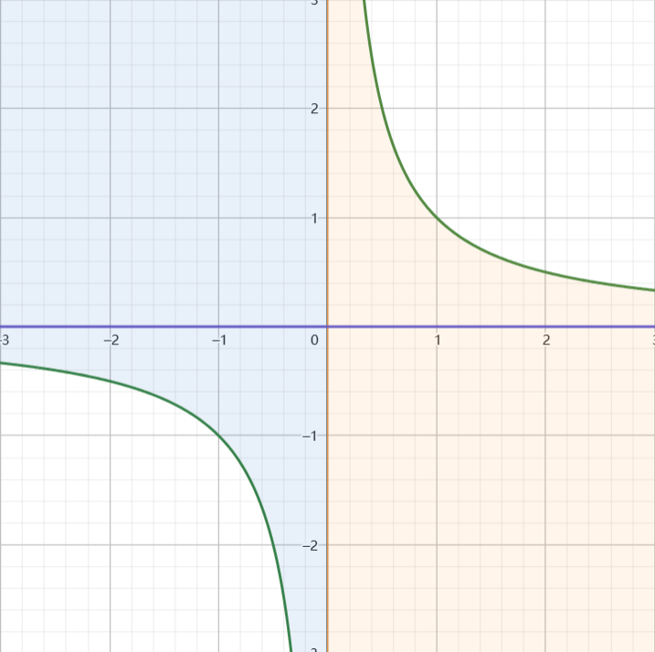
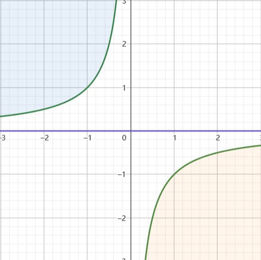

#### 乘积的分布
设 $(\xi,\eta)$ 是服从密度函数 $p_{\xi,\eta}(\xi,\eta)$ 的随机变量,求 $\zeta = \xi\eta$ 的概率密度函数.
解:

$$\begin{align}
   P\{\zeta \leq y\} &= P\{\xi\eta \leq y\} \\
   &=P\{\eta\leq \frac{y}{\xi}\}
\end{align}$$

将 $\xi\rightarrow t,\eta \rightarrow s$ ,分类讨论:
**1.$y>0时$**
1.1 $t>0$ 时:$s \leq \displaystyle \frac{y}{t}$
1.2 $t<0$ 时:$s\geq \displaystyle \frac{y}{t}$

则有:

$$\begin{align}
    F_{\zeta}(y) = \iint_{D_{ts}} p_{\xi,\eta}(t,s) dtds
\end{align}$$

其中积分区域 $D_{ts} = \{(t,s)|(t>0,s\leq \frac{y}{t}) \cup (t<0 , s\geq \frac{y}{t})\}$

**2.$y<0$时**
2.1 $t>0$ , $s \leq \displaystyle \frac{y}{t}$
2.2 $t<0$ , $s \geq \displaystyle \frac{y}{t}$
则有:

$$\begin{align}
    F_{\zeta}(y) = \iint_{D'_{ts}} p_{\xi,\eta}(t,s) dtds
\end{align}$$

其中积分区域 $D'_{ts} = \{(t,s)|(t>0,s\leq \frac{y}{t}) \cup (t<0 , s\geq \frac{y}{t})\}$

无论 $y$ 的正负,都有:

$$\begin{align}
    F_{\zeta}(y) =  \int^{+\infty}_{0}dt\int^{\frac{y}{t}}_{-\infty} p_{\xi,\eta}(t,s)ds + \int^{0}_{-\infty}dt\int^{+\infty}_{\frac{y}{t}} p_{\xi,\eta}(t,s)ds
\end{align}$$

两边同时对 $y$ 求导有:

$$\begin{align}
    f_{\zeta}(y) &=\int^{+\infty}_{0}\frac{1}{t}p_{\xi,\eta}(t,\frac{y}{t})dt + \int^{0}_{-\infty}-\frac{1}{t}p_{\xi,\eta}(t,\frac{y}{t})dt \\
    &=\int^{+\infty}_{0}\frac{1}{|t|}p_{\xi,\eta}(t,\frac{y}{t})dt + \int^{0}_{-\infty}\frac{1}{|t|}p_{\xi,\eta}(t,\frac{y}{t})dt \\
    &=\int^{+\infty}_{-\infty}\frac{1}{|t|}p_{\xi,\eta}(t,\frac{y}{t})dt
\end{align}$$

又因为 $Z = \xi\eta$ 是对于 $\xi,\eta$ 对称的(即 $\xi,\eta$ 互换不影响 $Z$) ,则:

$$\begin{align}
    f_{\zeta}(y) 
    &=\int^{+\infty}_{-\infty}\frac{1}{|t|}p_{\xi,\eta}(x,\frac{y}{x})dx \\
    &=\int^{+\infty}_{-\infty}\frac{1}{|t|}p_{\xi,\eta}(\frac{y}{x},x)dx
\end{align}$$

