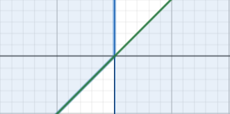

## 商的分布
如果 $(\xi,\eta) \thicksim p(\xi,\eta)$ ,求 $\zeta = \frac{\xi}{\eta}$ 的概率密度函数.
因为:

$$\begin{align}
    F_\zeta(y) &= P\{\zeta\leq y\}\\
    &=P\{\frac{\xi}{\eta} \leq y\}
\end{align}$$

其积分区域(横坐标为 $\eta = \eta$,纵坐标为 $\xi = \xi$)为:

$$\begin{cases}
    \xi \in(-\infty,+\infty) \\
    \eta \in(-\infty,+\infty) \\
    \frac{\xi}{\eta} \leq y
\end{cases}$$
1.$\eta>0$ 时,$\xi \leq y\eta$
2.$\eta<0$ 时,$\xi \geq y \eta $
如图横坐标为 $\eta$  纵坐标为 $\xi$ ,斜线为 $\xi = y\eta$

那么就有:

$$\begin{align}
    F_\zeta(y)
    &=P\{\frac{\xi}{\eta} \leq y\}\\
    &= \int^{+\infty}_0 d\eta \int^{\eta y}_{-\infty} p(\xi,\eta) d\xi + \int^{0}_{-\infty} d\eta \int^{+\infty}_{\eta y} p(\xi,\eta) d\xi  \\
    &=\int^{+\infty}_0  [\int^{\eta y}_{-\infty} p(\xi,\eta) d\xi] d\eta+ \int^{0}_{-\infty}  [\int^{+\infty}_{\eta y} p(\xi,\eta) d\xi]d\eta
\end{align}$$ 

根据含参积分的性质:

$$\begin{align}
    \frac{dF_{\zeta}}{dy} &= \int^{+\infty}_0  [\int^{\eta y}_{-\infty} p(\xi,\eta) d\xi] d\eta+ \int^{0}_{-\infty}  [\int^{+\infty}_{\eta y} p(\xi,\eta) d\xi]d\eta\\
    &= \int^{+\infty}_0  \eta p(\eta y,\eta)  d\eta + \int^{0}_{-\infty}(-\eta) p(\eta y,\eta)  d\eta \\
    &= \int^{+\infty}_{-\infty} |\eta|p(\eta y,\eta) d\eta \\
    &=\int^{+\infty}_{-\infty} |x|p(yx,x) dx
\end{align}$$

注意: 在 $(-\infty,0)$ 上 $|\eta| = -\eta$

