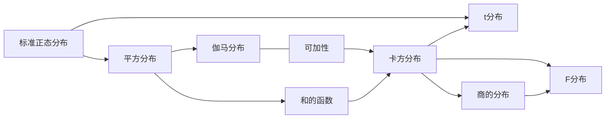

### 1.路线

```mermaid
graph LR
    标准正态分布 --> 平方分布;
    标准正态分布-->t分布;
    平方分布 --> 伽马分布; 
    伽马分布 --- 可加性;
    可加性 --> 卡方分布;
    平方分布-->和的函数;
    和的函数-->卡方分布;
    卡方分布--> F分布;
    卡方分布--> t分布;
    卡方分布--> 商的分布;
    商的分布--> F分布;
```
