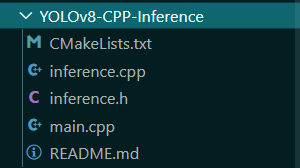
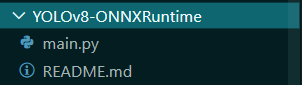

### 1.示例一
利用 `opencv-dnn` 的 `C++` 的代码截图如下

<center>

</center>

构建方法:在 `linux` 环境下进行编译,且要求`opencv` 环境要支持 `cv::dnn`
```
mkdir build &&  cd build
cmake ..
make -j 4
```

即可,如果环境支持`cuda` 更好.主体代码
```C++ {.line-numbers}
// 头文件

int main(int argc, char **argv)
{
    // gpu选项 ,需要将 opencv配置cuda+cudnn 环境
    bool runOnGPU = true;
    // 推理模型,重点
    Inference inf(${onnxfile_path}, ${image_size}$, ${classtxt_path}, runOnGPU);
    // ${classtxt_path} 这里会载入你的类别所以要配置

    // for 循环读图推理
    for (img : images)
    {
        // 推理得到目标定位框
        std::vector<Detection> output = inf.runInference(img);
        for (detect : output)
        {
            // 画边框
            // 填文本
        }
        // opencv 结果展示
    }
    return 0;
}

```

注意的是 `${classtxt_path}` 的文件内部应该是
```txt
class_1
class_2
...
class_n
```

这样的.


### 2.示例二
`YOLOv8-ONNXRuntime` 即 `onnxruntime` 运行,截图如下
<center>

</center>

只有 `main.py` ,其中它定义了一个 `YOlOv8` 的一个类,而主要的函数有
```python
## 定位框函数
1.draw_detections()
## 预处理函数
2.preprocess()
## 处理函数(包括推理)
3.postprocess()
## 结果函数
4.main()
## 初始化函数
5.__init__()
```

一张图像初始化一个`YOlOv8` 类,所以我们可以在内部进行修改然后再优化,改动如下:
```python
2.preprocess() # 添加 input_img

3.postprocess() # 添加 input_img

4.main() # 添加 input_img

5.__init__() # 删除 input_image 
```

详情请看 `./YOLOv8-ONNXRuntime/pred_video.py`,其中的类别是由
```
CLASSES = yaml_load(check_yaml('coco128.yaml'))['names']
```

得到的.

### 3.示例三
opencv-python 的 dnn ,像示例一,一样改一些关键部分即可. 