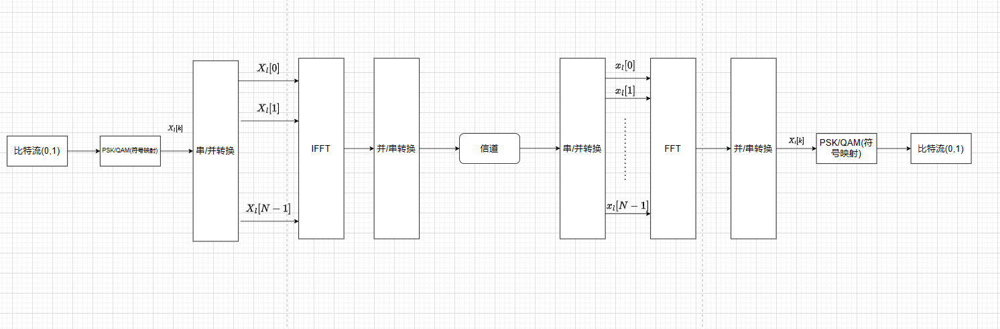

### 一.ODFM技术
相关词语说明:
* 符号:即一个码元,但是需要经过信息的抽象表示.
* 子载波:一个符号内有多个子载波,比如一个符号`h` ,可能是`010100101` ,而每个 `0,1` 都代表一个子载波.

在一个通信系统中，数字信息经过调制和编码处理，最终通过子载波进行传输，形成符号，进而实现可靠的通信。**每个符号内部有多个子载波**。

#### 1.流程图
最主要的调制解调流程如下:

流程:
发射方
*  将比特流进行符号映射.
*  将星座映射后的序列进行串转并处理
*  将并行信号乘以对应的复指数信号进行求和累加($IFFT$)
*  并转串处理,并且发送信号.

接收方:
* 将接收的信号进行串并转换
* 将并行信号乘以对应的复指数信号进行求和累加($FFT$)
* 将输出信号进行并转串处理
* 反符号映射得到比特流信号

其中的 $IFFT$ 和 $FFT$ 就是调制和解调的过程.

#### 2.原理
##### 2.1调制
ODFM发射机将数字信号的比特流映射成PSK或者QAM符号序列,之后将符号序列转换为 $N$ 个串/并行符号流,每 $N$ 个经过串/并转换后的符号被不同的子载波调制.
令 $X_l[k]$ 表示在第 $l$ 个符号上的第 $k$ 个子载波,其中 $l = 0,1,\cdots, k = 0,1,\cdots N - 1$ ;令 $\Phi_{l,k}(t)$ 表示第 $l$ 个符号上的第 $k$ 个载波持续 $T$ 秒的信号,则每个符号需要的传输时间为 $T_s = NT$ 则
$$\begin{align}
    \Phi_{l,k}(t) = \begin{cases}
        e^{j2\pi f_k(t - lT_s)} , 0 \leq t\leq T_s \\
        0, else
    \end{cases}
\end{align}$$

则连续时间的传输信号可以表示为
$$\begin{align}
    x_l(t) = \sum_{l=0}^{+\infty}\sum_{k=0}^{N-1}X_l[k]e^{j2\pi f_k(t - lT_s)}
\end{align}$$

其中 $f_k = \frac{k}{T_s}$ 表示每个符号的第 $k$ 个子载波的频率.在时刻 $t = lT_s + nT , T = \frac{T_s}{N} $ 时对 $ODFM$ 连续的信道进行抽样得到离散的符号
$$\begin{align}
    x_l[n] &= \sum_{n=0}^{N - 1}X_l[k]e^{j2\pi\frac{nk}{N}} \\
    &=\sum_{n=0}^{N - 1}X_l[k]e^{j\frac{2\pi}{N}nk}
\end{align}$$

通过计算式可以得到 $x_l[n]$ 是 $X_l[k]$ 的 $IFFT$.
注意:这里求和是因为串并转换了,一串信号变成了多个单一的信号然后乘以复指数信号再累加.

##### 2.2解调
考虑基带接收信号
$$\begin{align}
    y_l(t) = \sum_{k=0}^{N-1}X_l[k]e^{j2\pi f_k(t - lT_s)} , lT_s\leq t \leq lT_s + nT
\end{align}$$

通过正交信号的性质,我们可以利用正交信号进行解调,得到
$$\begin{align}
    Y_l[k] &= \frac{1}{T_s}\int^{+\infty}_{-\infty} y_l(t)e^{-j2\pi f_k(t - lT_s)} dt \\
    &=\frac{1}{T_s}\int^{+\infty}_{-\infty} [\sum_{n=0}^{N-1}X_l[n]e^{j2\pi f_n(t - lT_s)}]e^{-j2\pi f_k(t - lT_s)} dt \\
    &=\frac{1}{T_s}\sum_{n=0}^{N-1}X_l[n]\int^{+\infty}_{-\infty} e^{j2\pi f_n(t - lT_s)}e^{-j2\pi f_k(t - lT_s)} dt \\
    &=\frac{1}{T_s}\sum_{n=0}^{N-1}X_l[n]\int^{+\infty}_{-\infty} e^{j2\pi (f_n - f_k)(t - lT_s)} dt \\
    &=X_l[k]
\end{align}$$

在考虑没有信道和噪声的干扰下, $\{y_l[n]\},n=0,1,\cdots N - 1 $ 为 $y_l(t)$ 的抽样,则连续时间积分过程变为
$$\begin{align}
    Y_l[k] &= \sum_{n=0}^{N-1}y_l[n]e^{-j\frac{2\pi}{N}nk} \\
    &= \sum_{n=0}^{N-1}\frac{1}{N}\sum_{i=0}^{N-1}X_l[i]e^{j\frac{2\pi}{N}in}e^{-j\frac{2\pi}{N}nk} \\
    &= \frac{1}{N}\sum_{i=0}^{N-1}X_l[i]\sum_{n=0}^{N-1}e^{j\frac{2\pi}{N}n(i-k)} \\
    &=X_l[k]
\end{align}$$

上式是序列  $\{y_l[n]\},n=0,1,\cdots N - 1 $ 的  $FFT$.

总结:调制的每个子载波都是复指数信号进行调制,而解调的子载波则是调制的复指数信号的共轭信号进行调制.

---
#### 3.