### Anaconda
#### 1.Anaconda安装
我们需要anaconda配置python环境,首先去官网安装https://www.anaconda.com/ 。

点击下面的download即可。

等待安装完毕，双击exe文件,点击next。

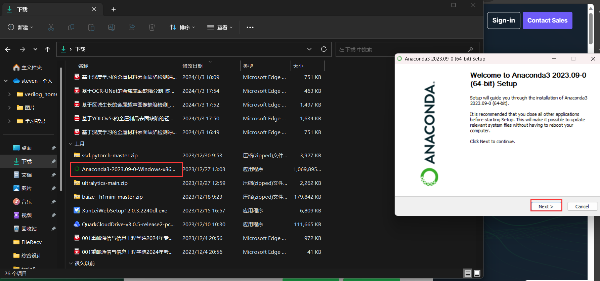

点击"I agree"。

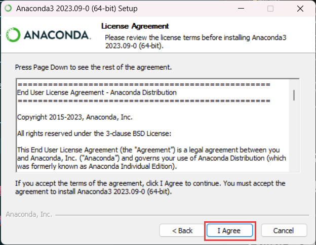

设置为所有用户安装。

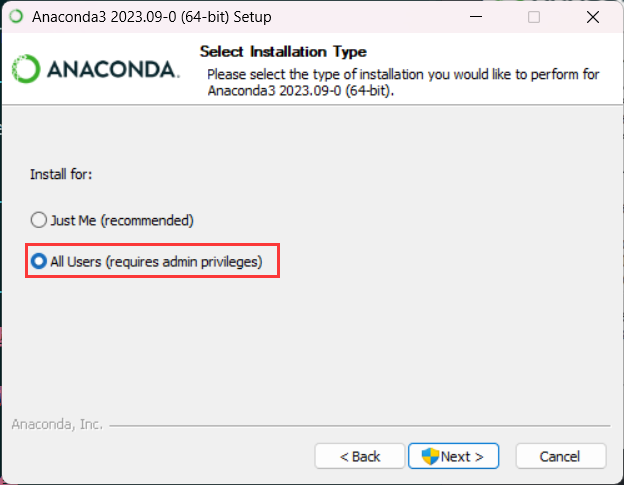

设置安装路径,最好安装在D盘或者E盘,不要安装到C盘里面,**这里一定要挑选好路径,后面还会用到这个路径**。

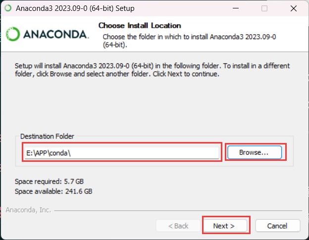

点击安装。

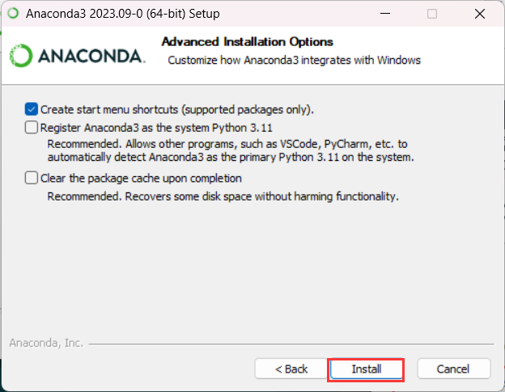

然后一直点`next` 即可。

#### 2.设置环境变量

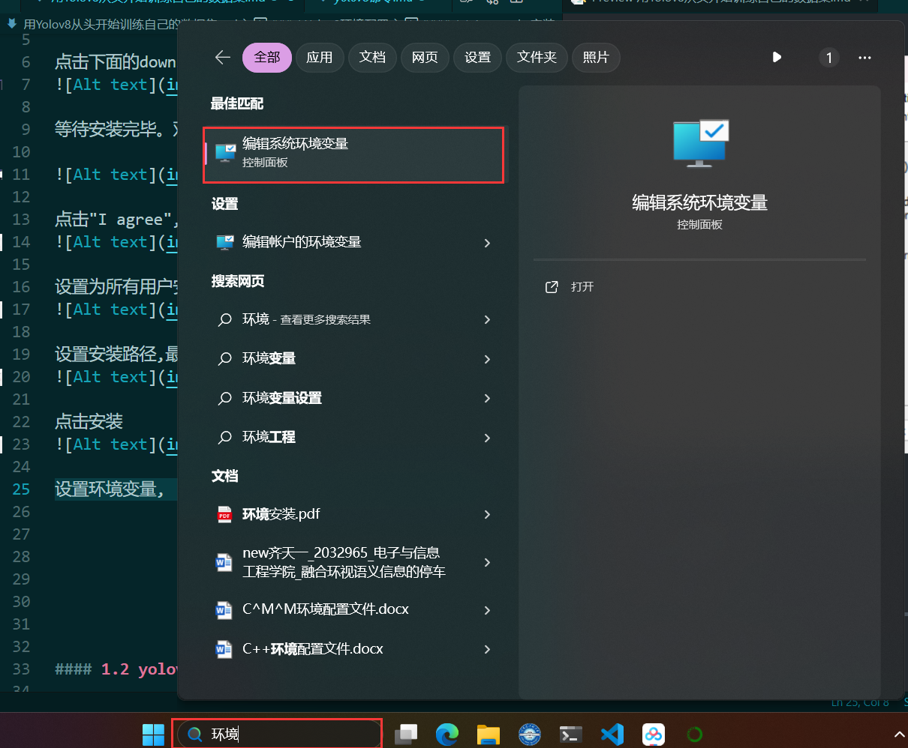

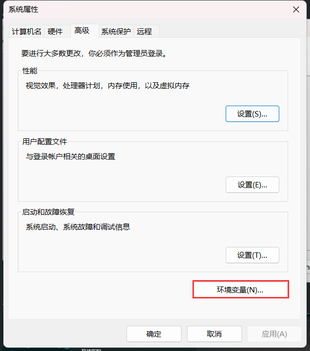

在系统变量中找到Path选项,双击它。

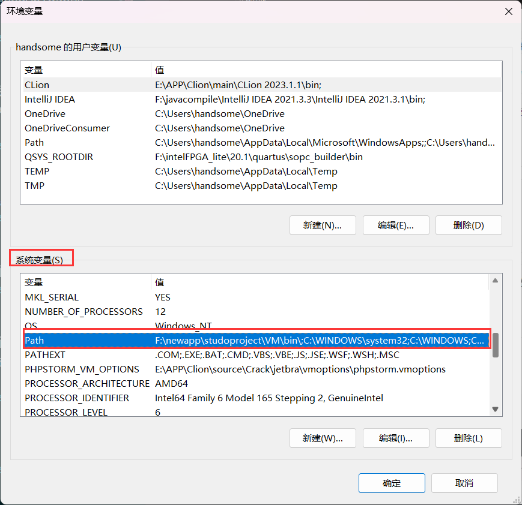

通过右上角的新建选项添加conda的环境路径。

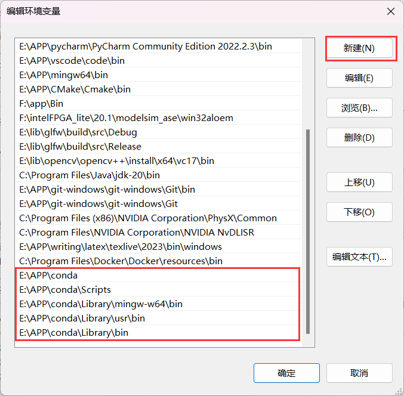

注意`E:\APP\conda` 是在安装路径时决定的,所以一定要注意，弄完以后点击确定即可。

#### 3.验证
验证conda是否生效，在系统搜索栏里面搜索cmd。

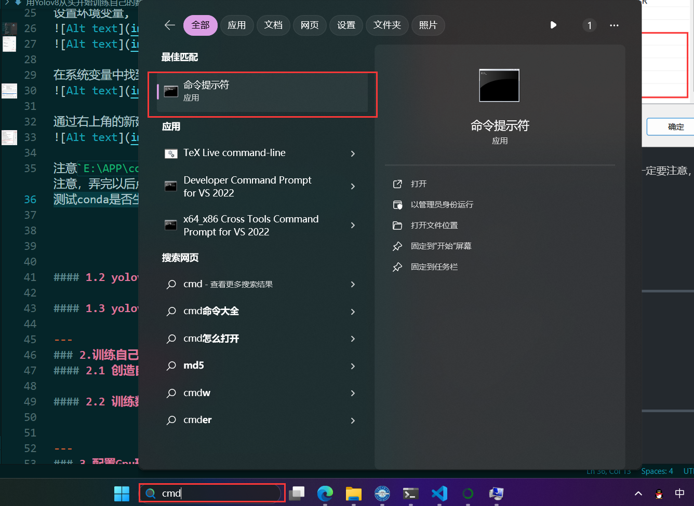

并且打开cmd，在命令行中输入`conda --version`，如果不报错，并且打印`conda` 的版本就是安装成功。

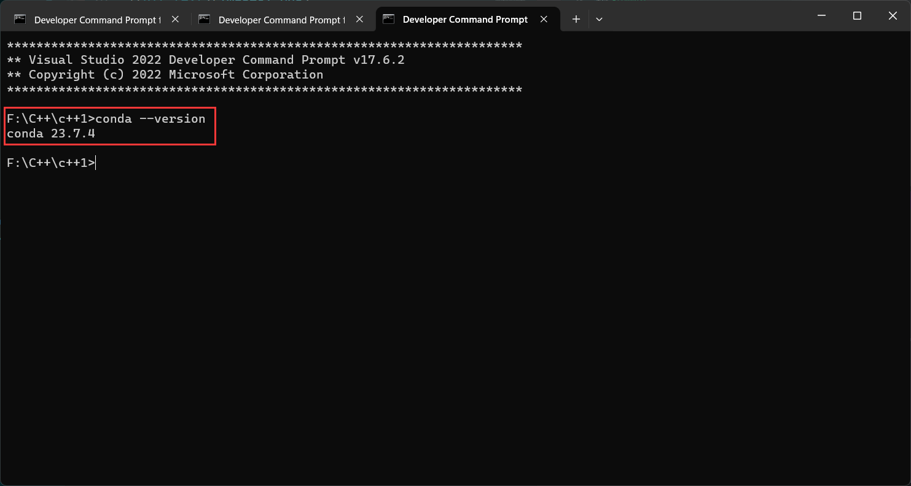

