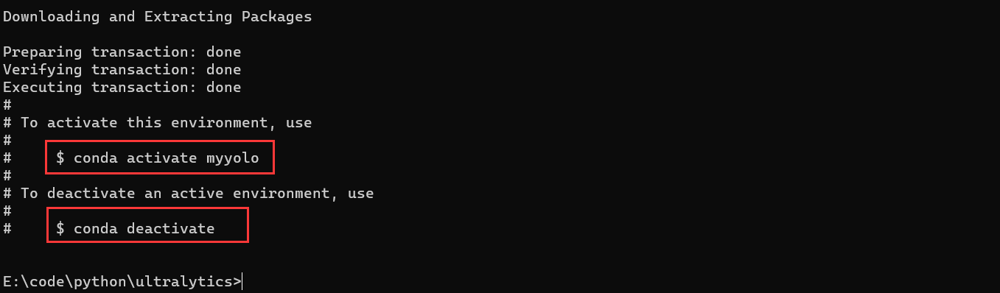

### yolov8环境配置

#### 1.安装源码
如果有魔法的就直接去网址 https://github.com/ultralytics/ultralytics 安装源码即可,没有的就用学长的网盘。
网盘链接：https://pan.baidu.com/s/1a2c3BKayXgQxHaq2qyrlMA 
提取码：yolo

#### 2.开始配置环境
将上述源码安装好后就解压缩，自己的路径要记好，下图只是一个示范
<center>

</center>

然后通过命令行转移到源码目录下
<center>

</center>

用`Anaconda`配置环境，先创建名称为`myyolo`,`python` 版本为3.8的虚拟环境，
<center>

</center>

在`Proceed` 这里输入 `y` (表达yes)即可,等待一会
<center>

</center>

出现下图内容就表示虚拟环境创建成功
<center>

</center>


用命令 `activate myyolo` 如果不行就用`conda activate myyolo`打开虚拟环境,可以到看命令行右边就有`myyolo` 标签
<center>

</center>

用`pip` (一个`python`专用的依赖库下载工具)安装依赖,先设置好国内镜像源`pip config set global.index-url https://mirrors.ustc.edu.cn/pypi/web/simple
`
<center>

</center>

然后安装依赖:在当前目录下运行 `pip install -r requirements.txt` (该命令是让 `pip` 逐个安装`requirements.txt`文件中依赖库)
<center>

</center>


之后就是漫长的等待,等待库安装成功,部分截图
<center>

</center>
<center>

</center>

然后就是安装必要依赖
<center>

</center>

环境就安装完毕

#### 3.官方预训练模型测试
安装一个预训练模型权重,
`yolov8n.pt`: https://github.com/ultralytics/assets/releases/download/v0.0.0/yolov8n.pt
`yolov8s.pt`: https://github.com/ultralytics/assets/releases/download/v0.0.0/yolov8s.pt

学长的百度网盘里面有 `yolov8n.pt` 文件,把它转移到源码目录下即可
<center>

</center>

通过命令行运行`yolo predict model=./yolov8n.pt source='./ultralytics/assets/bus.jpg'` ,`·/ultralytics/assets/bus.jpg` 是在`yolov8`源码自带的图像
<center>

</center>

发现结果图像在当前目录下的 `runs/detect/predict3`(注意看目录,第一次生成应该是`runs/detect/predict`,学长的是因为已经生成过多次了),查看结果图
<center>

</center>


### 3.运行自己拍摄的图片
#### 3.1 命令行
用自己的手机拍照,然后上传到电脑端,用命令
```shell
yolo predict model=./yolov8n.pt source=图像路径
```

即可使用模型推理自己的数据。注意:要在源码目录下运行代码。

#### 3.2 代码
在源码路径有`example`文件夹,而`./examples/YOLOv8-OpenCV-ONNX-Python` 使用 `opencv-python` 和`.onnx` 文件推理部署的;我们可以用该代码进行推理。
首先把`.pt`权重转换为 `.onnx`,如下图
<center>

</center>

在当前目录下得到`.onnx` 文件然后把该 `.onnx` 文件转移到`./examples/YOLOv8-OpenCV-ONNX-Python` 中,再用vscode或者直接打开`./examples/YOLOv8-OpenCV-ONNX-Python` 的`main.py` 文件
<center>

</center>


其中主要的代码如下,将主要代码改一下即可
``` python
parser = argparse.ArgumentParser()
## 设置你的onnx文件路径,这一行要改
parser.add_argument('--model', default='./best.onnx', help='Input your ONNX model.')
## 设置检测的图像,这一行要改
parser.add_argument('--img', default='E:\\dataset\\medal\\NEU\\Sc_82.bmp', help='Path to input image.')
args = parser.parse_args()
main(args.model, args.img)
```

然后在命令行中运行`python main.py`,用默认参数运行
<center>

</center>


也可以在命令行中替换参数
```shell
## 修改图像路径
python main.py --img E:\\dataset\\medal\\NEU\\Sc_86.bmp 
```
<center>

</center>

模板:
```shell
python main.py --model .onnx模型路径 --img 图像路径
```


#### 3.3 命令行方法和代码方法比较
命令行方法比较快捷简便但是不能进行魔改，代码方法比较复杂但是你可以把内部代码进行魔改，添加pyqt模块和其他模型做成一个软件或者视频流算法。