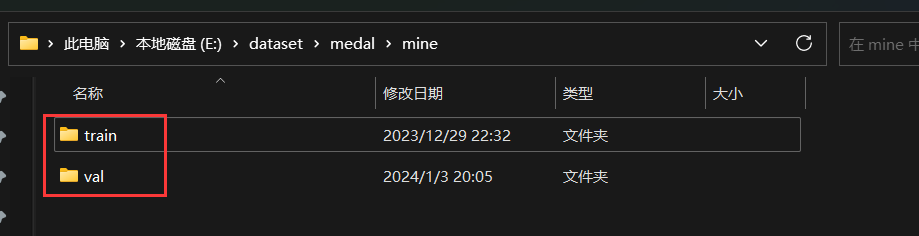
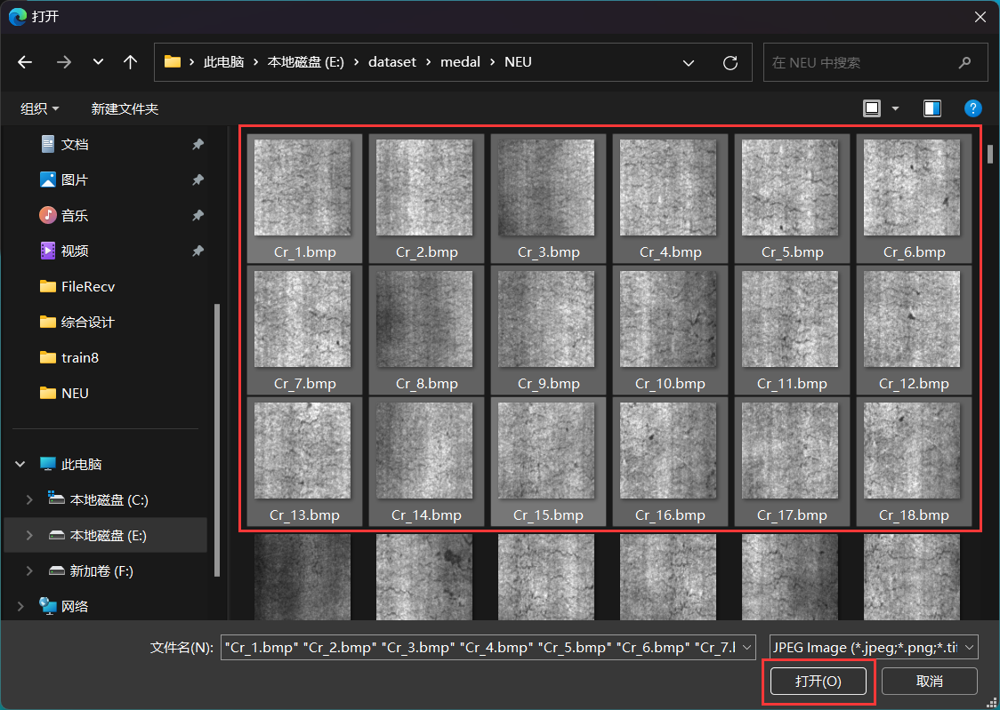

### 创建数据集
本文旨在帮助大家创建属于自己的yolo格式的数据集。


#### 1.数据集格式
数据集分为训练集(`train`)和验证集(`val`),训练集用于训练模型,验证集用于验证模型的真正能力,一个数据集的训练集和验证集的比例一般为 `7:3`,
yolo模型数据集**要求的格式**如下:
```
data
    |-- train
    |   |-- image/images
    |        |-- xx1.jpg
    |        |-- xx2.jpg
    |        ...
    |   |-- labels
    |        |-- xx1.txt
    |        |-- xx2.txt
    |        ...
    |-- val
        |-- image/images
             |-- xx1.jpg
             |-- xx2.jpg
             ...
        |-- labels
             |-- xx1.txt
             |-- xx2.txt
             ...
```

如图(仅展示train文件夹,val文件夹是一样的)
<center>

</center>

进入到`train`文件夹中
<center>

</center>

进入到`image/images`文件夹中
<center>

</center>

进入到`labels` 文件夹中
<center>

</center>


#### 2.创建数据集
知道了数据集文件的格式,我们就需要来创建对应格式的数据,有了图像以后我们需要获得定位框的数据标签。
标签的标注一般学长是使用makesense网站 :https://www.makesense.ai/ ,其标注的流程就是:打开网站后点击右下角的`Get Started`
<center>

</center>

点击中间的`drop image/images`
<center>

</center>

选择你要标注的图像,支持一次标注多张图像
<center>

</center>

点击`Object Detection`
<center>

</center>


添加标签,在文本框中填写标签名,如果还要添加其他的标签点击键盘上的`enter` 键,他会自动添加一个标签然后让你填写,添加完所有标签后点击 `Start Project`
<center>

</center>

通过选择定位框,然后添加标签,单个图像标签弄完后,在左边点击下一个图像即可开始标下一个
<center>

</center>

所有图像标完后,点击上方的`Actions` 的`Export rect annotations`
<center>

</center>

勾选 `yolo` 格式的标签,然后点击 `Export` 键即可
<center>

</center>

就会导出用于`yolo`训练的标签数据(注意只有标签数据)
<center>

</center>
<center>

</center>

把标签数据和图像数据整理成**要求的格式**即可.