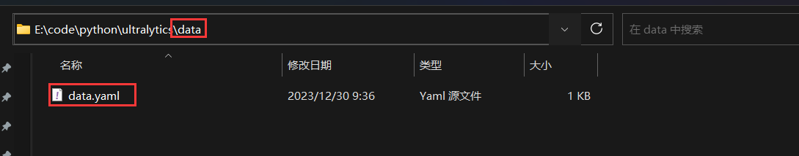
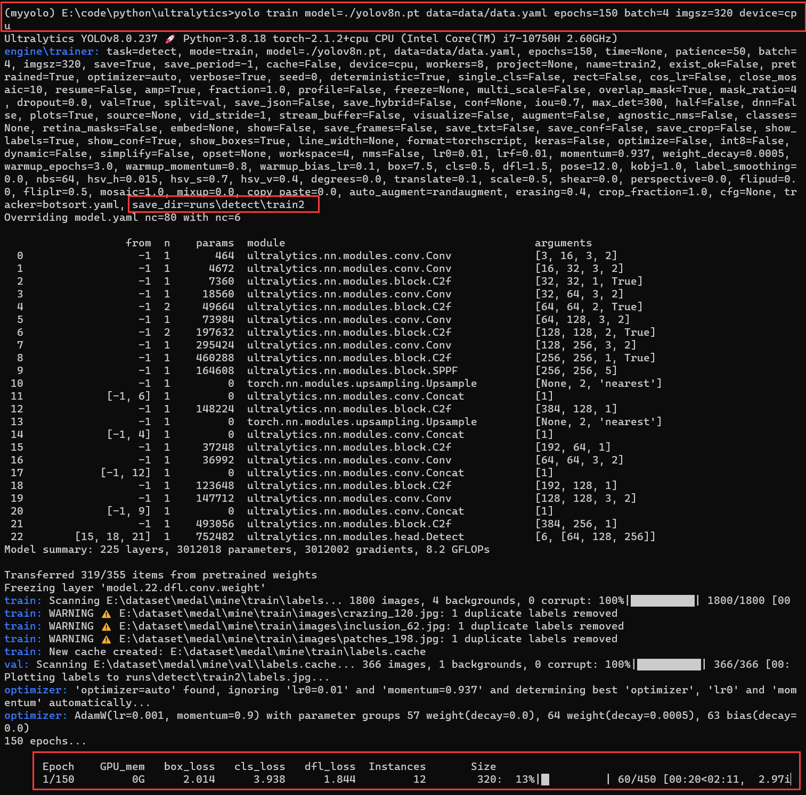
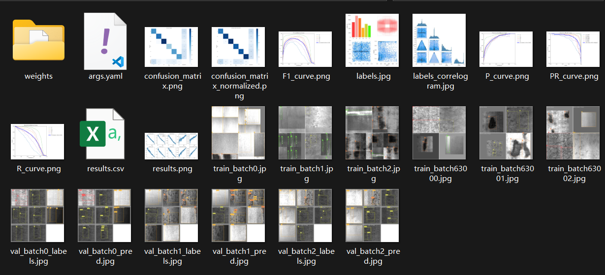
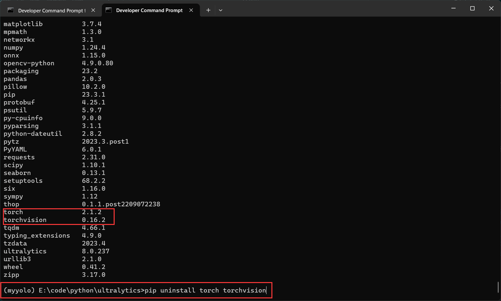
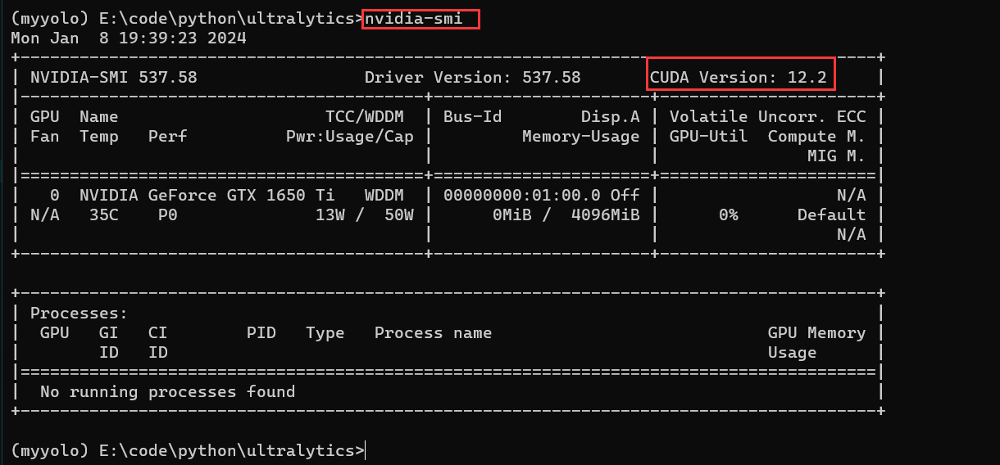
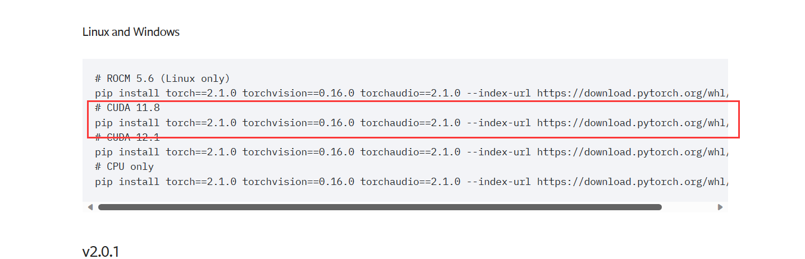
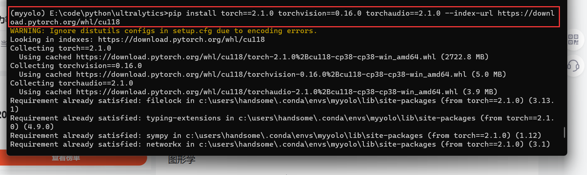
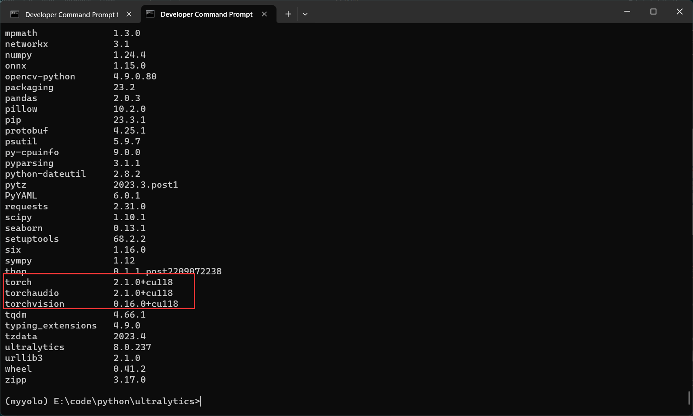

### 训练
在 `1.创建自己的数据集` 中我们创建了自己的数据集,假设数据集的路径为`${dataset_path}` ,那么其中的路径有:
* 训练集:`${dataset_path}/train`
* 验证集:`${dataset_path}/val`

例如:
* `${dataset_path} = E:/dataset`
* 训练集路径:`E:/dataset/train`
* 验证集路径:`E:/dataset/val`

其中的图像和标签是按照1.中最后所说那样。


#### 1.配置格式文件
在当前目录下创建一个`data` 文件夹,在`data` 文件夹下创建一个`data.yaml` 文件,
<center>

</center>


打开`data.yaml` 文件,并且添加以下内容
```yaml
## 训练集路径
train: ${dataset_path}/train
## 验证集路径
val: ${dataset_path}/val
## 标签数量
nc: 6 
## 标签的类别
names: ["cr","in","pa","ps","rs","sc"]
```

注意:上述内容是学长训练自己数据的示范,训练自己的数据还需要从头填写你自己的内容。


#### 2.训练开始
在yolo源码的目录下,运行命令
```shell
## 激活虚拟环境,如果已经激活就可以不运行
activate myyolo
```

##### 2.1 cpu训练
```shell
## 开始训练
yolo train model=./yolov8n.pt data=data/data.yaml epochs=150 batch=4 imgsz=320 device=cpu
```
其中参数解释如下:
* train : 训练模式
* model : 预训练权重路径
* data : 训练设置的yaml文件路径
* epochs : 训练的轮数
* batch : 一次前向计算的图像张数
* imgsz : 模型输入图像的尺寸可填:[640,320],主要是为了减小运行内存,无论填哪个都可以允许,模型会在训练时将你的数据resize到适合训练的尺寸。
* device : 训练设备,可选:cpu,gpu(0,1,2,3)
开始训练后可以看到如下内容
<center>

</center>

在途中我们可以看到训练保存的路径,以及训练的进度。训练结束后我们到保存目录下可以看到如下内容
<center>

</center>

其中 `weights` 文件夹是最重要的,里面
* best.pt : 训练中loss最小那一轮的权重文件
* last.pt : 训练最后一轮的权重文件

而其他文件,比如`args.yaml` 记录训练的一些参数设置,其他的图像记录了损失曲线,指标曲线。
测试,`.pt` 文件里面包含了模型权重和一些其他的功能函数,可以直接用,比如
```
yolo predict model=best.pt source=图像路径
```

可以直接得到预测的结果;如果转为`.onnx` 文件,我们还需要改一些源码,这个会在之后的内容讨论。


##### 2.2 gpu训练
首先要配置 `cuda + cudnn` ,这里推荐网址: https://blog.csdn.net/qq_41946216/article/details/129476960?ops_request_misc=%257B%2522request%255Fid%2522%253A%2522170471383716800225544505%2522%252C%2522scm%2522%253A%252220140713.130102334..%2522%257D&request_id=170471383716800225544505&biz_id=0&utm_medium=distribute.pc_search_result.none-task-blog-2~all~sobaiduend~default-1-129476960-null-null.142^v99^pc_search_result_base4&utm_term=windows11%E9%85%8D%E7%BD%AEcuda&spm=1018.2226.3001.4187

同时虚拟环境`myyolo` 中 `cpu`版本的 `torch,torchvision` 删除,如下图
<center>

</center>

查询`cuda` 的版本,
<center>

</center>

去`torch`官网安装对应版本或者较低版本的`torch,torchvison` ,网址 : https://pytorch.org/get-started/previous-versions/ ,如图学长安装适合 `cuda-11.8`的`torch,torchvison` 
<center>

</center>

将命令复制粘贴到命令行中运行
<center>

</center>

然后就是等它下完,下完以后查看是否为 `cuda` 适配的,如图在命令行中运行 `pip list`
<center>

</center>

如果后面跟着 `cuxxx` 就说明是安装上`cuda` 版本的`torch`了,现在用`gpu`训练,到`yolov8` 的源码目录,运行命令
```shell
yolo train model=./yolov8n.pt data=data/data.yaml epochs=150 batch=4 imgsz=320 device=0
```

注意这里只用`device` 发生了变化,如果有多个`gpu` 那么,`device=0,1,2...` 也可以,`gpu` 训练在这里只有加速训练的作用,并不会对最后的权重 `best.pt,last.pt` 产生什么其他的影响.测试:
```shell
yolo predict model=模型路径 source='图像路径'
```