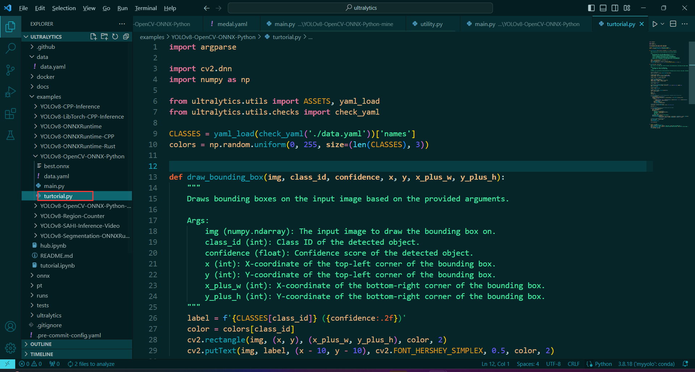
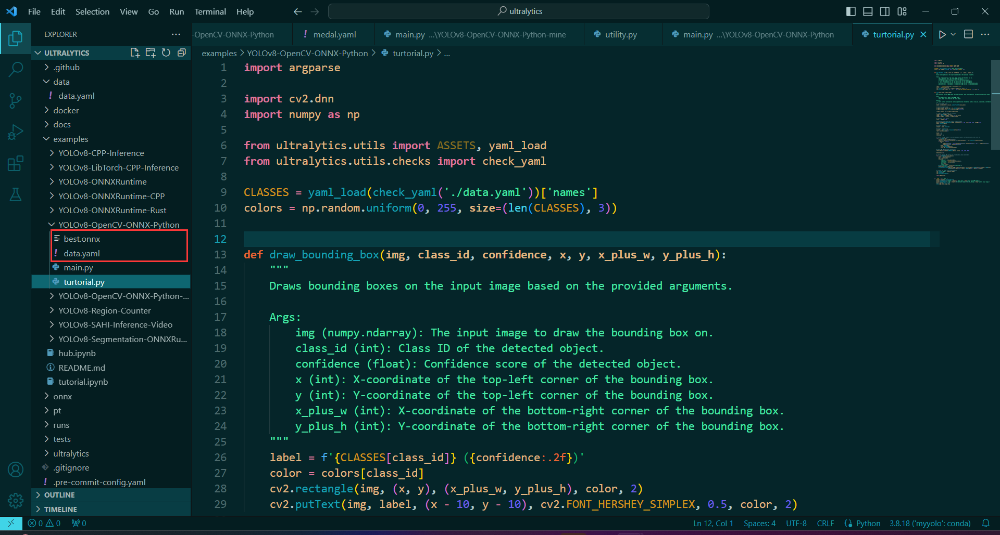
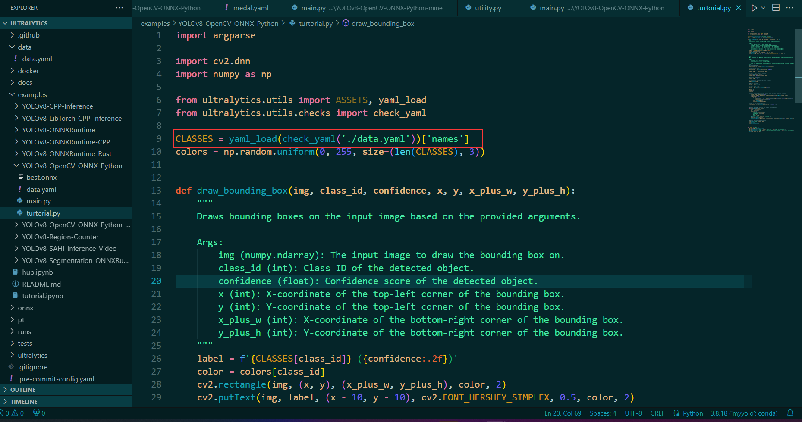
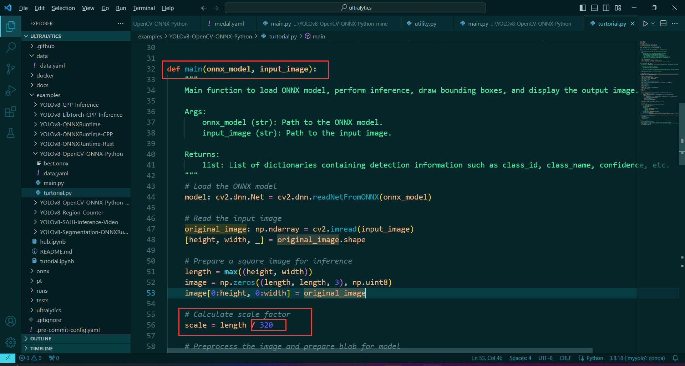
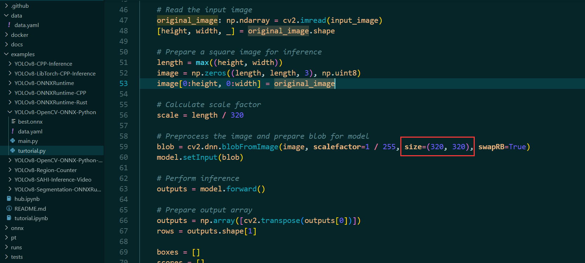

首先,在 `./examples/YOLOv8-OpenCV-ONNX-Python` 窗建一个 `turtorial.py` 文件,将`main.py` 的代码复制到 `turtorial.py` 中
<center>

</center>

然后将你训练自己数据集得到的`data.yaml` 和 `best.onnx` 预训练权重复制到该目录下
<center>

</center>

改动以下代码：
* 第一处:

<center>

</center>
把 `check_yaml`内的路径换为当前目录下的 `data.yaml` 文件.

* 第二处
  
<center>

</center>

将 `main` 函数中的 `scale` 的分母改为训练时的 `imgsz`.
* 第三处

<center>

</center>

把第二处下面的 `size` 改成训练时的 `imgsz`.


---
上述三处地方改完后就可以运行代码，在当前文件夹打开`cmd` 命令行,或者打开命令行 `cmd` 然后再转移到当前目录下
```shell
## 其中虚拟环境
activate myyolo
```

运行:
```shell 
python main.py --model ./best.onnx --img 图像路径
```

即可.