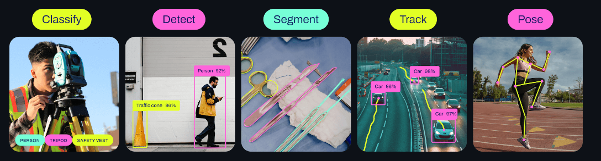

### 简介
YOLO是一种基于深度学习的目标检测算法，它的主要思想是将整个图像划分为网格，并在每个网格上预测边界框和类别，从而实现对图像中目标的快速检测。
YOLOv8的开源实现通常是基于Darknet框架，由Joseph Redmon和Alexey Bochkovskiy等人开发和维护。此外，社区中也可能有其他的实现和改进版本。
其常见功能为：
* Classify 分类
* Detect 定位
* Segment 分割
* Track 追踪
* Pose 位姿

如下图所示

其中最常用的功能就是定位功能，本文章旨在教授学弟学妹们如何使用yolov8和用yolov8在定位功能上训练自己的模型，其他功能的使用和训练与定位相差不大。
Yolov8的官方开源库:https://github.com/ultralytics/ultralytics
Yolov8的官方文档:https://docs.ultralytics.com/