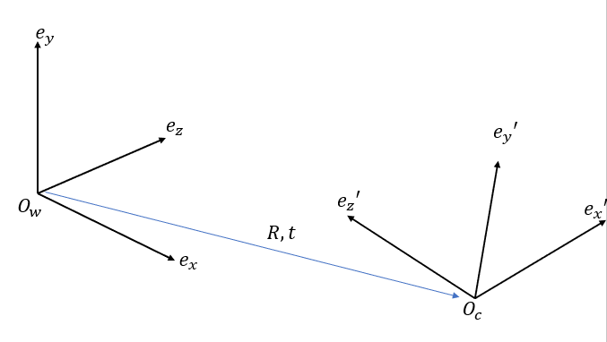
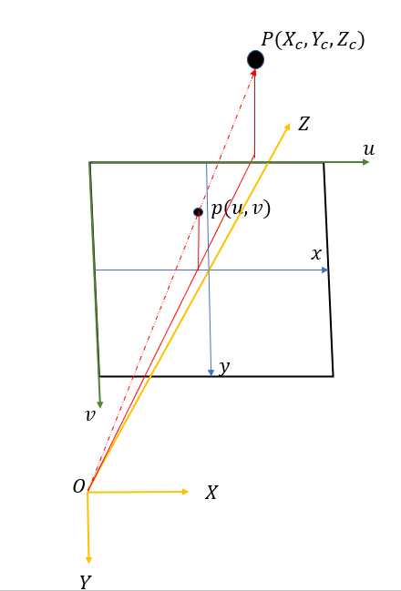
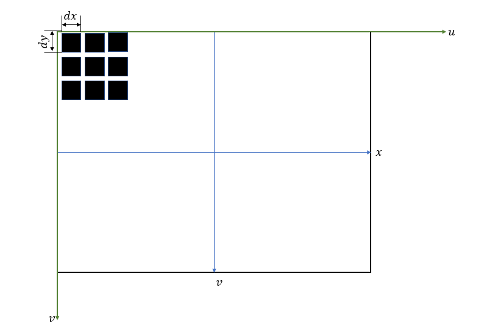

### 1.原理
#### 1.1 世界坐标系到相机坐标系

三维坐标系的转换由一个欧氏变换描述
$$\begin{align}
    \begin{bmatrix}
        X_c \\ Y_c \\ Z_c \\1
    \end{bmatrix} = \begin{bmatrix}
        R & t \\
        0^T & 1
    \end{bmatrix} \begin{bmatrix}
        X_w \\ Y_w \\ Z_w \\1
    \end{bmatrix}
\end{align}$$

其中 $R \in So(3) , t \in R^{3 \times 1}$, 其中特征正交群的定义为 $So(3) =\{R| R \in R^{3\times 3} ,RR^T = E ,det(R) = 1\}$.

#### 1.2 相机坐标系到图像平面

利用投影原理和相似三角形定理有
$$\begin{align}
    \begin{cases}
        x = \frac{f}{Z_c} X_c \\
        y = \frac{f}{Z_c} Y_c \\
        z = f
    \end{cases} \rightarrow \begin{bmatrix}
        x \\ y  \\1
    \end{bmatrix} = \frac{1}{Z_c}\begin{bmatrix}
        f & 0 & 0 & 0\\
        0 & f & 0 & 0 \\
        0 & 0 & 1 & 0 
    \end{bmatrix} \begin{bmatrix}
        X_c \\ Y_c \\ Z_c \\1
    \end{bmatrix}
\end{align}$$

注意，图像平面上的点的 $z$ 坐标都是 $f$ ,所以在左侧我们不考虑 $z$ 坐标；再将图像平面转移到左上角
$$\begin{align}
    \begin{cases}
        x' = x + m_x \\
        y' = y + m_y
    \end{cases} \rightarrow \begin{bmatrix}
        x' \\ y' \\ 1
    \end{bmatrix} \begin{bmatrix}
        1 & 0 & m_x \\
        0 & 1 & m_y \\
        0 & 0 & 1 
    \end{bmatrix}\begin{bmatrix}
        x \\ y  \\1
    \end{bmatrix}
\end{align}$$

#### 1.3 图像平面转换为像素平面
通过对图像平面$x,y$ 轴等距采样有

$$\begin{align}
    \begin{cases}
        u = \frac{x'}{dx} \\
        v = \frac{y'}{dy}
    \end{cases} \rightarrow \begin{bmatrix}
        u \\ v \\ 1
    \end{bmatrix} = \begin{bmatrix}
        \frac{1}{dx} & 0 & 0 \\
        0 & \frac{1}{dy} & 0 \\
        0 & 0 & 1
    \end{bmatrix}\begin{bmatrix}
        x' \\ y' \\ 1
    \end{bmatrix}
\end{align}$$

#### 1.4总结
合起来有
$$\begin{align}
    \begin{bmatrix}
        u \\ v \\ 1
    \end{bmatrix} &= \begin{bmatrix}
        \frac{1}{dx} & 0 & 0 \\
        0 & \frac{1}{dy} & 0 \\
        0 & 0 & 1
    \end{bmatrix}\begin{bmatrix}
        1 & 0 & m_x \\
        0 & 1 & m_y \\
        0 & 0 & 1 
    \end{bmatrix}\frac{1}{Z_c}\begin{bmatrix}
        f & 0 & 0 & 0\\
        0 & f & 0 & 0 \\
        0 & 0 & 1 & 0 
    \end{bmatrix}\begin{bmatrix}
        R & t \\
        0^T & 1
    \end{bmatrix} \begin{bmatrix}
        X_w \\ Y_w \\ Z_w \\1
    \end{bmatrix} \\
    &=\frac{1}{Z_c}\begin{bmatrix}
        \frac{1}{dx} & 0 & \frac{m_x}{dx} \\
        0 & \frac{1}{dy} & \frac{m_y}{dy} \\
        0 & 0 & 1
    \end{bmatrix}\begin{bmatrix}
        f & 0 & 0 & 0\\
        0 & f & 0 & 0 \\
        0 & 0 & 1 & 0 
    \end{bmatrix}\begin{bmatrix}
        R & t \\
        0^T & 1
    \end{bmatrix} \begin{bmatrix}
        X_w \\ Y_w \\ Z_w \\1
    \end{bmatrix} \\
    &= \frac{1}{Z_c} \begin{bmatrix}
        \frac{f}{dx} & 0 & \frac{m_x}{dx} & 0 \\
        0 & \frac{f}{dy} & \frac{m_y}{dy} & 0 \\ 
        0 & 0 & 1 & 0
    \end{bmatrix}\begin{bmatrix}
        R & t \\
        0^T & 1
    \end{bmatrix} \begin{bmatrix}
        X_w \\ Y_w \\ Z_w \\1
    \end{bmatrix} \\
    &=\frac{1}{Z_c}\begin{bmatrix}
        \frac{f}{dx} & 0 & \frac{m_x}{dx} \\
        0 & \frac{f}{dy} & \frac{m_y}{dy} \\ 
        0 & 0 & 1 
    \end{bmatrix}\begin{bmatrix}
        I|0
    \end{bmatrix}\begin{bmatrix}
        R & t \\
        0^T & 1
    \end{bmatrix} \begin{bmatrix}
        X_w \\ Y_w \\ Z_w \\1
    \end{bmatrix} \\
    &= \frac{1}{Z_c} \begin{bmatrix}
        f_x & 0 & c_x \\
        0 & f_y & c_y \\
        0 & 0  & 1  
    \end{bmatrix}\begin{bmatrix}
        I|0
    \end{bmatrix}\begin{bmatrix}
        R & t \\
        0^T & 1
    \end{bmatrix} \begin{bmatrix}
        X_w \\ Y_w \\ Z_w \\1
    \end{bmatrix} \\
    &=\frac{1}{Z_c}\begin{bmatrix}
        f_x & 0 & c_x \\
        0 & f_y & c_y \\
        0 & 0  & 1  
    \end{bmatrix}\begin{bmatrix}
        R|t
    \end{bmatrix}\begin{bmatrix}
        X_w \\ Y_w \\ Z_w \\1
    \end{bmatrix}
\end{align}$$

记
$$\begin{align}
    K = \begin{bmatrix}
        f_x & 0 & c_x \\
        0 & f_y & c_y \\
        0 & 0  & 1  
    \end{bmatrix}
\end{align}$$

由此得到最后的相机矩阵 $P = K[R|t]$。这里没有加 $Z_c$ 是因为，在中间过程中我们可以使用齐次坐标去掉 $Z_c$.

畸变是在摄像机平面到图像平面映射时产生的，径向畸变和切向畸变可以参考网上说的。