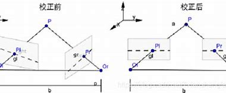

### 1.原理
#### 1.1 左右摄像机坐标系转换
无矫正的双目相机模型为

这个时候,参数左右相机的外参 $R_l,t_l,R_r,t_r$内参矩阵 $K_l,K_r$ ,左右相机的相机矩阵为
$$\begin{align}
    P_l = K_l[R_l|t_l]\\
    P_r = K_r[R_r|t_r]
\end{align}$$

可知对于同一个世界点映射到左右相机的像素坐标为
$$\begin{align}
    u_l = P_rX \\
    u_r = P_rX
\end{align}$$

由于左右相机的的摄像机坐标系也是一个三维坐标系,那么左摄像机也可以由刚性变换转换到右摄像机,利用上述的参数有
$$\begin{align}
    X_{c}^l = R_lX_w + t_l \\
    X_{c}^r = R_rX_w + t_r 
\end{align}$$

我们得到
$$\begin{align}
    X_w &= R_l^{-1}(X_c^l - t_l) \\
    &= R^{-1}_r(X_c^r - t_r)
\end{align}$$

得到
$$\begin{align}
    X_c^l &= R_lR_r^{-1}(X_c^r - t_r) + t_l \\
    &=R_lR_r^TX_c^r + (t_l - R_lR_r^Tt_r)
\end{align}$$ 

易得左相机到右相机的旋转矩阵 $R$ 和平移向量 $t$ 为
$$\begin{align}
    \begin{cases}
        R = R_lR_r^T \\
        t = t_l - Rt_r
    \end{cases}
\end{align}$$

其中 $t$ 的模就是基线长.

#### 1.2 矫正原理
有两种矫正方法,第一种是将左右相机的极点映射到无穷远处,如下图

思路就是通过 $x_l^TFx_r = 0$ 用左右对应的像素点计算出基本矩阵,得到 $F$,然后求出左右极点 $e,e'$，利用仿射变换 $H,H'$ 使得极点在无穷远处.第二种方法是基于我们上面的旋转矩阵,简单来说就是将左相机向着极线方向旋转一半的角度，右相机沿着左相机的方向逆着旋转一半的角度,那么我们就得到了两个平行的相机

我们利用 $so(3)$ 和 $So(3)$ 的关系(李代数和李群),利用 $R$ 求得它的旋转向量 $\phi$ ,将它的模值变成原来的一半,然后再转换为 $R_{l'}$,并且易得
$$\begin{align}
    R_{r'} = R_{l'}^{-1}
\end{align}$$

为了将极线矫正到平行线上,我们还需要选择一个旋转 $R_{rect}$ ,使得
$$\begin{align}
    R^l_{rect} =  R_{rect}R_{l'} \\
    R^r_{rect} =  R_{rect}R_{r'}
\end{align}$$

这样就可以矫正图像了,此时矫正的后的相机为

实际的图像效果为

从左目到右目就只有平移而没有旋转了,注意旋转之后的平移也会随之变化,不再是之前的平移了.

#### 1.3 双目三维重建模型
在矫正之后,将左目相机的摄像机坐标系视为世界坐标系,那么左目的外参和内参可以分别写为
$$\begin{align}
    P_l' &= \begin{bmatrix}
        f_x & s & c_x \\
        0 & f_y & c_y \\
        0 & 0 & 1  
    \end{bmatrix}[I|0]\begin{bmatrix}
        I & 0 \\
        0^T & 1
    \end{bmatrix} \\
    &=K_l[I|0]
\end{align}$$

由于矫正之后左目摄像机坐标系到右目摄像机坐标系只剩平移,所以右目的外参和内参为
$$\begin{align}
    P_r' &= K_r[I|T]
\end{align}$$

其中由于 $O_l,O_r$ 是平行的,所以 $T$ 只有一个非零元素,这里就假定为
$$\begin{align}
    T = (T_x,0,0)^T
\end{align}$$

那么将三维坐标系 $X,Y$ 轴扁平化有

上图中 $P(X,Y,Z)$ 是世界点(基于左目摄像机坐标系), $x_l/x_r$ 是 $P$ 映射到左目/右目的图像平面上的坐标, $f$ 是焦距, $Z$ 是距离相机光心的深度;
以 `世界坐标系->摄像机坐标系->图像平面` 的流程推导 $x_l,x_r$ ,
a.左目的 $x_l$,世界坐标系到摄像机坐标系下是一个单位矩阵
$$\begin{align}
    \begin{bmatrix}
        X_l \\ Y_l \\ Z_l
    \end{bmatrix} = E \begin{bmatrix}
        X \\ Y \\ Z 
    \end{bmatrix} + 0
\end{align}$$

摄像机坐标系到图像平面的映射利用相似三角有
$$\begin{align}
    x_l = \frac{f}{Z}X
\end{align}$$

b.左目的 $x_l$,世界坐标系到摄像机坐标系下是一个单位矩阵
$$\begin{align}
    \begin{bmatrix}
        X_l \\ Y_l \\ Z_l
    \end{bmatrix} &= E \begin{bmatrix}
        X \\ Y \\ Z 
    \end{bmatrix} +  \begin{bmatrix}
        T_x \\ 0 \\ 0 
    \end{bmatrix} \\
    &= \begin{bmatrix}
        X + T_x \\ Y \\ Z 
    \end{bmatrix}
\end{align}$$

摄像机坐标系到图像平面的映射利用相似三角有
$$\begin{align}
    x_r = \frac{f}{Z}X + \frac{fT_x}{Z}
\end{align}$$

注意上式并没有将图像平面的中心移动到左上角,于是有
$$\begin{align}
    x_l - x_r = -\frac{fT_x}{Z} \rightarrow Z = -\frac{fT_x}{d}
\end{align}$$

其中 $d = x_l - x_r < 0$ 为视差值,也就是左右目相机的图像平面的相同目标投影点的相对距离差,由此我们可以得到物体的深度 $Z$,并且我们可以左目相机对于该点的坐标
$$\begin{align}
    X = \frac{Z}{f}x_l , Y = \frac{Z}{f}y_l , Z = \frac{fT_x}{|d|}
\end{align}$$

#### 1.4 考虑像素采样
考虑图像平面平移和采样,左目
$$\begin{align}
    u_l &= \frac{1}{dx}(\frac{f}{Z}X + m_x) =\frac{f_x}{Z}X + c_x \\
    v_l &= \frac{1}{dy}(\frac{f}{Z}Y + m_y) =\frac{f_y}{Z}Y + c_y
\end{align}$$

右目
$$\begin{align}
    u_r &= \frac{1}{dx}(\frac{f}{Z}X + \frac{fT_x}{Z} + m_x) = \frac{f_x}{Z}X + c_x + \frac{f_x}{Z}T_x \\
    v_r &= \frac{1}{dy}(\frac{f}{Z}Y + m_y) = \frac{f_y}{Z}X + c_y
\end{align}$$

则
$$\begin{align}
    u_l - u_r = - \frac{f_x}{Z}T_x \rightarrow Z = -\frac{f_xT_x}{d}
\end{align}$$

可以看到和图像平面仅仅相差一个采样因子的差距,一般来说采样因子是不用考虑的,因为在双目标定时,我们就会将现实中真正的度量(mm) 带入到标定程序中(将图像点<-->世界点中的世界点序列带入真正的单位)
$$\begin{align}
    \begin{bmatrix}
        u \\ v \\ 1
    \end{bmatrix} &= \frac{1}{Z_c}\begin{bmatrix}
        f_x & 0 & c_x \\
        0 & f_y & c_y \\
        0 & 0  & 1  
    \end{bmatrix}\begin{bmatrix}
        R|t
    \end{bmatrix}\begin{bmatrix}
        X_w \\ Y_w \\ Z_w \\1
    \end{bmatrix}
\end{align}$$

在正向投影时,世界点转换为图像点,逆向投影时 $f_x,f_y,c_x,c_y$ 隐含了度量的信息,所以可以直接使用.(这里面其实隐含了欧氏变换不会改变度量的性质,相似变换才会改变度量)

#### 1.5 总结
根据上面的原理，假设我们已经知道了像素点 $(u,v)$ 的视差值 $d_{u,v}$ ,那么可以通过以下步骤来获取三维坐标
* 平移
$$\begin{align}
\begin{cases}
    x = u - c_x \\
    y = v - c_y
\end{cases}    
\end{align}$$

* 求深度
$$\begin{align}
    Z = -\frac{fT_x}{d}
\end{align}$$

* 求坐标
$$\begin{align}
\begin{cases}
    X = \frac{Z}{f} x = -\frac{T_x}{d}x\\
    Y = \frac{Z}{f}y =  - \frac{T_x}{d}y
\end{cases}    
\end{align}$$

那么就有
$$\begin{align}
    X &= -\frac{T_x}{d}(u - c_x )\\
    Y &= -\frac{T_x}{d}(v - c_y)  \\
    Z &= -\frac{fT_x}{d}
\end{align}$$

则有
$$\begin{align}
    \begin{bmatrix}
        X \\ Y \\ Z \\ 1
    \end{bmatrix} &\equiv \begin{bmatrix}
        u - c_x \\ v - c_y \\ f \\  -\frac{d}{T_x} \\ 
    \end{bmatrix} \\
    &= \begin{bmatrix}
        1 & 0 & 0 & -c_x \\
        0 & 1 & 0 & -c_y \\
        0 & 0 & 0 & f  \\
        0 & 0 & -\frac{1}{T_x} & 0
    \end{bmatrix}\begin{bmatrix}
        u \\ v \\ d \\ 1
    \end{bmatrix}
\end{align}$$
