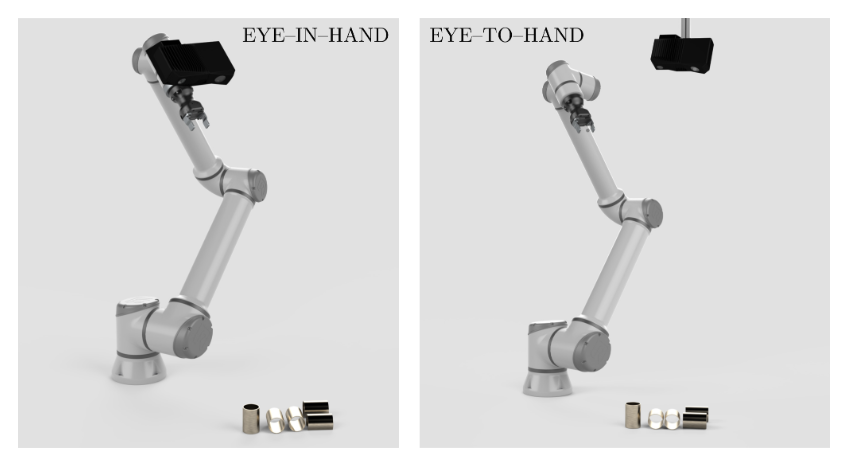
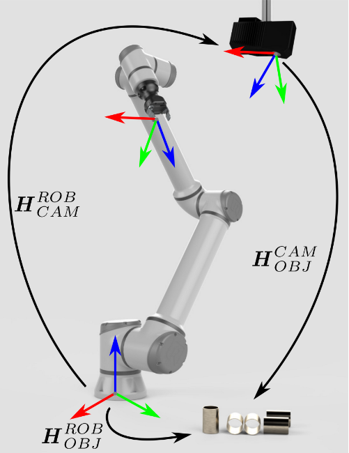
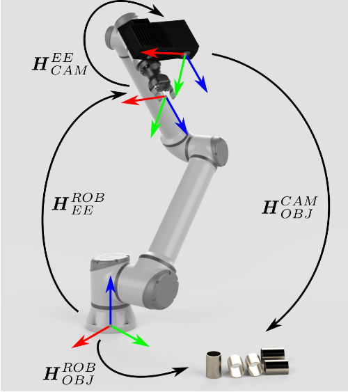

### 1.基础
机器人的手眼标定的需求是因为将相机和机械臂识别出来,手眼标定分为两种:`eye to hand`, `eye in hand` ,如图

我们浅谈一种手眼标定方法, `eye in hand` ,首先我们要明确机器人为什么需要手眼标定,这是因为机械臂需要拾取物品,但是机械臂的眼睛是相机,所以我们需要将物体的坐标先从眼睛(相机)再到机械臂,而手眼标定就是确认眼睛到机械臂的转换.

设有三个直角坐标架 $W_b -[O^b,e^b_1,e^b_2,e^b_3],W_C -[O^c,e^c_1,e^c_2,e^c_3],W_E -[O^e,e^e_1,e^e_2,e^e_3]$ ,三个坐标系为基底坐标系,相机坐标系,机械臂坐标系.

### 2.推导
手眼标定是通过棋盘格固定的世界坐标系点,然后利用真实的度量性质获取各个坐标系的转换矩阵,现代六轴机械臂会提供从基底坐标系到机械臂坐标系的坐标变换 $T_{be}$ ,即
$$\begin{align}
    \begin{bmatrix}
        X_e \\ 1
    \end{bmatrix} = T_{be}\begin{bmatrix}
        X_b \\ 1
    \end{bmatrix}
\end{align}$$

以棋盘格的点的世界坐标系做推导,从单目理论
$$\begin{align}
    \begin{bmatrix}
        u \\ v \\ 1
    \end{bmatrix} &= \frac{1}{Z_c} \begin{bmatrix}
        f_x & 0 & c_x \\
        0 & f_y & c_y \\
        0 & 0  & 1  
    \end{bmatrix}\begin{bmatrix}
        I|0
    \end{bmatrix}\begin{bmatrix}
        R & t \\
        0^T & 1
    \end{bmatrix} \begin{bmatrix}
        X_w \\ Y_w \\ Z_w \\1
    \end{bmatrix} \\
    &= \frac{1}{Z_c}K[I|0] T_{wc}\begin{bmatrix}
        X_w \\ Y_w \\ Z_w \\1
    \end{bmatrix}
\end{align}$$

#### 2.1 手在眼上
机械臂和相机的位姿估计固定,通过标定获取 $T_{wc}$ ,并且有
$$\begin{align}
    \begin{bmatrix}
        X_e \\ 1
    \end{bmatrix} = T_{we} \begin{bmatrix}
        X_w \\ 1
    \end{bmatrix}
\end{align}$$

机器人基底坐标系可以获取它的相对坐标
$$\begin{align}
    \begin{bmatrix}
        X_b \\ 1
    \end{bmatrix} =T_{wb} \begin{bmatrix}
        X_w \\ 1
    \end{bmatrix}
\end{align}$$

现在我们知道 $T_{wb},T_{be},T_{wc}$ ,现在求摄像机到机械臂的变换 $T_{ce}$ 得到
$$\begin{align}
    \begin{bmatrix}
        X_e \\ 1
    \end{bmatrix} = T_{ce} \begin{bmatrix}
        X_c \\ 1
    \end{bmatrix}
\end{align}$$

通过标定板不动,机械臂移动到两个不同的位置有
$$\begin{align}
    T_{bw}^1  = T_{bw}^2
\end{align}$$

转换为
$$\begin{align}
    T_{be}^1T_{ec}^1T_{cw}^1 &= T_{be}^2T_{ec}^2T_{cw}^2 \\
    (T_{be}^2)^{-1}T_{be}^1T_{ec}^1&= T_{ec}^2T_{cw}^2(T_{cw}^1)^{-1}
\end{align}$$

注意 $T_{ec}$ 是固定的,所以 $T_{ec}^1 = T_{ec}^2 = X$ ,上式可以变为
$$\begin{align}
    AX = XB
\end{align}$$

即
$$\begin{align}
    A &= (T_{be}^2)^{-1}T_{be}^1 \\
    B &= T_{cw}^2(T_{cw}^1)^{-1}
\end{align}$$

这样我们就变成一个矩阵方程求解问题了,并且 $T_{be},T_{cw}$ 可以通过仪器活得 $T_{be}$ ,而 $T_{cw}$ 则是通过相机标定来获取.

那么有以下步骤:
* 移动三次机械臂,得到三次坐标系的位姿 $H_1,H_2,H_3$ 则有

$$\begin{align}
    T_{be}^1 = H_2^{-1}H_1 \\
    T_{be}^2 = H_3^{-1}H_1
\end{align}$$

* 将相机的三次移动分别标定 $M_1,M_2,M_3$
$$\begin{align}
    T_{cw}^1 =M_2^{-1}M_1 \\
    T_{cw}^2 = M_3^{-1}M_1
\end{align}$$

* 求解
$$\begin{align}
    (T_{be}^2)^{-1}T_{be}^1X&= XT_{cw}^2(T_{cw}^1)^{-1}
\end{align}$$

#### 2.2 眼在手外
此时注意相机是固定的,那么 $T_{cb}$ 就是固定的,所以我们需要得到  $T_{cb}$ ,同样