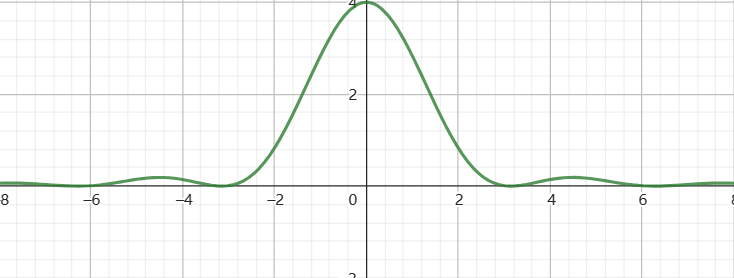

### 解
$$\begin{align}
    F(s) &= \frac{s^2(1 - e^{-s})}{s + 3} \\
    &=  \frac{[(s+3)^2 - 6s  - 9]](1 - e^{-s})}{s + 3} \\
    &=(s + 3)(1 - e^{-s})  - \frac{(6s + 9)(1 - e^{-s})}{s + 3} \\
    &=(s + 3)(1 - e^{-s})  -6(1 - e^{-s}) + \frac{ 9(1 - e^{-s})}{s + 3}
\end{align}$$

那么

$$\begin{align}
    f(0_+) &= \lim_{s\rightarrow \infty}sF'(s)
\end{align}$$

注意其中 $F'(s)$ 是 $F(s)$ 的真分式,则

$$\begin{align}
    f(0_+) &= \lim_{s\rightarrow \infty}sF'(s) \\
    &=\lim_{s\rightarrow \infty}\frac{ 9s(1 - e^{-s})}{s + 3} \\
    &= 9
\end{align}$$

---
解:
已知宽度为 $1$ 的门函数 $g_2(t)=\begin{cases} 1 ,|t|\leq 1  \\ 0,else\end{cases}$ ,两个该函数卷积就变为了三角波函数 $f(t) = 2\Delta_4(t) = g_2(t) * g_2(t) $ ,其中

$$\begin{align}
    \Delta_4(t)=\begin{cases}
        1 - \frac{|t|}{2} , |t| \leq 2 \\
        0, else
    \end{cases}
\end{align}$$

得到他的傅里叶变换为 $F(jw) = F[f(t)] = 4Sa^2(w)$ ,如图

它的第一个零点,$w = \pi$ ,而图中的函数 $f_T(t)$ 是一个周期 $T = 8$ 的周期函数,$f_T(t) = \displaystyle \sum_{n=-+\infty}^{+\infty}f(t - 8n) =f(t) * \sum_{n=-+\infty}^{+\infty} \delta(t - 8n)$ ,那么它的傅里叶变换为

$$\begin{align}
    F_T(jw) &= F(jw) \frac{n\pi}{4}\sum_{n=-+\infty}^{+\infty} \delta(w - \frac{n\pi}{4}) \\
    &=\frac{n\pi}{4}\sum_{n=-+\infty}^{+\infty} F(j\frac{n\pi}{4})\delta(w - \frac{n\pi}{4})
\end{align}$$

$$\begin{align}
    \frac{\sin w}{w} = 0 \rightarrow \sin w = 0, w= n\pi \rightarrow first \; w_0 = \pi
\end{align}$$

---
因为 $F\{G_2(t)\} = 2Sa(w)$ ,则 $f_1(jw) = 6Sa(w)$ 
$$\begin{align}
    f(t) &= \sum_{k=-\infty}^{\infty} f_1(t - 6k) \\
    &= f_1(t) *  \sum_{k=-\infty}^{\infty} \delta(t - 6k) 
\end{align}$$

令 $T = 6 , w_s = \frac{2\pi}{T}$ 那么
$$\begin{align}
    F\{f(t)\} &=F_1(jw) \sum_{k=-\infty}^{\infty} e^{-j6kw} \\
    &=F_1(jw) [1 + \sum_{k=1}^\infty( e^{-j6kw} + e^{j6kw})] \\
    &=F_1(jw) (1 + 2\sum_{k=1}^\infty \cos 6kw) \\
    &=6Sa(w)(1 + 2\sum_{k=1}^\infty \cos 6kw )
\end{align}$$

---
$$\begin{align}
    H(s) = \frac{H_1(s)}{1 - H_1(s)H_2(s)}
\end{align}$$

---
已知
$$\begin{align}
    F(jw) = \frac{2}{jw + 1}
\end{align}$$

通过 $H(jw)$ 后有
$$\begin{align}
    Y(jw) = \begin{cases}
        \frac{2}{jw + 1} , |w| <w_0\\
        0 ,else
    \end{cases}
\end{align}$$

上式可以写为
$$\begin{align}
    Y(jw) = \begin{cases}
        \displaystyle \frac{2}{\sqrt{w^2 + 1}e^{j\arctan w}} , |w| <w_0\\
        0 ,else
    \end{cases}
\end{align}$$

能量谱为
$$\begin{align}
    |Y(jw)|^2 = \begin{cases}
        \frac{4}{w^2 + 1} , |w|<w_0\\
        0,else
    \end{cases}
\end{align}$$

$$\begin{align}
    F(jw)&= \int^\infty_{-\infty} e^{-t}\varepsilon(t)e^{-jwt} dt \\
    &=\int^\infty_0 e^{-(jw + 1)t} dt \\
    &= -\frac{e^{-(jw + 1)t}|^{\infty}_0}{jw + 1}  \\
    &= \frac{1}{jw + 1}
\end{align}$$

---
解:
已知
$$\begin{align}
    F\{f(t)\}  &= F\{sgn(t)\} \\
    &= \frac{2}{jw}
\end{align}$$

则
$$\begin{align}
    F\{f(t - 2)\} = \frac{2}{jw}e^{-j2w}
\end{align}$$

又有
$$\begin{align}
    F\{tf(t - 2)\} &= j\frac{d}{w} \frac{2e^{-j2w}}{jw} \\
    &=j \frac{-4j(jw)e^{-j2w} - j2e^{-j2w}}{(jw)^2} \\
    &= - \frac{j4we^{-j2w} +2e^{-j2w}}{w^2}
\end{align}$$

---
解:
$$\begin{align}
    F(z) &= \frac{3z^2 - 2z}{ z^2 + 4} \\
    &= \frac{3(z^2 + 4) - 12 - 2z}{z^2 + 4} \\
    &=3 - \frac{2z + 12}{z^2 + 4}
\end{align}$$

则 $f[n] = 3\delta[n] - f_1[n]$ ,其中
$$\begin{align}
    F_1(z) &= \frac{2z + 12}{z^2 + 4} \\
\end{align}$$

则
$$\begin{align}
    \frac{F_1(z)}{z} &= \frac{2z + 12}{z(z - 2i)(z + 2i)} \\
    &= \frac{3}{z} + -\frac{4i+12}{8}\frac{1}{z - 2i} + -\frac{-4i + 12}{8}\frac{1}{z + 2i}
\end{align}$$

则
$$\begin{align}
    F_1(z) = 3 - (\frac{i+3}{2}\frac{z}{z - 2i} + \frac{-i+3}{2} \frac{z}{z + 2i})
\end{align}$$

注意到 $a = \frac{i + 3}{2} = \frac{\sqrt{10}}{2}e^{j\arctan \frac{1}{3}}$ (复变函数)得到
$$\begin{align}
    f_1[n] &= 3\delta[n] - \frac{i+3}{2} (2i)^n - \frac{-i + 3}{2} (-2i)^n \\
    &=3\delta[n] - a 2^n e^{j\frac{\pi}{2}n} - a^{*}2^ne^{-j\frac{\pi}{2}n} \\
    &=3\delta[n] -2^n[ae^{j\frac{\pi}{2}n} + (ae^{j\frac{\pi}{2}n})^{*}] \\
    &=3\delta[n] -2^n \frac{\sqrt{10}}{2}[e^{j(\frac{\pi n}{2} +\arctan \frac{1}{3} )}+ e^{-j(\frac{\pi n}{2} + \arctan \frac{1}{3})}] \\
    &= 3\delta[n] - \sqrt{10}2^{n}\cos (\frac{\pi n}{2} +\arctan \frac{1}{3})
\end{align}$$

则
$$\begin{align}
    f[n] &= 3\delta[n] - f_1[n] \\
    &=\sqrt{10}2^n\cos (\frac{\pi n}{2} +\arctan \frac{1}{3})
\end{align}$$

---

注意
$$\begin{align}
    \lim_{x\rightarrow 0} Sa(狗) =\lim_{x\rightarrow 0} \frac{\sin 狗}{狗} = 1
\end{align}$$
$$\begin{align}
    F_0 &= \frac{1}{T}\lim_{n\rightarrow 0}F_0(w)_{w = nww_s}\\
    &=\frac{1}{6} \lim_{n\rightarrow 0} \frac{4\sin \frac{2\pi n}{3} - 4 Sa(\frac{\pi n}{3}) \sin \frac{\pi n}{3}}{\frac{\pi n}{3}} \\
    &=\frac{1}{6} \lim_{n\rightarrow 0} \frac{4\sin \frac{2\pi n}{3}}{\frac{\pi n}{3}} - \frac{1}{6}\lim_{n\rightarrow 0}\frac{4 Sa(\frac{\pi n}{3}) \sin \frac{\pi n}{3}}{\frac{\pi n}{3}} \\
    &=\frac{4}{6} \frac{2\pi}{3}\frac{3}{\pi} - \frac{4}{6} \\
    &=\frac{2}{3}
\end{align}$$

---
解:
对于指数信号
$$\begin{align}
    f(t) = e^{st} , t \in (-\infty,+\infty)
\end{align}$$

他的响应是 $y(t) = H(s)e^{st}$,特别的若 $H(s)$ 有傅里叶变换即存在
$$\begin{align}
    H(jw) = |H(jw)|e^{j\varphi(w)}    
\end{align}$$

那么对于复指数信号有
$$\begin{align}
    e^{jw_0t} &\rightarrow H(jw_0)e^{jw_0t} \\
    A\cos(w_0 t + \theta) &\rightarrow A|H(jw_0)|\cos(w_0t + \theta + \varphi(w_0))
\end{align}$$

则
$$\begin{align}
    f(t) = e^{-jt} + \sum_{n=0}^\infty \cos(nt)
\end{align}$$

的输出为
$$\begin{align}
    y(t) &= H(-j1)e^{-jt} + \sum_{n=0}^\infty |H(jn)|\cos(nt + \varphi(n)) \\
    &=e^{-jt}e^{j} +  2 + \cos (t - 1) \\
    &=e^{-j(t - 1)} + 2 +\cos (t - 1)
\end{align}$$

注意:
$$\begin{align}
    H(-j1) &= e^{j} \\
    |H(j0)| &= 2 ,\varphi(0) = 0\\
    |H(j1)| &= 1 ,\varphi(1) = -1,\\
    |H(jn)| &= 0 , n\geq 2
\end{align}$$

---
$$\begin{align}
    \begin{cases}
        T_s \leq 2\\
        2\pi \leq w_c \leq w_s - 2\pi
    \end{cases}
\end{align}$$

---
解:
$$\begin{align}
    f(t) = t[\varepsilon(t) - \varepsilon(t - 1)] + \varepsilon(t - 1)
\end{align}$$

得到
$$\begin{align}
    f^{(1)}(t) &= \varepsilon(t) - \varepsilon(t-1) - \delta(t-1) + \delta(t - 1) \\
    &=\varepsilon(t) - \varepsilon(t-1)
\end{align}$$

得到
$$\begin{align}
    F_1(jw) &= \frac{1 - e^{-jw}}{jw}\\
    &= \frac{e^{-j\frac{w}{2}}(e^{j\frac{w}{2}} - e^{-j\frac{w}{2}})}{jw} \\
    &=\frac{2j\sin\frac{w}{2}e^{-j\frac{w}{2}}}{jw} \\
    &=\frac{\sin\frac{w}{2}e^{-j\frac{w}{2}}}{\frac{w}{2}} \\
    &=Sa(\frac{w}{2})e^{-j\frac{w}{2}}
\end{align}$$

根据时域微分定理
$$\begin{align}
    F(jw) = \pi\delta(w)[f(-\infty) + f(+\infty)] + \frac{F_n(jw)}{(jw)^n}
\end{align}$$

则
$$\begin{align}
    F(jw) = \pi\delta(w) + \frac{1 - e^{-jw}}{(jw)^2} 
\end{align}$$