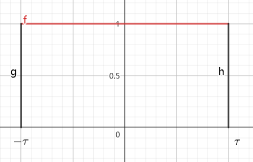
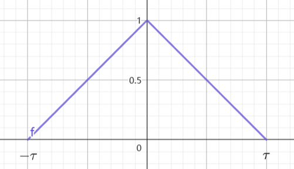
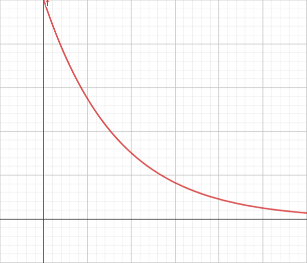
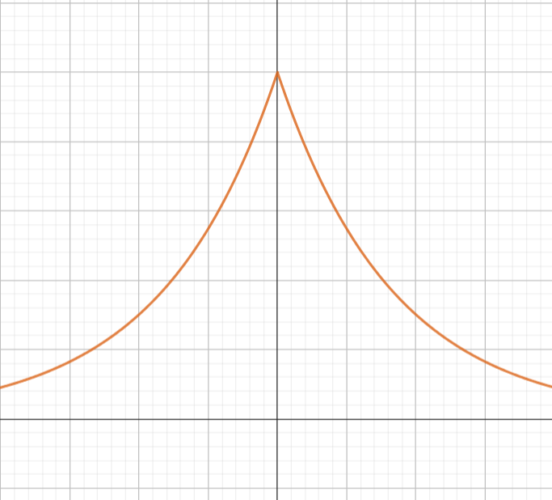
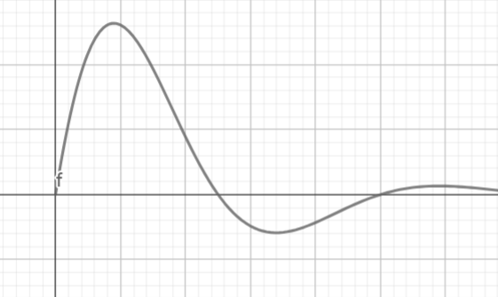

### 常用信号
#### 1.门函数

$$\begin{align}
    g_{\tau} (t)= \begin{cases}
        1 , |t| \leq \tau \\
        0 , else
    \end{cases} 
\end{align}$$

它的傅里叶变换为

$$\begin{align}
    G_{\tau}(jw) &= \int^{\tau}_{-\tau} e^{-jwt} dt \\
    &= \frac{1}{-jw} e^{-jwt}|^{\tau}_{-\tau} \\
    &= \frac{e^{jw\tau} - e^{-jw\tau}}{jw} \\
    &= \frac{2 \sin w\tau}{w} \\
    &=2\tau Sa(w\tau)
\end{align}$$

#### 2.三角脉冲

$$\begin{align}
    \Delta_{\tau}(t) = \begin{cases}
        1 - \frac{|t|}{\tau}, |t| \leq \tau \\
        0 , else
    \end{cases}
\end{align}$$

注意的是

$$\begin{align}
    g_{\tau}(t) * g_{\tau}(t) = 2\tau \Delta_{2\tau}(t)
\end{align}$$

所以它的傅里叶变换为

$$\begin{align}
    \Delta_{\tau}(jw) &= \frac{1}{\tau}[G_{\frac{\tau}{2}}(jw)]^2 \\
    &= \tau Sa^2(\frac{w\tau}{2})
\end{align}$$

#### 4.指数函数

$$\begin{align}
    f(t) = e^{-\alpha t}u(t) \rightarrow F(jw) = \frac{1}{jw + \alpha} 
\end{align}$$

$\alpha >0$ .

#### 5.绝对值指数

$$\begin{align}
    f(t) = e^{-\alpha |t|} , \alpha >0
\end{align}$$

得到

$$\begin{align}
    F(jw) &= \int^{+\infty}_0 e^{-\alpha t} e^{-jwt} dt + \int^0_{-\infty} e^{\alpha t}e^{-jwt} dt \\
    &= \frac{1}{jw + \alpha} + \frac{1}{ \alpha - jw} \\
    &= \frac{2\alpha}{\alpha^2 + w^2}
\end{align}$$

#### 6.指数三角函数
##### 6.1余弦

$$\begin{align}
    f(t) = e^{-\alpha t} \cos w_0t u(t)
\end{align}$$

$$\begin{align}
    F(jw) &= \frac{1}{2}\frac{1}{jw + \alpha} *  \delta(w - w_0) + \frac{1}{2}\frac{1}{jw + \alpha} * \delta(w + w_0) \\
    &= \frac{jw + \alpha}{(jw + \alpha)^2 + w_0^2}
\end{align}$$

#### 6.2正弦

$$\begin{align}
    f(t) = e^{-\alpha t} \sin w_0t u(t)
\end{align}$$

$$\begin{align}
    F(jw) &= \frac{1}{2j}\frac{1}{jw + \alpha} *  \delta(w - w_0) - \frac{1}{2j}\frac{1}{jw + \alpha} * \delta(w + w_0) \\
    &= \frac{w_0}{(jw + \alpha)^2 + w_0^2}
\end{align}$$

牢记他们的信号和他们的傅里叶变换.但注意的是 $\sin w_0tu(t)$ 和 $\cos w_0 t u(t)$ 不是那么简单,因为 $\sin w_0tu(t)$ 和 $\cos w_0 t u(t)$ 不满足迪利克雷条件.

#### 7.符号函数

$$\begin{align}
    sgn(t) = \begin{cases}
        1 &, t>0 \\ 
        0 &, t= 0\\
        -1&, t<0
    \end{cases}
\end{align}$$

或者可以这样表示 $sgn(t) = 2u(t) - 1$.所以它的傅立叶变换为 $F(jw) = \frac{2}{jw}$

#### 8.矩形脉冲

$$\begin{align}
    f(t) &= u(t) - u(t - \tau) \\
    &= g_{\frac{\tau}{2}}(t - \frac{\tau}{2}) \\
\end{align}$$

它的傅里叶变换为 $\displaystyle \tau Sa(\frac{t\tau}{2})e^{-j\frac{w\tau}{2}}$

#### 9. Sa 函数
$$\begin{align}
    F\{g_{\tau}(t)\} = 2\tau Sa(w\tau)
\end{align}$$

利用对偶性质我们可以得到
$$\begin{align}
    f(t) = \frac{\sin w_0 t}{\pi t} 
\end{align}$$

的傅里叶变换为 $F(jw) = g_{w_0}(w)$ ,即
$$\begin{align}
    g_{w_0}(w) = \begin{cases}
        1 , |w| \leq w_0 \\
        0 ,else
    \end{cases}
\end{align}$$

同理对于离散信号也有
$$\begin{align}
    F\{\frac{\sin w_0 n}{\pi n}\} = g_{w_0}(e^{jw})= \begin{cases}
        1 , |w| \leq w_0 \\
        0 ,else
    \end{cases}
\end{align}$$