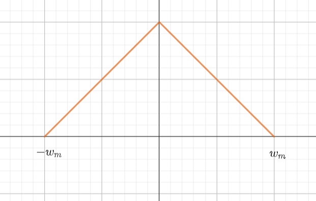
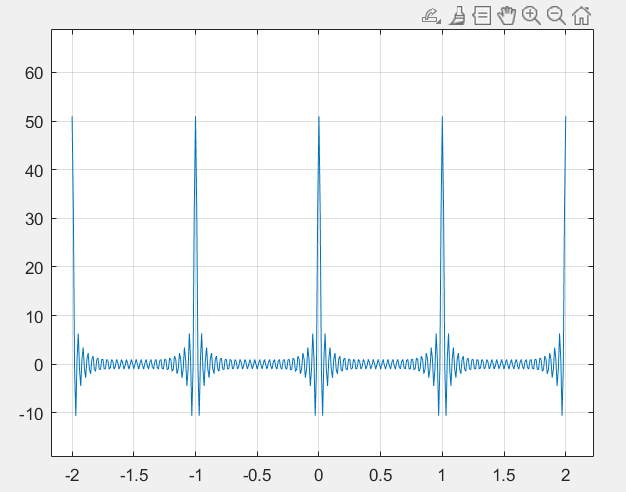
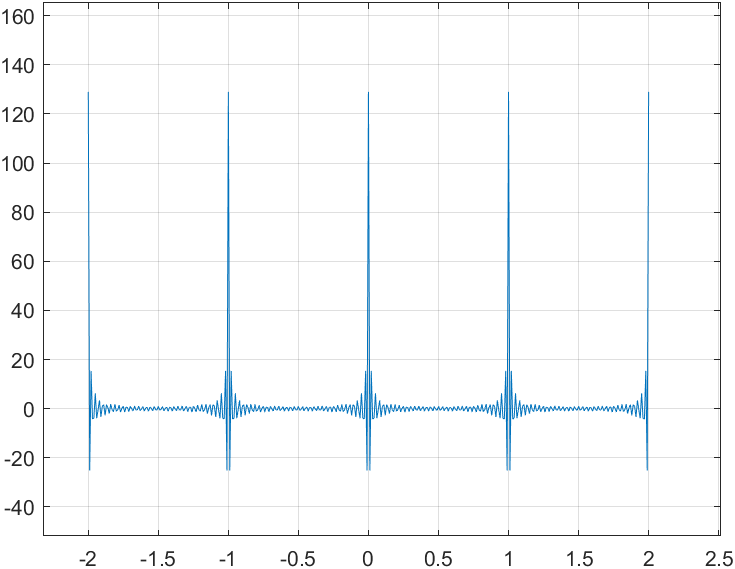
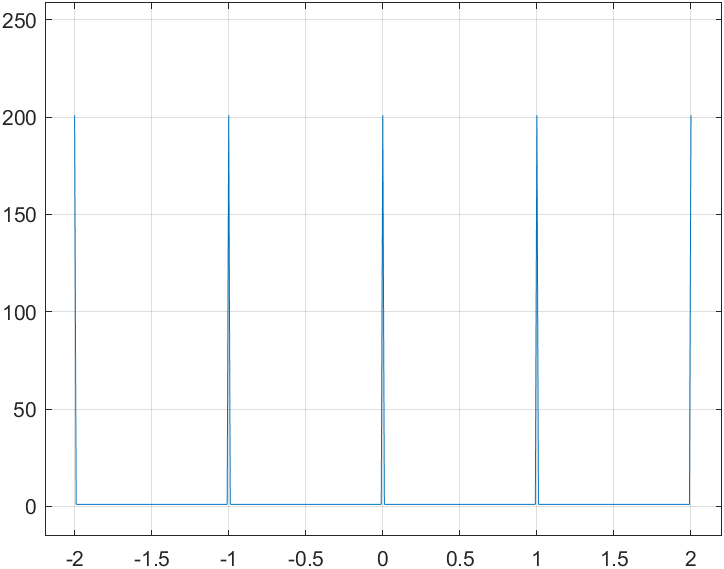
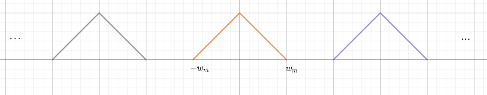
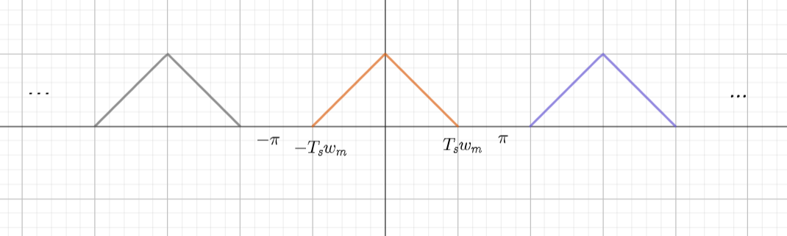
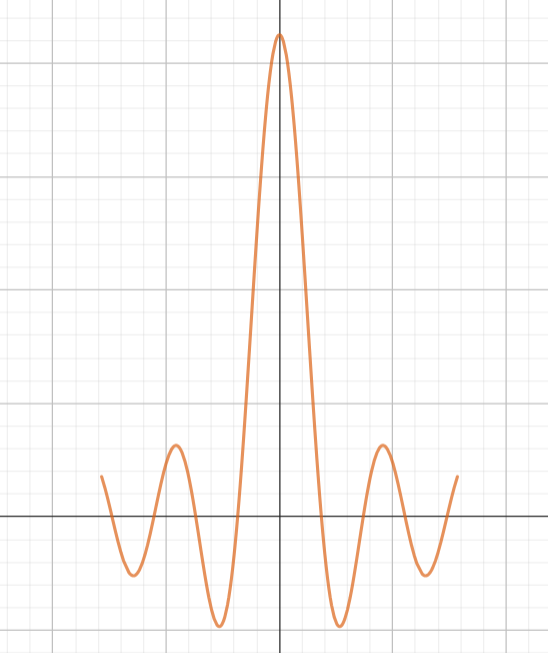
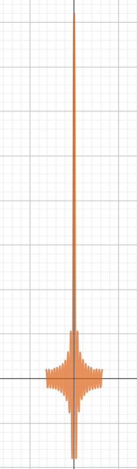
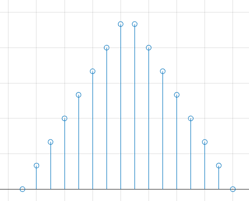
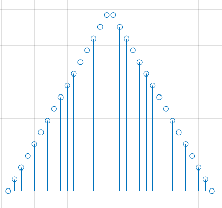

说明:
符号 $*$ 表示卷积,标量乘法直接 $ab$.

### 1.基础
对于一个连续信号 $x(t) , -\infty <t<+\infty$,若它满足迪利克雷条件,则存在傅里叶变换.则
$$\begin{align}
    X(jw) = \int^{+\infty}_{-\infty} x(t)e^{-jwt} dt
\end{align}$$

为 $x(t)$ 的傅里叶变换,为了书写方便,我们记 $\displaystyle \int^{+\infty}_{-\infty} $ 为 $\displaystyle \int_\infty$.则傅里叶变换对可以写为
$$\begin{align}
    X(jw) &= \int_\infty x(t)e^{-jwt} dt \\
    x(t) &= \frac{1}{2\pi} \int_\infty X(jw)e^{jwt} dw 
\end{align}$$

根据时域无限频域有限的定理,我们记 $x(t)$ 的最高频率为 $w_m$,以下图像作为参考.

---
### 2.采样信号
对于求和符号 $\displaystyle \sum_{n=-\infty}^{+\infty}$ 我们把它记为 $\displaystyle \sum_\infty$ ,对于信号
$$\begin{align}
    p(t) = \sum_{\infty} \delta(t - nT_s)
\end{align}$$

通常将它记为抽样信号,它的傅里叶级数表示为
$$\begin{align}
    p(t) &= \sum_\infty \frac{1}{T}e^{jn\frac{T_s}{2\pi}t} \\
    &= \frac{1}{T} + \frac{2}{T} \sum_{n = 1}^{\infty} \cos \frac{2\pi nt}{T_s}
\end{align}$$

其中 $w_s = \frac{T}{2\pi}$ ,则它的傅里叶变换为
$$\begin{align}
    P(jw) = \frac{2\pi}{T} \sum_\infty \delta(w - nw_s) 
\end{align}$$

利用式 $(6)$ 和 $matlab$  作图有 
$N = 25$ 时

$N = 64$ 时

$N = 100$ 时

---
### 3.采样
如果 $x_p(t)$ 满足奎恩斯特采样定理 $w_s \geq 2w_m$ ,利用 $x_p(t)$ 对信号 $x(t)$ 进行采样有
$$\begin{align}
    x_p(t) &= x(t)p(t) \\
    &= x(t) \sum_\infty \delta(t - nT_s) \\
    &=x(t)\sum_\infty \frac{1}{T}e^{jn\frac{T_s}{2\pi}t}
\end{align}$$

对于 $(9),(10)$ 有两个不同的形式,对于 $(9)$ 式有
$$\begin{align}
    X_p(jw) &= \sum_{\infty}x(nT_s)F\{\delta(t - nT_s)\} \\
    &=\sum_{\infty}x(nT_s)e^{-jnT_sw} \\
\end{align}$$

同时 $(10)$ 式有
$$\begin{align}
    X_p(jw) &= X(jw) * \frac{2\pi}{T}\sum_{\infty} \delta(w - nw_s) \\
    &=\frac{2\pi}{T}\sum_\infty X(j(w - nw_s))
\end{align}$$

那么最后得到
$$\begin{align}
    X_p(jw) &= \frac{2\pi}{T}\sum_\infty X(j(w - nw_s)) \\
    &= \sum_{\infty}x(nT_s)e^{-jnT_sw}
\end{align}$$

利用 $(14)$ 式,画出 $X_p(jw)$ 的图像为

---
### 4.C/D转换
我们令
$$\begin{align}
    x[n] = x(t)|_{t = nT_s} , -\infty<n <+\infty , n \in N
\end{align}$$

为离散信号,则它的离散傅里叶变换对为为
$$\begin{align}
    X(e^{j\Omega}) &= \sum_\infty x[n]e^{-j\Omega n} \\
    x[n] &= \frac{1}{2\pi} \int_{2\pi} X(e^{j\Omega}) e^{j\Omega n} d\Omega
\end{align}$$

将 $(16)$ 式与 $(18)$ 式对比,我们发现对于信号的抽样信号的频谱
$$\begin{align}
    X_p(jw) &= \sum_{\infty}x(nT_s)e^{-jnT_sw} \\
    &=\sum_{\infty}x[n]e^{-jnT_sw}
\end{align}$$

如果将 $wT_s$ 看成 $\Omega$ ,那么就有
$$\begin{align}
    X(e^{j\Omega}) &= X_p(jw)|_{w = \frac{\Omega}{T_s}} 
\end{align}$$

那么我们就得到
$$\begin{align}
    X(e^{j\Omega}) &= X_p(j\frac{\Omega}{T_s}) \\
\end{align}$$

利用 $(13)$ 式,得到最后的结果为
$$\begin{align}
    X(e^{j\Omega}) &= \frac{2\pi}{T}\sum_\infty X(j(\frac{\Omega}{T_s} - nw_s)) \\
    &=\frac{2\pi}{T}\sum_\infty X(j(\frac{\Omega}{T_s} - nw_s)) \\
    &=\frac{2\pi}{T}\sum_\infty X(j(\frac{\Omega - 2\pi n }{T_s}))
\end{align}$$

注意 $x(t)$ 在 $w_m$ 的频率转换到 $x[n]$ 变为了 $w_mT_s$ ,由于 $w_s \geq 2w_m$ ,所以
$$\begin{align}
    T_s = \frac{2\pi}{w_s} \leq \frac{\pi}{w_m} \rightarrow w_mT_s \leq \pi
\end{align}$$

即它将 $X(jw)$ 的最高频率 $w_m$ 处的频谱收缩到了 $\pi$ 或者说更小的频率处.这个频率取决于 $T_s$ 的大小,即采样频率,或者说抽样频率为 $T_s$ 的抽样信号将 $[-\frac{\pi}{T_s} , \frac{\pi}{T_s}]$ 的频率收缩到 $[-\pi,\pi]$.
$$\begin{align}
    1.w_s = 2w_m \rightarrow w_mT_s \leq \pi \\
    2.w_s = 4w_m \rightarrow w_mT_s \leq \frac{\pi}{2} \\
    3.w_m = nw_m \rightarrow \rightarrow w_mT_s \leq \frac{2\pi}{n}
\end{align}$$

当采样频率越大时,频谱的收缩程度就越大.如图

---
### 5.有限长采样分析
对于 $x(t)$,我们只能从 $t = 0$ 时开始采样,并且我们拿到数据进行处理的时候并不能对它的所以的点进行分析,因为现实世界中是不可能采样无限个点的,所以为了工程化,我们采样矩形窗函数来模拟有限长信号
$$\begin{align}
    u_N[n] = \begin{cases}
        1 , 0 \leq n \leq N - 1 \\
        0, else
    \end{cases}
\end{align}$$

则 $x(t)$ 的长度为 $N$ 的有限长的抽样离散信号为
$$\begin{align}
    x_N[n] = x[n]u_N[n]
\end{align}$$

它的傅里叶变换为
$$\begin{align}
    X_N(e^{j\Omega}) = \sum_{n = 0}^{N-1}x_N[n] e^{-j\Omega n}
\end{align}$$

注意到
$$\begin{align}
    U_N(e^{j\Omega}) = \frac{e^{-j\frac{(N- 1)\Omega}{2}}\sin \frac{N\Omega}{2}}{\sin \frac{\Omega}{2}}
\end{align}$$

利用时域相乘频域卷积的定理得到
$$\begin{align}
    X_N(e^{j\Omega}) &= \frac{1}{2\pi} X(e^{j\Omega}) * \frac{e^{-j\frac{(N- 1)\Omega}{2}}\sin \frac{N\Omega}{2}}{\sin \frac{\Omega}{2}} \\ 
    &=\frac{1}{2\pi}\int_{2\pi} X(e^{j\theta})\frac{e^{-j\frac{(N- 1)(\Omega - \theta)}{2}}\sin \frac{N(\Omega - \theta)}{2}}{\sin \frac{(\Omega - \theta)}{2}} d\theta
\end{align}$$

其实当 $N$ 足够大时, $|U_N(e^{j\Omega})| \approx k \delta(\Omega)$ ,如图 ,$N = 15$ 时 

$N = 40$ 时

也就是说随着采样点数的增加,那么 $X_N(e^{j\Omega})$ 会越来越接近 $X(e^{j\Omega})$.虽然随着采样的增大,窗函数的频谱越来越接近迪利克雷函数,但是现实中仍然会有误差存在,原因就在于窗函数的中高频分两的拖尾导致了误差的存在,将原频谱混乱了,这种现象就称为频谱泄露.
频谱泄露在一定程度上可以减少,但是一定会存在,因为现实中不存在迪利克雷函数的频谱,而减少的方式则是在窗函数上进行操作,详情可看奥本海姆的离散时间处理的窗函数法那一章节.

---
### 6.工程化分析
虽然我们抽象的对有限长采样进行了建模,但是可以看到有限长的信号的离散傅里叶变换频谱在频域是连续的,计算机不可能对连续信号进行处理,所以我们还要做一些工作来讲连续的频谱转换为离散的频谱.
考虑将 $x_N[n]$ 转换为周期信号,则令
$$\begin{align}
    x_{(N)}[n] &= \sum_{\infty} x_N[n + rN] \\
    &=x_N[((n))_N]
\end{align}$$

定义离散傅里叶级数对
$$\begin{align}
    \hat{X}[k] &= \sum_{n=<N>} x_{(N)}[n]e^{-jn\frac{2\pi}{N}k} \\
    x_{(N)}[n] &= \sum_{k=<N>}\hat{X}[k]e^{jn\frac{2\pi}{N}k} 
\end{align}$$

对于 $(37)$ 式我们有
$$\begin{align}
    \hat{X}[k] &= \sum_{n=<N>} x_{(N)}[n]e^{-jn\frac{2\pi}{N}k} \\
    &=\sum_{n=0}^{N-1} x_{N}[n]e^{-jn\frac{2\pi}{N}k}
\end{align}$$

对比 $(41)$ 式与 $(32)$ 式有
$$\begin{align}
    \hat{X}[k] &= X_N(e^{j\Omega})|_{\Omega = \frac{2\pi}{N}k} , k = 0,1,2\cdots N - 1  \\
    &=X_N(e^{j\frac{2\pi}{N}k}), k = 0,1,2\cdots N - 1 
\end{align}$$

上式表明我们可以利用离散傅里叶级数得到有限长信号的频谱的离散采样值.每一个频谱采样的间隔为 $\frac{2\pi}{N}$.同时 $(39)$ 式我们也可以写为
$$\begin{align}
    x_{(N)}[n] &= \sum_{k=<N>}\hat{X}[k]e^{jn\frac{2\pi}{N}k} \\
    &=\sum_{k=0}^{N-1}\hat{X}[k]e^{jn\frac{2\pi}{N}k}
\end{align}$$

为了将他更加规范化我们做出了一下改动.

---
### 7.离散傅里叶变换-DFT
对于一个有限长信号 $x_N[n] , n = 0,1,2\cdots N - 1$ ,它的离散傅里叶变换对记为
$$\begin{align}
    X[k] &= \sum_{n=0}^{N-1} x_{N}[n]e^{-jn\frac{2\pi}{N}k} \\
    x_N[n] &=\frac{1}{N} \sum_{k = 0}^{N - 1} X[k] e^{jn\frac{2\pi}{N}k}
\end{align}$$

则对应于 $X(e^{j\Omega})$ 的 $[0,2\pi]$ , $k \in [0,N - 1]$ ,第 $k$ 个采样点对应的采样信号的离散傅里叶变换的频率为 $\frac{2k\pi}{N - 1}$,而对应于原始的连续信号的傅里叶变换的频率为 $\frac{2\pi k}{(N - 1)T_s}$.例如对于 
$N = 16$ 时

$N = 32$ 时

那么现在如果我们要对一个信号进行分析和处理我们不仅要考虑时域上的采样还要考虑频域上的采样.

