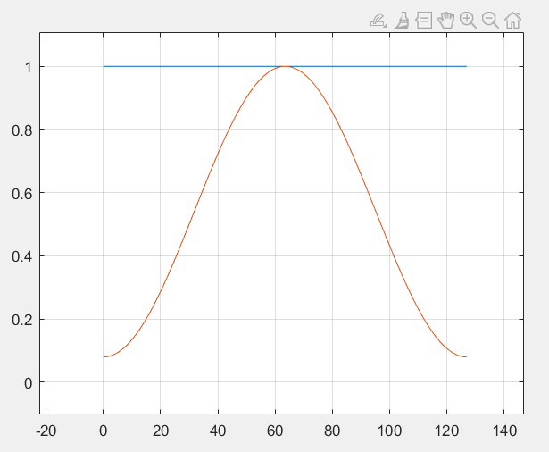
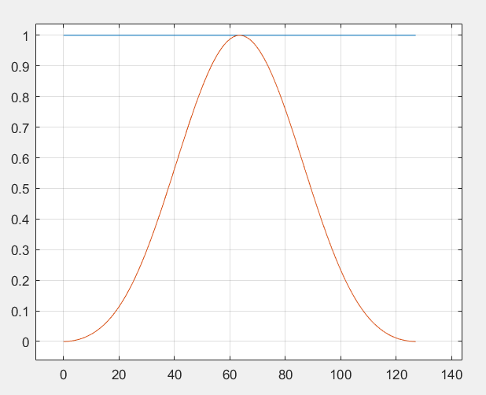

### 窗
在分析基础中,我们知道对于一个有限长信号,我们可以把他记为
$$\begin{align}
    x_N[n] = x[n]u_N[n]
\end{align}$$

其中 $u_N[n]$ 为一个矩形窗,矩形窗导致的频谱泄露是可以减少的,所以本章的目的就是如何减少这个频谱泄露.
频谱泄露是由于矩形窗函数的频谱密度不能近似于迪利克雷函数,导致频谱的旁瓣在卷积的时候产生了额外分量,所以我们如果选择一个频谱密度比矩形窗频谱较集中于 $w = 0$ 处的窗,那么这个频谱泄露的损耗就可以降低,注意矩形窗和任意 $N$ 个点的窗相乘都是该窗,即 $w[n] , 0 \leq n \leq N - 1$,
$$\begin{align}
    u_N[n]w[n] = w[n]
\end{align}$$

### 1.Hamming 窗
$$\begin{align}
    w[n] = \begin{cases}
        0.54 - 0.46 \cos \frac{2\pi n}{N - 1} , 0 \leq n \leq N - 1 \\
        0 ,else 
    \end{cases}
\end{align}$$

它与矩形窗的频谱对比为:

---
### 2.Blackman窗
$$\begin{align}
    w[n] = \begin{cases}
        0.42 - 0.5\cos \frac{2\pi n}{N - 1} + 0.08 \cos \frac{4\pi n}{N- 1 } , 0 \leq n \leq N - 1 \\
        0 ,else 
    \end{cases}
\end{align}$$

