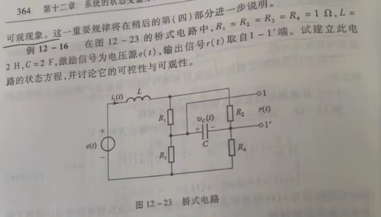

解:
利用复频域分析法回路电流法有
$$\begin{align}
    I_1(2s+ 2) - I_2 - I_3 &= E(s) \\
    I_2(2 + \frac{1}{2s}) - I_1 - I_3\frac{1}{2s} &= 0 \\
    I_3(2 + \frac{1}{2s}) - I_1 - I_2\frac{1}{2s} &=0
\end{align}$$

注意到
$$\begin{align}
    \begin{cases}
        I_L(s) = I_1 \rightarrow S\{\frac{di_L}{dt}\}  = sI_1\\
        U_c(S) = (I_2 - I_3)\frac{1}{2s} \rightarrow S\{\frac{du_c}{dt}\} = (I_2 - I_3)\frac{1}{2} 
    \end{cases}
\end{align}$$

所以通过 $(2),(3)$ 相减得到
$$\begin{align}
    (I_2 - I_3)[\frac{1}{2s} + 2] + (I_2 - I_3)\frac{1}{2s} = 0 \\
    4\frac{1}{2}(I_2 - I_3)+ 2 \frac{1}{2s}(I_2 - I_3) = 0 \\
    4 \frac{d u_c}{dt} = -2 u_c(t) 
\end{align}$$

即 $\displaystyle \frac{d u_c}{dt} = -\frac{1}{2} u_c(t)$ ,将 $(2),(3)$ 式相加有
$$\begin{align}
    2(I_2 + I_3) = 2I_1 \rightarrow I_2 + I_3 = I_1
\end{align}$$

所以对于 $(1)$ 式有
$$\begin{align}
    2sI_1 = - I_1 + E(s)  \rightarrow sI_1 = - \frac{1}{2}I_1 + \frac{1}{2}E(s)
\end{align}$$

故 $\displaystyle \frac{di_L}{dt} = - \frac{1}{2}i_L(t) + \frac{1}{2}e(t)$ .而 $r(t) = u_c(t)$ 故
$$\begin{align}
    \begin{bmatrix}
        \frac{di_L}{dt} \\
        \frac{du_c}{dt} 
    \end{bmatrix} &=\begin{bmatrix}
        - \frac{1}{2} & 0 \\
        0 & -\frac{1}{2}
    \end{bmatrix}\begin{bmatrix}
        i_L\\
        u_c
    \end{bmatrix} + \begin{bmatrix}
        \frac{1}{2} \\ 0 
    \end{bmatrix} e(t) \\
    r(t) &= \begin{bmatrix}
        0 & 1
    \end{bmatrix}\begin{bmatrix}
        i_L\\
        u_c
    \end{bmatrix}
\end{align}$$