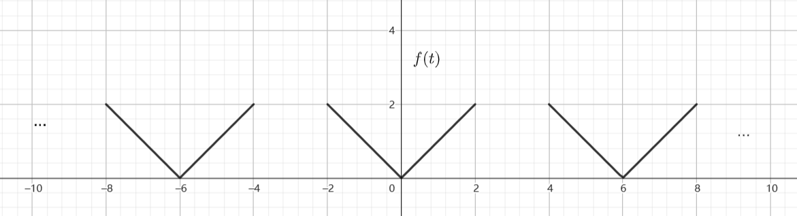
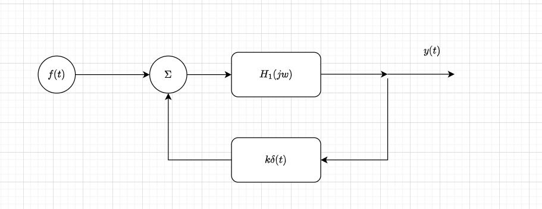
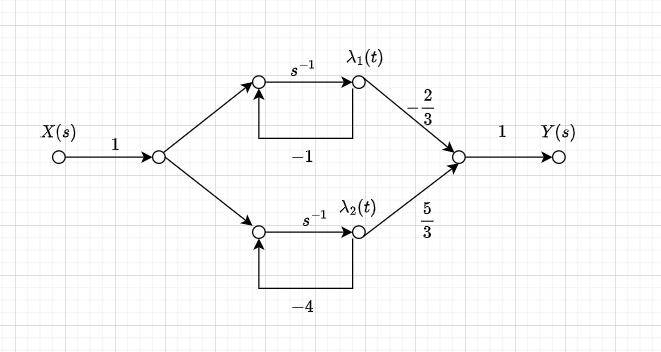
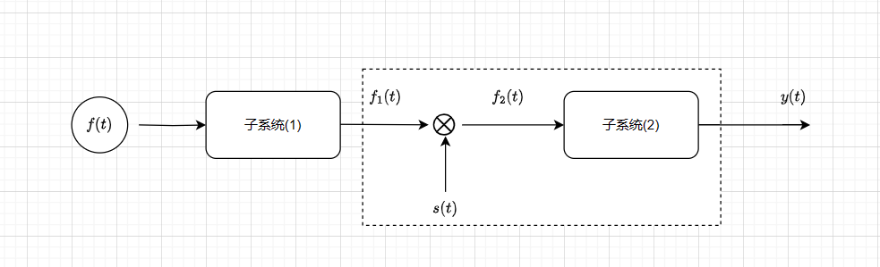
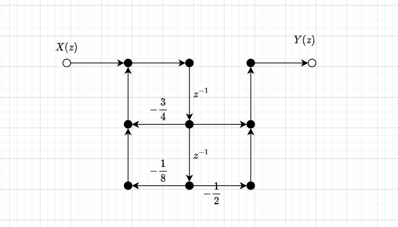

1.判断 $x[n] = 1 + e^{j\frac{1}{3}\pi n}+ e^{-j\frac{2}{5}\pi n}+ e^{j\frac{4}{7}\pi n}$ 是否为周期序列,如果是周期序列求他的周期.
解:分别得到 $e^{j\frac{1}{3}\pi n}, e^{-j\frac{2}{5}\pi n}, e^{j\frac{4}{7}\pi n}$ 的整数倍周期为
$$\begin{align}
    T_1 = 6,T_2 = 5,T_3 = \frac{7}{2} \times 2 = 7 
\end{align}$$

得到 $T_1,T_2,T_3$ 的公因数为 $6 \times 5 \times 7 = 210$,故 $x[n]$ 是一个周期函数,且周期为 $T = 210$.

---
2.设 $f(t),y(t)$ 满足 $y(t) = \displaystyle \int^{3t}_{-\infty} f(\tau) d\tau$ ,判断该系统的稳定性和因果性.
解:
该系统为一个非稳定非因果的系统.
(1)因果,去 $t = 1$,则
$$\begin{align}
    y(1) = \int^3_{-\infty} f(t) dt
\end{align}$$

则 $t = 1$ 时的输出会取决于 $t = 3$ 的输入,故是非因果的.
(2) 当 $f(t)$ 为一个有界输入时,取 $f(t) = a > 0$,则
$$\begin{align}
    y(t) = \int^{3t}_{-\infty} adt = \infty
\end{align}$$

故不稳定.

---
3.已知信号 $f(t)$ 为

求它的傅里叶变换.
解:
令
$$\begin{align}
    h_1(t) = \begin{cases}
        1 , |t| \leq 2 \\
        0,else
    \end{cases},h_2(t) = \begin{cases}
        2(1 - \frac{|t|}{2}), |t| \leq 2\\
        0,else
    \end{cases}
\end{align}$$

$h(t) = 2h_1(t) - h_2(t)$.则
$$\begin{align}
    f(t) = \sum_{n=-\infty}^{\infty} h(t - 6nt)
\end{align}$$

则它的傅里叶级数为
$$\begin{align}
    F_n &= \frac{1}{6} \int_T h(t) e^{-jnw_st}dt \\
    &=\frac{1}{6} \int^2_{-2} h(t) e^{-jnw_st}dt \\
    &= \frac{1}{6} H(jw)_{w = nw_s}
\end{align}$$

又有 $H(jw) = H_1(jw) - H_2(jw)$ ,则
$$\begin{align}
    H_1(jw) = 8Sa(2w) - 4Sa^2(w)
\end{align}$$

故
$$\begin{align}
    F_n &= \frac{1}{6}(8Sa(\frac{2\pi n}{3}) - 4Sa^2(\frac{\pi n}{3})) \\
    &=\frac{4}{3}Sa(\frac{2\pi n}{3}) - \frac{2}{3}Sa^2(\frac{\pi n}{3})
\end{align}$$

得到
$$\begin{align}
    F(jw) &= \sum_{n=-\infty}^{\infty} [\frac{4}{3}Sa(\frac{2\pi n}{3}) - \frac{2}{3}Sa^2(\frac{\pi n}{3})]e^{jn\frac{\pi}{3}t} \\
    &=\sum_{n=-\infty}^{\infty} 2\pi[\frac{4}{3}Sa(\frac{2\pi n}{3}) - \frac{2}{3}Sa^2(\frac{\pi n}{3})]\delta(w - \frac{\pi n}{3})
\end{align}$$

---
4.设 $F(jw)$ 是信号 $f(t)$ 的傅里叶变换, $F(jw) = |F(jw)|e^{j\varphi(w)}$ , $|F(jw)| = \pi e^{-|w|}, \varphi(w) = -w$.
(1)求 $f(t)$ 的偶分量.
(2)求 $f(t)$ 的能量.
解:
(1)可得
$$\begin{align}
    F(jw) &= |F(jw)|e^{j\varphi(w)} \\
    &=\pi e^{-|w|}e^{-jw} \\
    &=\pi e^{-|w|}\cos w - j \pi e^{-|w|}\sin w
\end{align}$$

则
$$\begin{align}
    F\{f_e(t)\} = \pi e^{-|w|}\cos w
\end{align}$$

易得
$$\begin{align}
    F\{e^{-|t|}\} = \frac{2}{w^2 + 1} \rightarrow F\{e^{-|t|}\cos t\} =\frac{1}{(w - 1)^2+1} + \frac{1}{(w + 1)^2 + 1}
\end{align}$$

利用对称性得到
$$\begin{align}
    F^{-1}\{\pi e^{-|w|}\cos w\} = \frac{1}{2}[\frac{1}{(w - 1)^2 + 1} + \frac{1}{(w + 1)^2 + 1}]
\end{align}$$

(2)求
$$\begin{align}
    E &= \frac{1}{2\pi}\int^{+\infty}_{-\infty} |F(jw)|^2 dw \\
    &= \frac{1}{2\pi}\int^{+\infty}_{-\infty} \pi^2e^{-2|w|} dw \\
    &=\frac{\pi}{2}2 \int^{+\infty}_0 e^{-2w} dw \\
    &=\frac{\pi}{2}
\end{align}$$

---
5.设某连续时间的系统结构如图所示,其中 $H_1(jw) = \frac{jw - 1}{5 - w^2 + 4jw}$.
(1)求系统函数的 $H(s)$
(2)欲使系统稳定求 $k$ 的取值范围.
(3)若系统临界稳定,求 $h(t)$
(4)若 $k = -1$ ,画出系统 $s$ 域系统流图,并且其动态方程.

解：
(1)得到
$$\begin{align}
    H(jw) &= \frac{H_1(jw)}{1 - kH_1(jw)} \\
    &=\frac{jw - 1}{(jw)^2 + (4 - k)jw+ ( 5 +k)}
\end{align}$$

转换为复频域为
$$\begin{align}
    H(s)=\frac{s - 1}{s^2 + (4 - k)s+ ( 5 +k)}
\end{align}$$

(2)
若使系统稳定,则利用罗斯阵列得到 $-5<k<4$
|$s^2$|1|5+k|
|---|---|---|
|$s$|4 - k| 0|
|$s^0$|5 + k|

(3) $k = -5,k=4$ 时,系统为临界稳定状态.
$k = -5$ 时,
$$\begin{align}
    H(s) &= \frac{s - 1}{s(s + 9)} \\ 
    &=\frac{-\frac{1}{9}}{s}+\frac{\frac{10}{9}}{s+9} 
\end{align}$$

得到 $h(t) = \frac{1}{9}[10e^{-9t} - 1]u(t)$ ,当 $k = 4$ 时
$$\begin{align}
    H(s) &= \frac{s - 1}{s^2 + 9} \\
    &= \frac{s}{s^2 + 3^2} - \frac{1}{3} \frac{3}{s^2 + 3^2}
\end{align}$$

得到 $h(t) = [\cos 3t - \frac{1}{3}\sin 3t]u(t)$.

(4) $k = -1$ 时,得到
$$\begin{align}
    H(s) &= \frac{s-1}{s^2+5s+4} \\
    &= \frac{s - 1}{(s + 4)(s + 1)} \\
    &= \frac{-\frac{2}{3}}{s+1} + \frac{\frac{5}{3}}{s + 4}
\end{align}$$

得到它的信号流图为

得到
$$\begin{align}
    \begin{cases}
        \dot{\lambda}_1(t) &= -\lambda_1(t) + x(t) \\
        \dot{\lambda}_2(t) &= -4\lambda_2(t) + x(t)\\
        y(t) &= -\frac{2}{3}\lambda_1(t) + \frac{5}{3}\lambda_2(t)
    \end{cases}
\end{align}$$

得到
$$\begin{align}
    \begin{cases}
        \begin{bmatrix}
            \dot{\lambda}_1(t) \\ \dot{\lambda}_2(t)
        \end{bmatrix} &= \begin{bmatrix}
            -1 & 0 \\
            0 & -4 \\
        \end{bmatrix}\begin{bmatrix}
            \lambda_1(t) \\ \lambda_2(t)
        \end{bmatrix} + \begin{bmatrix}
            1 \\ 1 
        \end{bmatrix}x(t)\\\\
        y(t) &=\begin{bmatrix}
        -\frac{2}{3} & \frac{5}{3}
        \end{bmatrix}\begin{bmatrix}
            \lambda_1(t) \\ \lambda_2(t)
        \end{bmatrix}
    \end{cases} 
\end{align}$$

---
6.在如图所示的的系统中, $f(t) = \begin{cases}2(1 - \frac{|t|}{2}) , |t| \leq 2\\0,else\end{cases}$ ,$s(t) =\sum_{-\infty}^\infty \delta(t - \frac{n}{3})$,子系统 $(1)$ 的频率响应为 $H_1(jw) = \begin{cases}1 , |w| \leq 2\pi\\0,\\\end{cases}$,子系统 $(2)$ 的单位冲激响应为 $h_2(t) = \frac{\sin \pi t  \cos 6\pi t}{\pi t}$.
(1)求子系统 $2$ 的频率响应 $H_1(jw)$
(2)分别画出 $f_1(t),f_2(t),y(t)$ 的频谱图.
(3)如果 $s(t) = \cos w_0t$ , $H_2(jw) = \begin{cases}
    e^{-jwt_0} , |w|\leq w_c \\
    0,else
\end{cases}$ , $w_0,t_0$ 为常数,求虚线中的系统的系统函数.

解:
这里只做 $(3)$,只有 $(3)$ 题很妙,当 $f_1(t) = \delta(t)$ 时, $y(t) = h(t)$,则
$$\begin{align}
    f_2(t) &= \delta(t) \cos w_0t \\
    &=\delta(t)
\end{align}$$

又有
$$\begin{align}
    y(t) &= \delta(t) * h_2(t) \\
    &= h_2(t) \\
    &=F^{-1}\{H_2(jw)\} \\
    &= \frac{\sin w_c(t - t_0)}{\pi (t - t_0)}
\end{align}$$

附注:这里的关键点就在于 $f_1(t) = \delta(t)$ 时 $y(t) = h(t)$.

---
7.某因果离散系统的信号流图如图所示.
(1)求系统函数 $H(z)$
(2)求 $h[n]$ 和 $h[1]$
(3)判断系统的稳定性
(4)当 $x[n] = (\frac{1}{2})^nu[n]$ ,系统全响应为 $y[n] = [-\frac{11}{2}(-\frac{1}{2})^n + \frac{9}{2}(-\frac{1}{4})^n]u[n]$,求 $y[-1],y[-2]$.

(1)利用梅森公式有
$$\begin{align}
    H(z) &= \frac{z^{-1} - \frac{1}{2}z^{-2}}{1 + \frac{3}{4}z^{-1} + \frac{1}{8}z^{-2}} \\
    &=\frac{z - \frac{1}{2}}{z^2 + \frac{3}{4}z + \frac{1}{8}} \\
    &=\frac{z - \frac{1}{2}}{(z + \frac{1}{2})(z + \frac{1}{4})}
\end{align}$$

(2) 得到 $H(z)$ 的形式
$$\begin{align}
    \frac{H(z)}{z} &= \frac{z - \frac{1}{2}}{z(z + \frac{1}{2})(z + \frac{1}{4})} \\
    &= \frac{-4}{z} + \frac{-8}{z + \frac{1}{2}} + \frac{12}{z + \frac{1}{4}}
\end{align}$$

得到
$$\begin{align}
    H(z) = -4 + \frac{-8z}{z + \frac{1}{2}} + \frac{12z}{z + \frac{1}{4}} \rightarrow h[n] = -4\delta[n] -8(-\frac{1}{2})^nu[n] + 12 (-\frac{1}{4})^nu[n]
\end{align}$$

得到 $h[1] = 4 - 3 = 1$.
(3) 已知 $H(z)$ 的两个极点为 $z = -\frac{1}{4} , z = -\frac{1}{2}$ ,由于 $h[n]$ 为右边序列,则收敛域为 $|z| > \frac{1}{2}$,则收敛域包括了 $|z| = 1$,所以系统是稳定的.

(4)已知系统全响应在 $n>0$ 时为
$$\begin{align}
    y[n] = y_{ZS}[n] + y_{ZI}[n] 
\end{align}$$

则 $y_{ZI}[n] = y[n] - y_{ZS}[n]$,我们求零状态响应有
$$\begin{align}
    Y_{ZS}(z) &= H(z)X(z) \\
    &=\frac{z(z - \frac{1}{2})}{(z + \frac{1}{2})(z + \frac{1}{4})(z - \frac{1}{2})}
\end{align}$$

得到
$$\begin{align}
    \frac{Y_{ZS}(z)}{z} &=\frac{z(z - \frac{1}{2})}{(z + \frac{1}{2})(z + \frac{1}{4})(z - \frac{1}{2})z} \\
    &=\frac{1}{(z + \frac{1}{2})(z + \frac{1}{4})} \\
    &=\frac{-4}{z+ \frac{1}{2}} + \frac{4}{z  + \frac{1}{4}}
\end{align}$$

得到 $y_{ZS}[n] = -4(-\frac{1}{2})^nu[n] +4(-\frac{1}{4})^nu[n] $,则
$$\begin{align}
    y_{ZI}[n] &= y[n] - y_{ZS}[n] \\
    &= -\frac{3}{2}(-\frac{1}{2})^nu[n] + \frac{1}{2}(-\frac{1}{4})^nu[n] , n >0
\end{align}$$

则
$$\begin{align}
    y_{ZI}[n] = -\frac{3}{2}(-\frac{1}{2})^n + \frac{1}{2}(-\frac{1}{4})^n
\end{align}$$

得到
$$\begin{align}
    y[-1] = 3 - 2 = 1\\
    y[-2] = -6 +8 = 2
\end{align}$$

附注:在计算全响应的时候,我们采用的是 $n>0$,来求零状态响应和全响应,利用 $n>0$ 时的全响应减去零状态响应得到零输入响应,而零输入响应在 $n<0$ 时与 $n>0$ 时的表达式是一致的,所以 $y[n] = y_{ZI}[n] , n<0$.