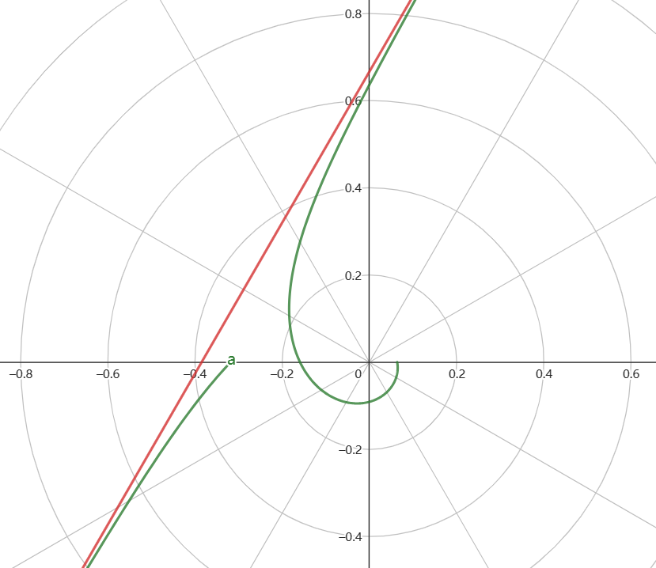

####
1.已知 $u_n$ 是一个单调递减的正值数列,求证:级数 $\displaystyle \sum_{n=1}^{+\infty} \frac{u_n - n_{n+1}}{\sqrt{u_n}}$ 收敛.
证明:
根据单调有界准则, $u_n$ 必然存在极限.

$$\begin{align}

    0 \geq u_n \leq u_{n+1} \rightarrow u_n - u_{n+1} \geq 0

    0 \geq u_n \leq u_{n+1} \rightarrow u_n - u_{n+1} \geq 0

    0 \geq u_n \leq u_{n+1} \rightarrow u_n - u_{n+1} \geq 0

    0 \leq u_n \leq u_{n+1} \rightarrow u_n - u_{n+1} \geq 0

\end{align}$$

故 $a_n = \displaystyle \frac{u_n - u_{n+1}}{\sqrt{u_n}}$ 也是一个正值数列,可以使用正项级数的判别法,考虑

$$\begin{align}
    \frac{u_n - u_{n+1}}{\sqrt{u_n}} &= \frac{(\sqrt{u_{n}} + \sqrt{u_{n+1}})(\sqrt{u_n} - \sqrt{u_{n-1}})}{\sqrt{u_n}} \\
    &=(1 +\sqrt{\frac{u_{n+1}}{u_n}})(\sqrt{u_n} -\sqrt{u_{n+1}}) \\
    &\leq 2 (\sqrt{u_n} -\sqrt{u_{n+1}})
\end{align}$$

现在只要证明 $\displaystyle \sum_{n=1}^{+\infty}(\sqrt{u_n} -\sqrt{u_{n+1}})$ 收敛即可;因为

$$\begin{align}
    \sum_{n=1}^{+\infty}(\sqrt{u_n} -\sqrt{u_{n+1}})&=\lim_{n\rightarrow +\infty}\sum_{k=1}^{n}(\sqrt{u_n} -\sqrt{u_{n+1}}) \\
    &=\lim_{n\rightarrow +\infty}[(\sqrt{u_1} -\sqrt{u_{2}}) + (\sqrt{u_2} -\sqrt{u_{3}}) +\cdots (\sqrt{u_n} -\sqrt{u_{n+1}})] \\
    &=\lim_{n\rightarrow +\infty}[(\sqrt{u_1} -\sqrt{u_{n+1}})] \\ 

    &=\lim_{n\rightarrow +\infty}(\sqrt{u_1} - \sqrt{u})

    &=\lim_{n\rightarrow +\infty}(\sqrt{u_1} - \sqrt{u})

    &=\lim_{n\rightarrow +\infty}(\sqrt{u_1} - \sqrt{u})

    &=\sqrt{u_1} - \sqrt{u}

\end{align}$$

所以 级数 $\displaystyle \sum_{n=1}^{+\infty}(\sqrt{u_n} -\sqrt{u_{n+1}})$ 收敛,则级数 $\displaystyle \sum_{n=1}^{+\infty} \frac{u_n - u_{n+1}}{\sqrt{u_n}}$ 收敛.
证毕.

注意 $\displaystyle \sum_{n=1}^{+\infty} (-1)^{n-1}u_n$ 不一定收敛.

2.已知 $y = f(x)$ 由参数方程 $\begin{cases}x = t - \ln(1 + t) \\ y = t^3 + t^2\end{cases}$ 确定,求极限 $\displaystyle \lim_{n\rightarrow \infty} \frac{f(\frac{2}{n})}{\ln(\frac{n+1}{n})}$ .
解:

$$\begin{align}
    \lim_{n\rightarrow\infty}\frac{f(\frac{2}{n})}{\ln(\frac{n+1}{n})} &=  \lim_{n\rightarrow \infty}\frac{f(\frac{2}{n})}{\ln(1 + \frac{1}{n})} \\
    &=\lim_{x\rightarrow 0}\frac{f(2x)}{\ln(1 + x)}
\end{align}$$

有参数方程得到 $x = 0 \rightarrow t = 0 ,y = 0$ ,所以极限可以转换为

$$\begin{align}
    \lim_{x\rightarrow 0}\frac{f(2x)}{\ln(1 + x)} &= \lim_{x\rightarrow 0}\frac{f(0 + 2x) - f(0)}{2x}\frac{2x}{\ln(1+x)} \\
    &=2f'(0)
\end{align}$$

因为

$$\begin{align}
    f'(0) &= \frac{dy}{dx}|_{x=0} \\
    &= \frac{y'(t)}{x'(t)}|_{t=0} \\
    &=\lim_{t\rightarrow 0} \frac{3t^2 + 2t}{1 - \frac{1}{t+1}} \\
    &=\lim_{t\rightarrow 0} \frac{3t^2 +3t^3 +  2t + 2t^2}{t} \\
    &=\lim_{t\rightarrow 0} (5t + 3t^2 + 2) \\
    &=2
\end{align}$$

故极限存在为 $4$ .

3.设圆柱面 $\Sigma :x^2 + y^2 = 1,(0\leq z\leq 1)$ ,$\Sigma$ 的密度为 $\rho = 1$ ,求 $\Sigma$ 关于转动轴 $z$ 轴的转动惯量.
解:
转动惯量为

$$\begin{align}
    I&=\iint_{\Sigma}(x^2 + y^2) dS \\
    &=2\iint_{\Sigma_{xoz}}(x^2 + y^2) dS
\end{align}$$

其中  $\Sigma_{xoz} $ 是 $\Sigma$ 在 $xoz$ 面上的投影,因为 $x^2 + y^2 = 1$ ,则得到

$$\begin{align}
    \begin{cases}
        \frac{\partial y}{\partial x} = -\frac{x}{y} \\
        \frac{\partial y}{\partial z} = 0
    \end{cases}
\end{align}$$

则 $dS =\sqrt{1 + (\frac{dy}{dx})^2 + (\frac{dy}{dz})^2} dzdx= \sqrt{\frac{1}{1 - x^2}}dzdx$,这里不能使用  $dxdy$ ,因为 $dxdy$ 需要曲面 $\Sigma$ 投影到 $xoy$ 面上,而 $\Sigma$ 在 $xoy$ 面上的投影是一条线 $x^2 + y^2 = 1$ 是零面积集,所以不可测，只有投影到 $xoz$面上才可以进行计算.则

$$\begin{align}
    I &= 2 \iint_{\Sigma_{xoz}}(x^2 + y^2) dS \\
    &=2\iint_{\Sigma_{xoz}}(x^2 + 1 - x^2)\sqrt{\frac{1}{1 - x^2}}dzdx \\
    &=2\int^1_0 dz \int^1_{-1}\sqrt{\frac{1}{1 - x^2}}dx   \\
    &=2 \arcsin x |^1_{-1}\\
    &=2\pi
\end{align}$$

注意: $\Sigma_{xoz} = \{(x,y,z)||x|\leq 1,  0 \leq z \leq 1 , y = 0\}$ .

4.设曲线 $y = f(x)$ 的的极坐标方程为 $r = \frac{1}{3\theta -\pi}$,求该曲线的斜渐近线.
解:
由 $x,y$ 的极坐标表示有

$$\begin{align}
    \begin{cases}
        x(\theta) &= \displaystyle \frac{\cos \theta}{3\theta - \pi} \\ \\
        y(\theta) &= \displaystyle \frac{\sin \theta}{3\theta - \pi}
    \end{cases}
\end{align}$$

则 $\theta \rightarrow \frac{\pi}{3}$ 时 $x \rightarrow \infty$ ,则

$$\begin{align}
    \lim_{x\rightarrow \infty} \frac{y}{x} &= \lim_{\theta\rightarrow \frac{\pi}{3}} \frac{y(\theta)}{x(\theta)}  \\
    &=\lim_{\theta\rightarrow\frac{\pi}{3}} \tan \theta \\
    &=\sqrt{3}
\end{align}$$

又有

$$\begin{align}
    \lim_{x\rightarrow \infty} (y - \sqrt{3}x) &= \lim_{\theta\rightarrow \frac{\pi}{3}} [y(\theta)-\sqrt{3}x(\theta)] \\
    &=\lim_{\theta\rightarrow \frac{\pi}{3}} \frac{\sin \theta - \sqrt{3} \cos \theta}{3\theta - \pi} \\
    &=2\lim_{\theta\rightarrow \frac{\pi}{3}}\frac{\frac{1}{2}\sin \theta  - \frac{\sqrt{3}}{2}\cos \theta}{3\theta - \pi} \\
    &=2\lim_{\theta\rightarrow \frac{\pi}{3}}\frac{\sin(\theta - \frac{\pi}{3})}{3\theta - \pi} \\
    &=\frac{2}{3}
\end{align}$$

故斜渐近线为 $y = \sqrt{3}x + \frac{2}{3}$,如图.

5.设曲面 $\Sigma:x^2 + y^2 = z$ 与平面 $z = 1 $ 所维的立体为 $V$ ,且在 $\Sigma$ 上使其切平面与 $V$ 的质心距离最近的点的轨迹为 $\Gamma$ .
(1)$V$ 的质心坐标
(3)求曲线 $\Gamma$ ,并且计算 $I = \int_{\Gamma} xdy  - ydx + zdz$ , $\Gamma$ 取逆时针方向.
(1)
解:
立体 $V$ 使关于 $xoz ,yoz$ 分别对称的,所以 $\bar{x} = \bar{y} = 0$ ,

$$\begin{align}
    \iiint_V dV &= \int^1_0 dz \iint_{D_{xy}} d\sigma & \\
    &=\int^1_0 \pi z dz \\
    &=\frac{\pi}{2}
\end{align}$$ 

$$\begin{align}
    \iiint_V zdV &= \int^1_0z dz \iint_{D_{xy}} d\sigma & \\
    &=\int^1_0 \pi z^2 dz \\
    &=\frac{\pi}{3}
\end{align}$$ 

则 $\bar{z} = \frac{2}{3}$
(2)得到 $ F(x,y,z) = x^2 + y^2 - z$ 切平面的法向量为 $(2x,2y,-1)$ ,切平面方程为

$$\begin{align}
    z -z_0= 2x_0(x - x_0) + 2y_0(y - y0)
\end{align}$$

质心到切平面的距离为

$$\begin{align}
    d = \frac{|x_0^2+y_0^2 + \frac{2}{3}|}{\sqrt{1 + 4x_0^2 + 4y_0^2}}
\end{align}$$

而 $\Gamma$ 的方程则是当 $d$ 最小时的方程,令 $x_0^2 + y_0^2 = u$ ,则

$$\begin{align}
    d = \frac{u + \frac{2}{3}}{\sqrt{1 + 4u}}
\end{align}$$

得到极值点 $u = \frac{1}{6} , z = \frac{1}{6}$ ,则 $\Gamma$ 方程为

$$\begin{align}
    x^2 + y^2 = \frac{1}{6} \\
    z = \frac{1}{6}
\end{align}$$

则

$$\begin{align}
    I &= \int_{\Gamma} xdy  - ydx + zdz \\
    &=2 \iint_{D_{xy}} dxdy \\
    &=2 \frac{\pi}{6} \\
    &= \frac{\pi}{3}
\end{align}$$

6.求极限

$$\begin{align}
    \lim_{x\rightarrow \frac{\pi}{2}} (\frac{\pi \sin x}{2x})^{\displaystyle \frac{1}{x - \frac{\pi}{2}}}
\end{align}$$

解:

$$\begin{align}
    \lim_{x\rightarrow \frac{\pi}{2}} (\frac{\pi \sin x}{2x})^{\displaystyle \frac{1}{x - \frac{\pi}{2}}} &= \lim_{x\rightarrow \frac{\pi}{2}}\exp\{\frac{\ln(\frac{\pi \sin x}{2x})}{x-\frac{\pi}{2}}\}
\end{align}$$

则

$$\begin{align}
    \lim_{x\rightarrow \frac{\pi}{2}}\frac{\ln(\frac{\pi \sin x}{2x})}{x-\frac{\pi}{2}} &= \lim_{x\rightarrow \frac{\pi}{2}}\frac{\ln(\frac{\pi \sin x}{2x}-1 + 1)}{x-\frac{\pi}{2}} \\
    &=\lim_{x\rightarrow \frac{\pi}{2}}\frac{\frac{\pi \sin x}{2x}-1 }{x-\frac{\pi}{2}}
\end{align}$$

注意到 $f(x) = \frac{\pi\sin x}{2x} $, $f(\frac{\pi}{2}) = 1$,得到

$$\begin{align}
    \lim_{x\rightarrow \frac{\pi}{2}}\frac{\frac{\pi \sin x}{2x}-1 }{x-\frac{\pi}{2}} &= f'(\frac{\pi}{2}) \\
    &=[\frac{\pi\sin x}{2x}]'|_{x= \frac{\pi}{2}} \\
    &=\frac{2\pi x\cos x - 2\pi \sin x}{(2x)^2}|_{x=\frac{\pi}{2}} \\
    &= \frac{-2}{\pi}
\end{align}$$ 

即得到

$$\begin{align}
    \lim_{x\rightarrow \frac{\pi}{2}} (\frac{\pi \sin x}{2x})^{\displaystyle \frac{1}{x - \frac{\pi}{2}}} &= \exp\{-\frac{2}{\pi}\}
\end{align}$$

