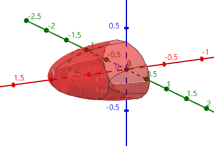

###
1.将长为 $2m$ 的铁丝分成三段,依次围成圆,正方形,正三角形,三个图形之间是否存在最小值,若存在,则求其最小值.
解:
设 $x,y,z$ 是分别赋给圆,正方形,正三角形,三个图形的铁丝长度,则 $x + y+ z = 2$ ,设圆的半径为 $r$ , 正方形的边长为 $d$ , 正三角形的边长为 $l$ ,则

$$\begin{align}
    \begin{cases}
        x = 2\pi r\\
        y = 4d \\
        z = 3l
    \end{cases}
\end{align}$$

可以得到面积和 $S = \pi r^2 + d^2  + \frac{\sqrt{3}}{4}l^2$,原问题转换为 $S$ 在约束 $2\pi r + 4d + 3 l = 2$ 的情况下的最小值.考虑拉格朗日函数 $L(r,d,l,\lambda)=\pi r^2 + d^2  + \frac{\sqrt{3}}{4}l^2 + \lambda(2\pi r + 4d + 3 l - 2)$ ,求偏导数

$$\begin{align}
\begin{cases}
    \displaystyle \frac{\partial L}{\partial r} =  2\pi r + 2\pi\lambda= 0\\ \\
    \displaystyle \frac{\partial L}{\partial d} =2d + 4\lambda = 0\\\\
    \displaystyle \frac{\partial L}{\partial l} =\frac{\sqrt{3}}{2}l + 3\lambda = 0\\\\
    \displaystyle \frac{\partial L}{\partial \lambda} =2\pi r + 4d + 3 l -2 = 0
\end{cases}
\end{align}$$

则得到 $r = -\lambda , d = -2\lambda,l = -2\sqrt{3}\lambda$ ,带回式 $(2)$ 的最后一个式子得到

$$\begin{align}
    \lambda = \frac{-2}{8 + 2\pi + 6\sqrt{3}}
\end{align}$$

对其尽心求二阶偏导,很容易验证海森矩阵 $H$ 是正定的,即取到极小值,得到

$$\begin{align}
    S &= \frac{4\pi + 16 + 12\sqrt{3}}{(8 + 2\pi + 6\sqrt{3})^2} \\
    &=\frac{2}{8 + 2\pi + 6\sqrt{3}}
\end{align}$$

2.设 $\Sigma$ 是曲面 $x = \sqrt{1  - 3y^2 - 3z^2}$ 的前侧,计算曲面积分 $I  =  \displaystyle \iint_{\Sigma}xdydz + (y^3 + 2)dzdx +z^3dxdy$.
解:
取 $\Sigma' : 3y^2  + 3z^2 \leq 1 , x = 0$ 向后,则

$$\begin{align}
    I &= \iint_{\Sigma} w \\
    &= \iint_{\Sigma + \Sigma'} w + \iint_{-\Sigma'}w \\
    &=I_1 + I_2
\end{align}$$

注意 $I_2$ 中 $x = 0,dx = 0$ ,则 $I_2 = 0$ ,得到

$$\begin{align}
    I_1 &= \iiint_{\Omega} 1 + 3y^2 + 3z^2 dxdydz \\
    &= V + 3\iiint y^2 + z^2 dV \\
    &= V + I_3
\end{align}$$

其中 $I_3$ 中由于积分区域是关于 $y,z$ 轮换对称的

$$\begin{align}
    I_3 &= 6\iiint_{\Omega} y^2 dxdydz \\
\end{align}$$

注意到积分区域为 $x^2 + 3y^2 + 3z^2 \leq 1,z,x\geq 0$ 转换为 $x^2 + 3z^2\leq 1 - 3y^2$ (注意的是,截面面积因为 $x\geq 0$ 的原因,只有原面积的一半),如图:

所以有

$$\begin{align}
    I_3 &=6\int^{\frac{1}{\sqrt{3}}}_{-\frac{1}{\sqrt{3}}} y^2 dy \iint_{D_y} dxdz \\
    &=6\int^{\frac{1}{\sqrt{3}}}_{-\frac{1}{\sqrt{3}}} y^2 \pi (1 - 3y^2)\frac{1}{2\sqrt{3}}dy \\
    &=\sqrt{3}\pi \int^{\frac{1}{\sqrt{3}}}_{-\frac{1}{\sqrt{3}}} y^2 - 3y^4dy \\
    &=\sqrt{3}\pi (\frac{y^3}{3} - \frac{3}{5}y^5)|^{\frac{1}{\sqrt{3}}}_{-\frac{1}{\sqrt{3}}} \\
    &=\frac{4\pi}{45}
\end{align}$$

$$\begin{align}
    V &= \int^{\frac{1}{\sqrt{3}}}_{-\frac{1}{\sqrt{3}}} dy \iint_{D_{y}} dxdz \\
    &=\int^{\frac{1}{\sqrt{3}}}_{-\frac{1}{\sqrt{3}}}  \pi(1 - 3y^2)\frac{1}{2\sqrt{3}}dy \\
    &=\frac{\pi}{2\sqrt{3}}\int^{\frac{1}{\sqrt{3}}}_{-\frac{1}{\sqrt{3}}}  (1 - 3y^2)dy \\
    &=\frac{2\pi}{9}
\end{align}$$

则 $I = \frac{2\pi}{9} + \frac{4\pi}{45} = \frac{14\pi}{45}$