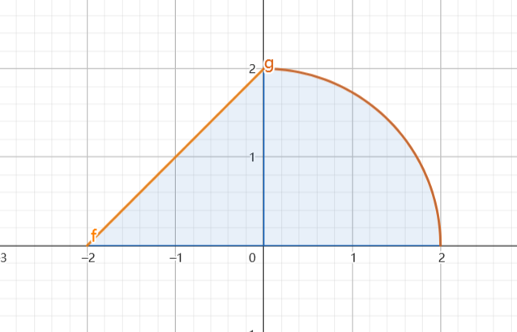

1.设 $-\frac{\pi}{2}<x_n <\frac{\pi}{2}$,判断以下命题的正确性.
(1)若极限 $\lim \sin \cos x_n$ 存在,则 $\lim x_n$ 存在.
(2)若极限 $\lim \cos \sin x_n$ 存在,则 $\lim x_n$ 存在.
(3)若极限 $\lim \sin \cos x_n $时 ,$ \lim \sin x_n$ 存在,而 $\lim x_n$ 存在.
(4)若极限 $\lim \sin \cos x_n $时 ,$ \lim \cos x_n$ 存在,而 $\lim x_n$ 不一定存在存在.

解:
(1)(2)(3) 全错,就 $(4)$ 对
取 $x_n = \frac{\pi}{4} (-1)^{n}$ (在 $\sin x , \cos x$ 的奇偶性上考察)

---
2.当 $x \geq 0  , y \geq 0$ 时, $x^2 + y^2 \leq k e^{x + y}$ ,求 $y$ 的最小值.
解:
问题可以转换为
$$\begin{align}
    (x^2 + y^2)e^{-(x+y)} \leq k
\end{align}$$

即求 $f(x,y) = (x^2 + y^2)e^{-(x+y)}$ 的最大值.

---
3.已知 $A , A - E$ 可逆,其中 $E$ 为 $n$ 阶单位矩阵,若矩阵 $ B $ 满足 $(E - (E - A)^{-1})B = A$ ,求 $B$ .

---
4.设 $\Sigma:x^2 + y^2+z^2 = 1, x\geq 0, y \geq 0, z \geq 0$ 的上侧,$\Gamma$ 时该曲面的边界求曲线积分
$$\begin{align}
    \int_\Gamma (yz^2 - \cos z) dx + 2xz^2 dy + (2xyz + x \sin z )dz
\end{align}$$

解: 利用斯托克斯公式得到一个无奇点的函数 $F(x,y,z)$ ,它的
$$\begin{align}
    \oint_L Pdx + Q dy + Rdz = 0
\end{align}$$

来补面计算.

---
5.设 $f(x)$ 在 $(-\infty,+\infty)$ 上有二阶连续导函数,求证: $f''(x)$ 的充分必要条件为: 对于任意不同的实数 $a,b$ $f(\frac{a+b}{2}) \leq \frac{1}{b-a}\int^b_af(x) dx$

---
6.已知 $D = \{(x,y) | y - 2 \leq x \leq \sqrt{4 - y^2} , 0 \leq y \leq 2 \}$ ,求积分
$$\begin{align}
    \iint_D \frac{(x - y)^2}{x^2 + y^2} dxdy
\end{align}$$

解:积分区域为

这个题直接积分即可,不必使用对称性或者其他性质,利用对称性和轮换对称性做不出来,则积分变为
$$\begin{align}
    &\int^\frac{\pi}{2}_0 d\theta \int^2_0 \frac{r^3(\cos \theta - \sin \theta)^2}{r^2} dr + \int^\pi_{\frac{\pi}{2}}d\theta \int^{\frac{2}{\sin \theta - \cos \theta}}_0\frac{r^3(\cos \theta - \sin \theta)^2}{r^2} dr \\
    &=2\int^\frac{\pi}{2}_0(1 - 2\cos \theta\sin \theta) d\theta + \int^\pi_{\frac{\pi}{2}}2d\theta \\
    &=2\pi - 2
\end{align}$$