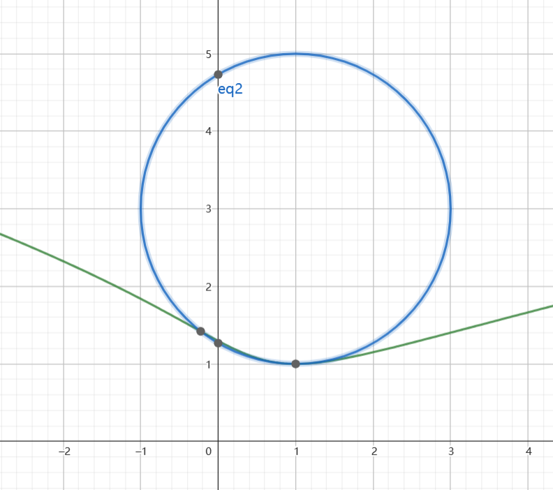

1.对于数列 $\{x_n\}, \{y_n\} $ 判断以下命题是否正确.
a.若数列 $\{x_{2n}\} , \{x_{2n-1}\}$ 收敛,则 $\{x_n\}$ 收敛.
b.若 $\{x_n + y_n\} , \{x_n - y_n\}$ 收敛,则 $\{x_n\} , \{y_n\} $ 收敛.
c.若数列 $\{x_n\}, \{y_n\}$ 发散,则 $\{x_n + y_n\} $ 可能收敛.
d.若数列 $\{x_ny_n\}$ 收敛,则 $x_n$ ,$y_n$ 其中一个必收敛.
解:b,c正确;a,d错误.
a.取 $x_{n}$ 为如下形式
$$\begin{align}
    x_n = \begin{cases}
        \frac{1}{n} + 2 , n = 2k - 1,k=1,2,\cdots \\
        \frac{1}{n} + 3 , n = 2k,k=1,2,\cdots
    \end{cases} 
\end{align}$$

则 $\{x_{2n}\} ,\{x_{2n-1}\}$ 都收敛,但是 ${x_n}$ 不收敛.
b.因为
$$\begin{align}
    x_n = \frac{x_{n} + y_{n}}{2} + \frac{x_n - y_n}{2} , y_n = \frac{x_n + y_n}{2} - \frac{x_n - y_n}{2}
\end{align}$$

所以 $\{x_n\}, \{y_n\} $ 收敛.

c.取
$$\begin{align}
    x_n = n,y_n = -n
\end{align}$$
则 $\{x_{n}\} ,\{y_{n}\}$ 都发散,但是 ${x_n + y_n}$ 收敛.

d.取
$$\begin{align}
    x_n  = y_n = (-1)^n 
\end{align}$$

数列 $\{x_ny_n\}$ 收敛,但是 $x_n$ ,$y_n$ 一个都不收敛.

附注:分叉选两个不同的数列,加减选平均,乘除想到 $(-1)^n$.

---
2.三元二次型 $(x_1 + x_2 + 2x_3)(x_2 + ax_3) = 1$ 的空间图形.
解:
取
$$\begin{align}
    \begin{cases}
        y_1 &=x_1 + x_2 + 2x_3 \\
        y_2 &=x_2 + ax_3 \\
        y_3 &= x_3
    \end{cases} \rightarrow \begin{pmatrix}
        y_1 \\ y_2 \\ y_3 
    \end{pmatrix} = \begin{pmatrix}
        1 & 1 & 2 \\
        0 & 1 & a \\
        0 & 0 & 1
    \end{pmatrix}\begin{pmatrix}
        x_1 \\ x_2 \\ x_3 
    \end{pmatrix}
\end{align}$$

其中 $y = Ax$ 是一个可逆变换,则
$$\begin{align}
    (x_1 + x_2 + 2x_3)(x_2 + ax_3) &= y_1y_2
\end{align}$$

再取
$$\begin{align}
    \begin{cases}
        y_1 &= z_1 - z_2 \\
        y_2 &= z_1 + z_2 \\
        y_3 &= z_3
    \end{cases} \rightarrow \begin{pmatrix}
        y_1 \\ y_2 \\ y_3 
    \end{pmatrix} = \begin{pmatrix}
        1 & 1 & 0 \\
        -1 & 1 & 0 \\
        0 & 0 & 1
    \end{pmatrix}\begin{pmatrix}
        z_1 \\ z_2 \\ z_3 
    \end{pmatrix}
\end{align}$$

$y = Bz$ 也是一个可逆变换,则一定可以得到 $x = Cz$,使得
$$\begin{align}
    (x_1 + x_2 + 2x_3)(x_2 + ax_3) &= z_1^2 - z_2^2 = 1
\end{align}$$

即该二次型的图形为双圆柱面.

---
3.若级数 $\displaystyle \sum_{n=1}^\infty \frac{1}{n^2} = \frac{\pi^2}{6}$ ,求积分 $\displaystyle \int^{+\infty}_1 \frac{[x]}{x^3} dx$.
解：
$$\begin{align}
    \displaystyle \int^{+\infty}_1 \frac{[x]}{x^3} dx &= \sum_{n=1}^\infty \int^{n+1}_n \frac{[x]}{x^3} dx \\
    &=\sum_{n=1}^\infty \int^{n+1}_n \frac{n}{x^3} dx \\
    &=\sum_{n=1}^\infty n \int^{n+1}_n \frac{1}{x^3} dx \\
    &=\sum_{n=1}^\infty n -\frac{1}{2}\frac{1}{x^2}|^{n+1}_n \\
    &=-\frac{1}{2} \sum_{n=1}^\infty n[\frac{1}{(n+1)^2} - \frac{1}{n^2}] \\
    &=\sum_{n=1}^\infty \frac{1}{2}[\frac{n}{n^2} - \frac{n}{(n+1)^2}]
\end{align}$$

它的前 $n$ 项和为
$$\begin{align}
    S_n = \frac{1}{2}[(1 - \frac{1}{2}) + (\frac{2}{4} - \frac{2}{3^2}) + (\frac{3}{9} - \frac{3}{16}) + \cdots]
\end{align}$$

注意:遇到绝对值和取整函数一定要注意划分区间.

---
4.设曲面 $\Sigma$ 为锥面 $z = \sqrt{x^2 + y^2}$ 和平面 $z = 1$ 所围的立体,求 $\Sigma$ 的形心.
解:
由对称性可知
$$\begin{align}
    \bar{x} = 0,\bar{y} = 0,\bar{z} = \frac{\iint_{\Sigma} z dS}{\iint_{\Sigma} dS}
\end{align}$$

积分区域为:
$$\begin{align}
    &\Sigma_1 = \{(x,y,z)| z = \sqrt{x^2 + y^2} , z\leq 1\}\\ 
    &\Sigma_2 = \{(x,y,z) | z = 1 ,x^2 + y^2 \leq 1\}\\
    &\Sigma = \Sigma_1 \cup \Sigma_2
\end{align}$$

即一个平面和圆锥面的并集,其中在 $\Sigma_1$ 上有 $\frac{\partial z}{\partial x} = \frac{x}{z},\frac{\partial z}{\partial y} = \frac{y}{z}$ ,则
$$\begin{align}
    \iint_{\Sigma} dS &= \iint_D \sqrt{1 + \frac{x^2}{z^2} + \frac{y^2}{z^2}} dxdy  + \iint_{\Sigma_2} dS\\
    &= \sqrt{2} \iint_D dxdy  + \pi\\
    &=(\sqrt{2} + 1) \pi    
\end{align}$$

同时
$$\begin{align}
    \iint_{\Sigma} z dS &= \iint_{\Sigma_1} z dS + \iint_{\Sigma_2} 1 dS \\
    &=\sqrt{2} \iint_D \sqrt{x^2 + y^2} dxdy + \iint_{x^2+y^2 leq 1} dxdy\\
    &=\sqrt{2} \int^{2\pi}_0 d\theta \int^1_0r^2 dr  + \pi\\
    &=\frac{2\pi\sqrt{2} }{3} +\pi \\
    &= \frac{\pi(2\sqrt{2} + 3)}{3}
\end{align}$$

故
$$\begin{align}
    \bar{z} = \frac{\frac{\pi(2\sqrt{2} + 3)}{3}}{(\sqrt{2} + 1) \pi } = \frac{2\sqrt{2} + 3}{3(\sqrt{2} + 1)}
\end{align}$$

读题:确定积分区域.

---
5.设 $A$ 是 $4$ 阶实矩阵,其中 $(A + 3E)x = 0$ 的基础解系为 $\alpha_1,\alpha_2$, $(A - E)x = 0$ 的基础解系为 $\alpha_3$ ,求 $r(A^2 + 2A - 3E)$.
解：
注意到
$$\begin{align}
    A^2 + 2A - 3E = (A + 3E)(A - E) = (A - E)(A + 3E)
\end{align}$$

那么就有
$$\begin{align}
    (A^2 + 2A - 3E)x &= (A + 3E)(A - E)x \\
    &= (A - E)(A + 3E)x \\ 
    &= 0
\end{align}$$

则说明 $\alpha_1,\alpha_2,\alpha_3$ 都是上述方程的解,则 $r(A^2 + 2A - 3E) = 4 - 3 = 1$.
附注:任何方阵都和单位矩阵 $E$ 可交换.

---
6.设 $y = y(x)$ 是由方程 $2y^3 - 2y^2 +2xy - x^2 = 1$ 确定,求 $y = y(x)$ 的极值点,并且极值点的曲率圆.
解:
对式子两边的 $x$ 求导,有
$$\begin{align}
    6y^2\frac{dy}{dx} - 4y\frac{dy}{dx} + 2y + 2x\frac{dy}{dx} - 2x = 0
\end{align}$$

则 $\frac{dy}{dx} = 0$ 时 , $y = x$ ,带入到原式内有 $y = x = 1$ ,再对 $(33)$ 式两边求导有
$$\begin{align}
    12y(\frac{dy}{dx})^2 + 6y^2 \frac{d^2y}{dx^2} - 4(\frac{dy}{dx})^2 - 4y\frac{d^2y}{dx^2} + 2\frac{dy}{dx} + 2\frac{dy}{dx} + 2x\frac{d^2y}{dx^2} - 2 = 0
\end{align}$$

带入 $\frac{dy}{dx} = 0 , x = y = 1$ 得到 $\frac{d^2y}{dx^2} = \frac{1}{2}$ ,则在该点的曲率为
$$\begin{align}
    k &= \frac{|y''|}{( 1 +(y')^2)^{1.5}} \\
    &= \frac{1}{2}
\end{align}$$

曲率圆的半径为 $r = 2$ ,同时在 $(1,1)$ 处的法线方程有
$$\begin{align}
    x = 1
\end{align}$$

而曲率圆的圆心在 $x = 1$ 上,并且与 $(1,1)$ 的距离为 $2$ ,得到 $(y - 1)^2 = 4 $ ,得到 $y = 3$ 或者 $ y =  -1$,因为 $y''(1)>1$ ,则说明曲线在 $(1,1)$ 处是凹的,则 $y = 3$, 则曲率圆方程为
$$\begin{align}
    (x - 1)^2 + (y - 3)^2 = 4
\end{align}$$

如图:

---
7.设函数 $f(x,y) = \sqrt{x^2 + \lambda y^2}$ 在原点 $O(0,0)$ 沿着 $P(1,1)$ 的方向导数为 $1$ .空间曲线 $\Gamma:\begin{cases}f(x,y) = z \\ y = 1\end{cases}$ 沿着 $z$ 轴旋转一周得到空间曲面 $\Sigma$,求函数 $F(x,y,z) = x^2 + y^2 + \frac{1}{\lambda + 2}z^3$ 在曲面  $\Sigma$ 上位于 $x^2 + y^2  \leq 1$ 部分沿 $\vec{l} = \{\lambda,\lambda,2\}$ 的方向导数的最大值.
解:
则 $f(x,y)$ 在 $O(0,0)$ 沿着 $(1,1)$ 的方向导数为
$$\begin{align}
    \lim_{t\rightarrow 0} \frac{f(0 + \frac{t}{\sqrt{2}},0 + \frac{t}{\sqrt{2}})}{t} &= \lim_{t\rightarrow 0} \frac{\sqrt{\frac{t^2}{2} + \lambda \frac{t^2}{2}}}{t} \\
    &= \sqrt{\frac{1 + \lambda}{2}}
\end{align}$$

得到 $\lambda = 1$,则 $f(x,y) = \sqrt{x^2 + y^2}$ ,得到曲面 $\Sigma : z = \sqrt{x^2 + y^2 + 1}$ ,转换为 $x^2 + y^2 - z^2 + 1 = 0$,而目标是求函数 $F(x,y,z) = x^2 + y^2 + \frac{1}{3}z^3$ 在曲面  $\Sigma$ 上位于 $x^2 + y^2  \leq 1$ 部分沿 $\vec{l} = \{1,1,2\}$ 的方向导数的最大值,得到
$$\begin{align}
    
\end{align}$$

---
8.设 $3$ 阶矩阵 $A = \alpha\alpha^T + \beta\beta^T$ ,其中 $\alpha,\beta$ 为正交的单位列向量, $A^{*}$ 为 $A$ 的伴随矩阵.
(1)证明:矩阵 $A + A^{*}$ 既是正交矩阵又是正定矩阵.
(2)求正交矩阵 $Q$ 使得 $Q^TA^{*}Q$ 为对角阵,并且求 $xA^{*}x = 1$ 的图形.
(3)求二次型 $f(\vec{x}) = x^TA^{*}x = 0$ 的解. 
(1)证明:
$$\begin{align}
    A\alpha = \alpha , A\beta = \beta
\end{align}$$

则 $A$ 的特征值为 $1,1$ ,又因为
$$\begin{align}
    r(A) = r(\alpha\alpha^T + \beta\beta^T) \leq r(\alpha\alpha^T) + r(\beta\beta^T) \leq 2
\end{align}$$

故 $r(A) = 2,r(A^{*}) = 1$ ,所以 $A$ 的特征值为 $1,1,0$ ,而 $A^{*}$ 的特征值为 $1,0,0$,取
$$\begin{align}
    \gamma = \alpha \times \beta
\end{align}$$ 

则 $\alpha,\beta,\gamma$ 为 $A,A^{*}$ 的特征向量.故令 $Q = (\alpha,\beta,\gamma)$ 
$$\begin{align}
    Q^T(A + A^{*})Q = E  \rightarrow A + A^{*} = E
\end{align}$$

则 $A + A^{*}$ 既是正交矩阵又是正定矩阵.

(2)因为 $A^{*}$ 的特征值为 $1,0,0$,则
$$\begin{align}
    Q^TA^{*}Q = diag\{1,0,0\}
\end{align}$$

则
$$\begin{align}
    x^TA^{*}x = y_1^2 = 1
\end{align}$$

也即 $y_1 = \pm 1$,即两个平行的平面.

(3)令 $x = Qy$ ,则
$$\begin{align}
    f(x) = y^TQ^TA^{*}Qy = y_1^2 = 0
\end{align}$$

则有 $y_1 = 0$ ,那么方程的解为
$$\begin{align}
    \begin{pmatrix}
        x_1 \\ x_2 \\x_3
    \end{pmatrix} &= Q \begin{pmatrix}
        0 \\ y_2 \\ y_3 \\
    \end{pmatrix}
    &=(\alpha,\beta,\gamma)\begin{pmatrix}
        0 \\ y_2 \\ y_3 \\
    \end{pmatrix} \\
    &=y_2 \beta + y_3\gamma
\end{align}$$