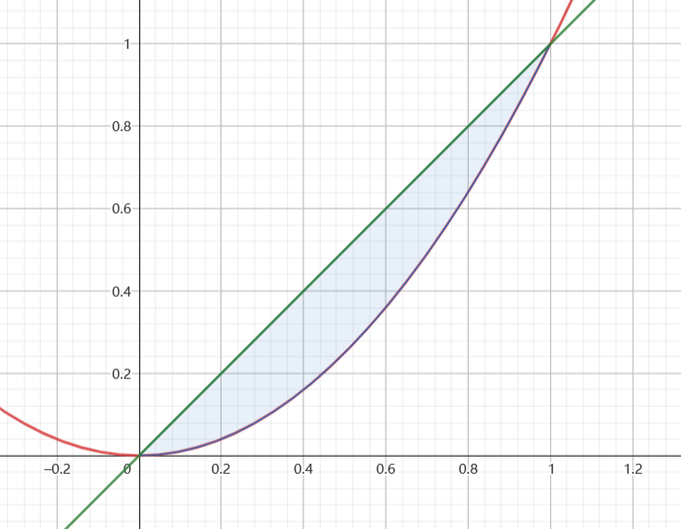
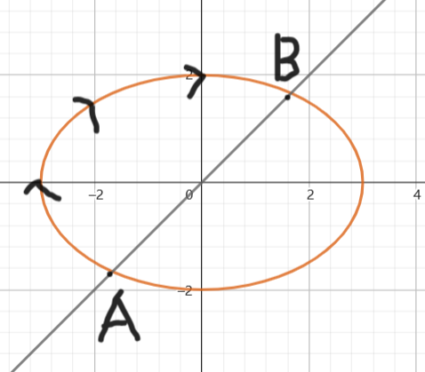

1.设 $f(x)$ 在 $x_0$ 的某个邻域内有定义,且 $\displaystyle \lim_{x\rightarrow x_0}  \frac{f(x) - f(x_0)}{(x - x_0)^2} = 1$,证明: $f(x)$ 在 $x = x_0$ 处有极值,且为极小值.
解:
已知
$$\begin{align}
    \lim_{x\rightarrow x_0}  \frac{f(x) - f(x_0)}{(x - x_0)^2} = 1
\end{align}$$

根据极限的保号性,存在 $x_0$ 的一个邻域 $U(x_0,\delta) = \{x| 0 <|x - x_0| <\delta\}$ ,使得当 $x \in U(x_0,\delta)$
$$\begin{align}
    \frac{f(x) - f(x_0)}{(x - x_0)^2} > 0 \rightarrow f(x) > f(x_0)
\end{align}$$

故 $f(x_0)$ 为极小值.

---
2.设函数
$$\begin{align}
    f(x,y) = \begin{cases}
        (xy + \lambda \sqrt{x^2 + y^2})\arctan \frac{1}{x^2 + y^2} , x^2 + y^2 \not ={0} \\
        0, x^2 + y^2 = 0
    \end{cases}
\end{align}$$

判断下列命题的真伪:
a. $f(x,y)$ 在点 $(0,0)$ 处的连续性与 $\lambda$ 无关.
b.$f(x,y)$ 在点 $(0,0)$ 处的可偏导性与 $\lambda$ 无关.
c.$f(x,y)$ 在点 $(0,0)$ 处的可微性与 $\lambda$ 有关.
d.$f(x,y)$ 在点 $(0,0)$ 处的可偏导,则 $f(x,y)$ 在 $(0,0)$ 处可微.

---
3.设 $A,B$ 为 $n$ 阶实矩阵,关于 $AB $ 与 $BA$ ,求证: $AB,BA$ 的特征值相同,但是不一定相似.
解:
因为
$$\begin{align}
    \begin{vmatrix}
        E & O \\
        -B & E
    \end{vmatrix}\begin{vmatrix}
        E & A \\
        B & E
    \end{vmatrix} &= \begin{vmatrix}
        E & A \\
        O & E-BA
    \end{vmatrix} &= |E - BA| 
\end{align}$$

故 $\begin{vmatrix}E & A \\ B & E\end{vmatrix} = |E - BA|$ ,又有
$$\begin{align}
    \begin{vmatrix}
        E & -A \\
        O & E
    \end{vmatrix}\begin{vmatrix}
        E & A \\
        B & E
    \end{vmatrix} &= \begin{vmatrix}
        E - AB& O \\
        B & E
    \end{vmatrix} &= |E - AB| 
\end{align}$$

则 $|E - AB| = |E - BA|$,因为上式,则
$$\begin{align}
    |\lambda E - AB| &= \lambda^n|E-\frac{1}{\lambda}AB|  \\
    &=\lambda^n|E- B \frac{1}{\lambda} A| \\
    &=\lambda^n|E - \frac{1}{\lambda}BA| \\
    &=|\lambda E- BA|
\end{align}$$

故 $|\lambda E - AB| = |\lambda E- BA|$ ,所以 $BA,AB$ 的特征多项式一致,故他们的特征值相同,并且代数重数一致.取
$$\begin{align}
    A = \begin{pmatrix}
        1 & 1 \\
        1 & 1
    \end{pmatrix} , B = \begin{pmatrix}
        1 & 1 \\
        -1 & -1
    \end{pmatrix} 
\end{align}$$

得到
$$\begin{align}
    AB = \begin{pmatrix}
        0 & 0 \\
        0 & 0
    \end{pmatrix},BA = \begin{pmatrix}
        2 & 2 \\
        -2 & -2
    \end{pmatrix}
\end{align}$$

对于任意可逆矩阵 $P$,都有
$$\begin{align}
    P^{-1}ABP = O \not ={BA} \\
    P^{T}ABP = O \not ={BA} \\
\end{align}$$

故 $AB,BA$ 既不一定相似也不一定合同.

---
4.已知 $\alpha,\beta,\gamma$ 为两两正交的三维列向量,其中 $\Vert \alpha \Vert = 1 , \Vert \beta \Vert = 2 ,\Vert \gamma \Vert = 3$ ,求二次型 $f = x^T(4\alpha\alpha^T + \beta\beta^T - \gamma\gamma^T)x$ 的标准型.
解:
令
$$\begin{align}
  A &=4\alpha\alpha^T + \beta\beta^T - \gamma\gamma^T
\end{align}$$

则
$$\begin{align}
    A\alpha = 4\alpha,A\beta = 4\beta,A \gamma = -9\gamma
\end{align}$$

得到 $A$ 的特征值为 $\alpha,\beta,\gamma$,令
$$\begin{align}
    Q = (\alpha,\frac{\beta}{\Vert \beta \Vert} , \frac{\gamma}{\Vert \gamma \Vert})
\end{align}$$

利用正交变换 $x = Qy$ ,得到二次型的标准型
$$\begin{align}
    y^TQ^TAQy = 4y_1^2 + 4y_2^2 - 9y_3^2
\end{align}$$

---
5.设随机变量为 $X$ 的概率密度函数为 $f_X(x) = \begin{cases}xe^{-x} ,x>0\\ 0 ,x \leq0\end{cases}$,在 $X = x$ 的条件下,随机变量 $Y \sim U(0,x)$,则求方程组 $Yx^2 - 2Xx + 1 = 0$ 无实根的概率.
解:
方程组 $Yx^2 - 2Xx + 1 = 0$ 有解的条件为 $4X^2 - 4Y>0$ ,则无实根的条件为 $Y >X^2$ ,即求概率
$$\begin{align}
    P\{X^2 <Y\}
\end{align}$$

因为
$$\begin{align}
    f_{X,Y}(x,y) &=f_X(x)f_{Y|X}(y|x) \\
    &= \begin{cases}
        e^{-x} , (x,y) \in D \\
        0 ,else
    \end{cases}
\end{align}$$

其中 $D = \{(x,y)| x >0 , 0<y<x\}$,得到积分区域

$$\begin{align}
    \int^1_0 dx \int^x_{x^2}e^{-x} dy &= \int
    ^1_0 (x - x^2) e^{-x} dx \\
    &= 1 - 2e^{-1}  - (2 - 5e^{-1}) \\
    &=3e^{-1} - 1
\end{align}$$

---
6.设 $X$ 是离散型随机变量, $Y$ 是对 $X$ 的一次观测,有如下假设 $H_0:$
|X|-1|0|1|
|---|---|---|---|
|P|0.2|0.6|0.2|

备择假设 $H_1:$
|X|0|1|2|3|
|---|---|---|---|---|
|P|0.1|0.2|0.3|0.4|

当事件 $P\{Y<\frac{1}{2}\}$ 时接受原假设 $H_0$ ,拒接假设 $H_1$ ,求第一类错误概率 $\alpha$ 和第二类错误概率 $\beta$.
解:
$$\begin{align}
    \alpha &= P\{拒绝H_0|H_0为真\} \\
    &= P\{Y\geq \frac{1}{2}|H_0为真\} \\
    &= 0.2 \\
    \beta &= P\{接受H_0|H_1为真\} \\
    &=P\{Y <\frac{1}{2} |H_1为真\} \\
    &= 0.1
\end{align}$$

---
7.求曲线 $f(x) = \frac{1}{1 + e^x} (x\geq 0)$ 与其渐近线和 $y$  轴围成的曲边三角形的面积.
解:
曲线 $f(x)$ 的渐近线,为 $y = 0$ ,则面积为
$$\begin{align}
    \int^{+\infty}_0\frac{1}{1 + e^{x}} dx &=  \int^{+\infty}_2 \frac{1}{t(t- 1)}dt \\
    &= \int^{+\infty}_2 \frac{1}{t(t- 1)}dt \\
    &= \int^{+\infty}_2 \frac{1}{t-1} - \frac{-1}{t} dt \\
    &= \ln (t -1) |^\infty_2 - \ln t |^{+\infty}_2 \\
    &= \lim_{x\rightarrow +\infty}\ln(1 - \frac{1}{t}) - \ln 1  + \ln 2\\
    &= \ln 2
\end{align}$$

---
8.设 $L$ 为椭圆 $C:4x^2 + 9y^2 = 36$ 上的一段曲线弧,积分 $I = \displaystyle \int_L 2dx + 3dy$,,求 $I$ 的最小值.
解:
$$\begin{align}
   \frac{x^2}{9} + \frac{y^2}{4} = 1 
\end{align}$$

令
$$\begin{align}
    \begin{cases}
        x = 3\cos \theta \\
        y = 2\sin \theta
    \end{cases}
\end{align}$$

则
$$\begin{align}
    I &=\int_L 6(\cos \theta -\sin \theta )d\theta 
\end{align}$$

当 $\cos \theta < \sin \theta$ 时, $I$ 最小,即 $y>x$ ,同时满足曲线方程 $C$.如图

积分变为
$$\begin{align}
    I &= 6\int^{\frac{5\pi}{4}}_{\frac{\pi}{4}}\cos \theta - \sin \theta d\theta \\
    &=6(\sin \theta + \cos \theta)|^{\frac{5\pi}{4}}_{\frac{\pi}{4}} \\
    &=6 -(\frac{\sqrt{2}}{2} + \frac{\sqrt{2}}{2})- (\frac{\sqrt{2}}{2} + \frac{\sqrt{2}}{2}) \\
    &=-12\sqrt{2}
\end{align}$$

---
9.设 $A,B$ 为三阶实矩阵 $r(A) = r(A,B) = r(A^T,B^T)^T = 2$ , $A^{*}$ 为 $A$ 的伴随矩阵,求分块矩阵
$$\begin{align}
    \begin{pmatrix}
        A &B \\
        0 & A^{*}
    \end{pmatrix},\begin{pmatrix}
        A & O\\
        B & A^{*}
    \end{pmatrix}
\end{align}$$

的秩 $r_1,r_2$.

解:
因为
$$\begin{align}
    r(A) = r(A,B) \rightarrow AP = B \\
    r(A) = \begin{pmatrix}
        A \\ B
    \end{pmatrix} \rightarrow PA = B
\end{align}$$

那么
$$\begin{align}
    \begin{pmatrix}
        A & AP \\
        O & A^{*}
    \end{pmatrix} \sim \begin{pmatrix}
        A & 0 \\
        O &A^{*}
    \end{pmatrix} \rightarrow r\begin{pmatrix}
        A & B \\
        O & A^{*}
    \end{pmatrix} = 3
\end{align}$$

则
$$\begin{align}
    \begin{pmatrix}
        A & O \\
        B & A^{*}
    \end{pmatrix} = \begin{pmatrix}
        A & O \\
        PA & A^{*}
    \end{pmatrix}\sim \begin{pmatrix}
        A & 0 \\
        O &A^{*}
    \end{pmatrix} \rightarrow r\begin{pmatrix}
        A & O \\
        B & A^{*}
    \end{pmatrix} = 3
\end{align}$$

则 $r_1 = r_2 = 3$.

---
8.设随机变量 $X$ 的概率密度为 $f(x)$, $D[x] = 2$ ,随机变量 $Y$ 的概率密度为 $f(-y)$ ,且 $\rho_{xy}= -\frac{1}{3}$ ,求 $D[X -2Y]$.
解:
已知
$$\begin{align}
    E[Y] &= \int^{+\infty}_{-\infty} yf(-y) dy \\
    &= -\int^{+\infty}_{-\infty}xf(x) dx  \\
    &= -E[x]
\end{align}$$

$$\begin{align}
    E[Y^2] &= \int^{+\infty}_{-\infty}y^2f(-y) dy \\
    &= \int^{+\infty}_{-\infty}x^2 f(x) dx \\
    &=E[X^2]
\end{align}$$

那么 $D[Y] = E[Y^2] - E^2[Y] =E[X^2] -  (-E[x])^2 = D[X] = 2$ ,同时
$$\begin{align}
    Cov(X,Y) &= \rho_{xy}D[X] \\
    &=-\frac{2}{3}
\end{align}$$

那么得到
$$\begin{align}
    D[X - 2Y] &= D[X] + 4D[Y] - 4Cov(X,Y) \\
    &=10 + \frac{8}{3} \\
    &=\frac{38}{3}
\end{align}$$