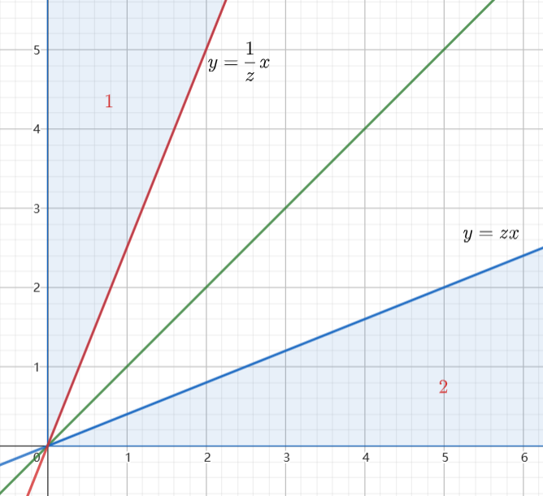

1.设直线 $L_1$ 是曲线 $\begin{cases}
    y = x^2 \\
    z = 3x - x^1
\end{cases}$ 在点 $(1,2,2)$ 处的切线,直线 $L_2$ 是曲面 $z = x^2 + y^2$ 在点 $(1,1,2)$ 处的法线,求 $L_1$ 与 $L_2$ 之间的关系.
解:已知 $L_1$ 的方向向量为 $\vec{s}_1 = (1,4,1)$ ,而 $L_2$ 的方向向量为 $\vec{s}_2(2,2,-1)$ ,则他们的方程为
$$\begin{align}
    L_1: \frac{x - 1}{1} = \frac{y - 1}{4} = \frac{z - 2}{1} \\
    L_2:\frac{x - 1}{2} = \frac{y - 1}{2} = \frac{z - 2}{-1}
\end{align}$$

可以得到 $r(\vec{s}_1,\vec{s}_2) = 2$ ,则他们不平行,但是 $\vec{s}_1^T\vec{s}_2 = 9$ ,则他们不垂直,考虑方程组 $(1),(2)$ 得到
$$\begin{align}
    4x - y = 2 \\
    y - 4z = -6 \\
    x - y = 0\\
    y + 2z = 5
\end{align}$$

无解,故 $L_1$ 与 $L_2$ 无交点,所以 $L_1$,$L_2$ 异面.

---
2.设 $A = (a_{ij})$ 是一个三阶实对称矩阵,若 $r(A) = 2$ ,且 $A$ 的每行元素之和都为 $0$ ,同时 $2,3$ 是 $A$ 的特征值,用 $A_{11}$ 表示 $A$ 的元素 $a_{11}$ 的代数余子式,求 $A_{11}$
解:
因为 $r(A) = 2 \rightarrow r(A^{*}) = 1$ ,同时 $A$ 的每行元素之和都为 $0$,则
$$\begin{align}
    A\begin{pmatrix}
        1 \\ 1 \\ 1
    \end{pmatrix} = 0 \begin{pmatrix}
        1 \\ 1 \\ 1
    \end{pmatrix}
\end{align}$$

则 $A$ 的一个基础解系为 $(1,1,1)^T$ ,又因为
$$\begin{align}
    AA^{*} = \bm{O} \rightarrow A(\alpha_1,\alpha_2,\alpha_3) = (0,0,0) 
\end{align}$$

则说明 $\alpha_i = k_i(1,1,1)^T , i=1,2,3$ ,又因为 $r(A^{*}) = 1$ ,又因为 $A$ 为实对称矩阵,所以 $A^{*}$ 也是实对称矩阵,则 $k = k_1 = k_2 = k_3$ .
$$\begin{align}
    A = \begin{pmatrix}
        k & k & k \\
        k & k & k \\
        k & k & k \\
    \end{pmatrix}
\end{align}$$ 

且 $A^{*}$ 的特征值为 $6,0,0$ ,则 $Tr(A) =A_{11} + A_{22} + A_{33} = 3k = 6  \rightarrow A_{11} = 2$.

---
3.求下面命题的真伪性
(1)若 $\alpha$ 是 $A^T$ 的特征向量,则 $\alpha$ 为 $A$ 的特征向量.
(2)若 $\alpha$ 是 $A^{*}$ 的特征向量,则 $\alpha$ 为 $A$ 的特征向量.
(3)若 $\alpha$ 是 $A^{2}$ 的特征向量,则 $\alpha$ 为 $A$ 的特征向量.
(4)若 $\alpha$ 是 $kA$ 的特征向量,则 $\alpha$ 为 $A$ 的特征向量.
解: $(1),(2),(3)$ 错 ,$(4)$ 对;显然 $(1),(3)$ 是错误的,对于 $(2)$,考虑 $r(A) < n  - 1$ ,则 $r(A^{*}) = 0$ ,则任意向量都是 $A^{*}$ 特征向量,但不一定是 $A$ 的特征向量.
对于 $kA\alpha = \lambda \alpha$ ,则 $A\alpha = \frac{\lambda}{k}\alpha$ ,故 $(4)$ 正确.

---
4.设 $A,B,C$ 是三个随机事件,且 $0<P(A)<1,P(AC)>0$ ,求证 $P(B|A) <P(B|AC)$
解:
$$\begin{align}
    P(B|A) = \frac{P(AB)}{P(A)} , P(B|AC) = \frac{P(ABC)}{P(AC)}
\end{align}$$

---
5.设 $P$ 为椭球面 $S:4x^2 + 4y^2 +z^2 = 4$ 上的动点,$S$ 在 $P$ 点的法向量与向量 $\vec{l} = (0,-1,4)$ 的数量积为 $8$ ,记曲线 $C$ 为 $P$ 点的轨迹,$\Sigma$ 为 $S$ 在曲线 $C$ 的上方部分.
(1)求曲线 $C$ 的方程
(2)求曲面积分 $I = \displaystyle \iint_{\Sigma} \frac{(x+2)z}{\sqrt{1 + 3x^2 + 3y^2}} dS$
解:
(1)已知 $S$ 的任意一点 $(x,y,z)$ 上的法向量为 $(8x,8y,2z)$ ,则 $P$ 的轨迹满足
$$\begin{align}
     0*8x + -1*8y+4*2z =  8 
\end{align}$$

即 $C:z = y + 1$.

(2)容易得到 $\Sigma:\begin{cases}
    4x^2 + 4y^2 +z^2 = 4 \\
    z \geq 1 +y
\end{cases}$ ,得到
$$\begin{align}
    dS = 2\frac{\sqrt{ 1 + 3x^2 + 3y^2}}{z} dxdy
\end{align}$$

故
$$\begin{align}
    I = \iint_{D_{xy}} 2(x+2) dxdy
\end{align}$$

利用 $C:z = y + 1 , S:4x^2 + 4y^2 +z^2 = 4$ ,得到改曲线在 $xoy$ 面上的投影曲线为 $4x^2 + 4y^2 + y^2 + 2y + 1 = 4$ ,即 $4x^2 + 5y^2 + 2y = 3$ ,那么积分 $(13)$ 的投影区域为 $D_{xy} = \{(x,y) | 4x^2 + 5y^2 + 2y \leq 3\} \rightarrow 4x^2 + 5(y + \frac{1}{5})^2 \leq \frac{16}{5}$,由于区域 $D_{xy}$ 是关于 $y$ 轴对称的,所以
$$\begin{align}
    I &= 4\iint_{D_{xy}} dxdy \\
    &= 4 \frac{16}{5\sqrt{20}} \\
    &=\frac{32}{5\sqrt{5}}
\end{align}$$

---
6.设 $f(x)$ 在 $[0,1]$ 上连续,$\int^1_0 f(x) dx = 0$ ,且对于任意 $x \in(0,1)$ 有 $\displaystyle\int^x_0 f(t) dt \not ={0}$ ,求证:$\exist \xi \in (0,1) ,f(\xi) = \displaystyle\int^x_0 f(t) dt$
证明:
令 $\varphi(u) = \displaystyle \int^u_0 f(t) dt - u \int^x_0 f(t) dt$ ,得到 $\varphi(x) = (1 - x)\int^x_0 f(t) dt ,\varphi(1) =  - \int^x_0 f(t) dt $ ,得到
$$\begin{align}
  \varphi(x)\varphi(1) =   (x - 1)[\int^x_0 f(t) dt]^2 <0 , x \in(0,1)
\end{align}$$

故 $\exist \eta \in (x,1)$ 使得, $\varphi (\eta) = 0$ ,又因为 $\varphi(0) = 0$ ,根据罗尔定理,则存在 $\xi \in(0,\eta)$ ,使得
$$\begin{align}
    \varphi'(\xi) = 0 \rightarrow f(\xi) = \int^x_0 f(t) dt
\end{align}$$

证毕.

---
7.设随机变量 $X,Y$ 独立同分布,且 $X \sim f_X(x) = \begin{cases}
    \sqrt{\frac{2}{\pi}} e^{-\frac{x^2}{2}} , x>0 \\
    0,else
\end{cases}$ ,令 $Z = \frac{\min\{X,Y\}}{\max\{X,Y\}}$ ,求 $Z$ 的分布函数.
1.解:分布函数法
$$\begin{align}
    F_Z(z) &=  P\{Z \leq z\} \\
    &=P\{\frac{\min\{X,Y\}}{\max\{X,Y\}} \leq z , (X >Y) \cup (X<Y>)\} \\
    &=P\{\frac{\min\{X,Y\}}{\max\{X,Y\}} \leq z , X >Y \} + P\{\frac{\min\{X,Y\}}{\max\{X,Y\}} \leq z ,  X<Y\} \\ 
    &=P\{\frac{Y}{X} \leq z , X >Y \} + P\{\frac{X}{Y} \leq z ,  X<Y\}\\
    &=P\{Y \leq zX , X >Y \} + P\{Y \geq \frac{1}{z}X ,  X<Y\}
\end{align}$$

(1)当 $z<0$ 时 ,$F_Z(z) = 0$
(2)当 $0 \geq z<1$ 时,积分区域分别为

得到
$$\begin{align}
    P\{Y \leq zX , X >Y \} + P\{Y \geq \frac{1}{z}X ,  X<Y\} &= \int^\infty_0 dx\int^{zx}_0 f(x,y) dxdy + \int^\infty_0 dy \int^{x/z}_0 f(x,y) dxdy  \\
    &=\iint_{D_1} \frac{2}{\pi} e^{-\frac{x^2 + y^2}{2}} dxdy + \iint_{D_2} \frac{2}{\pi} e^{-\frac{x^2 + y^2}{2}} dxdy \\
\end{align}$$

采用极坐标
$$\begin{align}
    &=\int^{\arctan z}_0 d\theta \int^{+\infty}_0 \frac{2}{\pi} re^{-\frac{r^2}{2}} dr + \int^{\frac{\pi}{2}}_{\arctan \frac{1}{z}} d\theta \int^\infty_0 \frac{2}{\pi} re^{-\frac{r^2}{2}} dr \\
    &= \frac{2}{\pi}[\frac{\pi}{2} - \arctan \frac{1}{z} + \arctan z]
\end{align}$$
(3) $z \geq 1$ 时 $F_Z(z) = 1$.
得到分布函数为
$$\begin{align}
    F_Z(z) = \begin{cases}
        0 , z <0  \\
        \frac{2}{\pi}[\frac{\pi}{2} - \arctan \frac{1}{z} + \arctan z] ,0 \leq z < 1 \\
        1 , z \geq 1 
    \end{cases} \rightarrow f_Z(z) = \begin{cases}
        \frac{4}{\pi(1 + z^2)} , 0 \leq z < 1\\
        0 , else
    \end{cases}
\end{align}$$

---
8.设在区间 $[0,1]$ 上任取 $n(n \geq 2)$ 个点, 求距离最远的两点间的平均距离.
解:
设 $X_1,X_2,\cdots X_n$ 为 $n$ 个点的坐标,则 $X_1,X_2\cdots X_n$ 是相互独立且服从 $U[0,1]$ 分布的随机变量,令 $M = \max\{X_1,X_2,\cdots X_n\} , N = \min\{X_1,X_2,\cdots X_n\}$ ,那么得到
a. 当 $0<x<1$ 时
$$\begin{align}
    P_M\{M \leq x\} &= P_M\{\max\{X_1,X_2,\cdots X_n\} \leq x\} \\
    &=P_X^n\{X \leq x\} \\
    &=x^n
\end{align}$$
 
b. 当 $0<y<1$ 时
$$\begin{align}
    P_N\{N \leq y\} &= P_N\{\min\{X_1,X_2,\cdots X_n\} \leq x\} \\
    &=1 - P_N\{\min\{X_1,X_2,\cdots X_n\} > x\} \\
    &=1 - P_X^n\{X > y\} \\
    &=1 - (1 - y)^n
\end{align}$$

故得到
$$\begin{align}
    F_M(x) = \begin{cases}
        0 , x<0 \\
        x^n , 0 \leq x<1 \\
        1 , x\geq 0
    \end{cases} , F_N(y) = \begin{cases}
        0 , y<0 \\
        1 - (1 - y)^n , 0 \leq y<1 \\
        1 , y\geq 0
    \end{cases}
\end{align}$$

得到
$$\begin{align}
    f_M(x) = \begin{cases}
        nx^{n-1} , 0 \leq x<1 \\
        0 , else
    \end{cases} , f_N(y) = \begin{cases}
        n(1 - y)^{n-1} , 0 \leq y<1 \\
        0 , else
    \end{cases}
\end{align}$$

$E[M] = \frac{n}{n+1},E[N] = \frac{1}{n+1}$,则 $E[M - N] = \frac{n - 1}{n+1}$ .

---
9.从编号 $1 \sim 9$ 的九张卡片中有放回地任取五张,试用切比雪夫不等式估计所取卡片之和在 $15$ 与 $35$ 之间的概率的最小值.
解:
设 $X$ 是一次抽取的结果,则 $P\{X = i\} = \frac{1}{9} , i =1,2\cdots 9$,则 $X_1,X_2,X_3,X_4,X_5$ 是来自母体 $X$ 的一个容量为 $5$ 的子样,令 $Y = X_1 + X_2 + X_3 + X_4 + X_5$,则求 $P\{15 \leq Y \leq 35 \}$ 的最小值,猜测一下
$$\begin{align}
    P\{15 \leq Y \leq 35\} &= P\{-10 \leq Y - 20 \leq 10\} \\
    &=P\{|Y - 25| \leq 10\}
\end{align}$$

则可以猜测 $Y$ 的均值为 $25$.现在来具体的计算 $Y$ 的均值和方差,则它的均值为
$$\begin{align}
    E[Y] &= E[X_1] + E[X_2] + E[X_3] + E[X_4] + E[X_5] \\
        &=5E[X] \\
        &= 25 \\
\end{align}$$

它的方差为
$$\begin{align}
    D[Y] &= D[X_1 + X_2 + X_3 + X_4 + X_5] \\
    &=5D[X] \\
    &=5\{E[X^2] - E^2[x]\} 
\end{align}$$

其中
$$\begin{align}
    E[X^2] &= \frac{1}{9}(1 + 4 + 9 + 16 + 25 + 36 + 49 +64 + 81) \\
    &=\frac{285}{9} 
\end{align}$$

得到
$$\begin{align}
    D[Y] &=5\{\frac{285}{9} - \frac{225}{9}\} \\
    &=\frac{300}{9} \\
    &=\frac{100}{3}
\end{align}$$

将 $(17)$ 式转换为
$$\begin{align}
    P\{|Y - 25| \leq 10\} &= P\{|Y - E[Y]| \leq 10\} \\
    &=1 - P\{|Y - E[Y]| > 10\} \\
    &\geq 1 - \frac{D[Y]}{100} \\
    &\geq \frac{2}{3} 
\end{align}$$

故 $P\{15 \leq Y \leq 35\}$ 的概率至少为 $\frac{2}{3}$ .