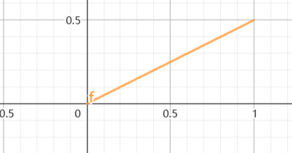
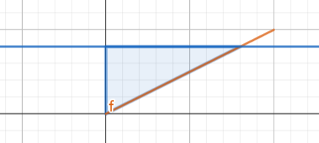
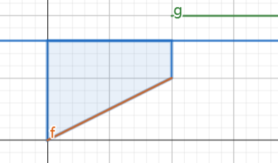

#### 混合型
指的是离散型和连续性的结合, $X$ 的概率分布里面有跳跃间断点,这样的类型,这种类型需要先将连续型的概率求出来,然后再将分段点处的概率讨论是否相加.

#### 例题
##### 1.已知 $X$ 分布满足 $F_X(x) = \begin{cases} 0 , x<0 \\ \frac{1}{2}x , 0\leq x <1 \\ 1 ,x \geq 1\end{cases}$ ,求 $Y = F_X(X) $ 的分布函数.
解:
已知定义域为 $x\in[0,1)$ ,图像为:

这种图像,一般是因为在分段点出现了离散型的概率,所有导致了分段,但是并不影响.
讨论:
1.$y<0$,$F_Y(y) = 0$
2.$0\leq 2y<1$ 时,有

$x\in [0,2y)$ 故:

$$\begin{align}
    F_Y(y) = \int^{2y}_0 \frac{1}{2} dx = y
\end{align}$$

3.$1 \leq 2y<2 \rightarrow \frac{1}{2} \leq y<1 $ 时,注意此时并没有到达分段点处 $x = 1$

$$\begin{align}
    F_Y(y) = \int^{1}_0 \frac{1}{2} dx = \frac{1}{2}
\end{align}$$

4.$2y\geq 2 \rightarrow y\geq 1$

$$\begin{align}
    F_Y(y) = P\{\Omega \} = 1
\end{align}$$
故 $Y$ 的分布函数为:

$$\begin{align}
    F_Y(y) = \begin{cases}
        0, y<0\\
        y,0\leq y<\frac{1}{2} \\
        \frac{1}{2},\frac{1}{2} \leq y<1 \\
        1, y\geq 1
    \end{cases}
\end{align}$$

总结: 原随机变量的分布在 $x = 1$ 处有离散型的概率 $P\{X = 1\} = \frac{1}{2}$ ,所以对于分段点我们需要多家考虑.

#### 2.例题
设随机变量 $X$ 服从 $F_X(x) = \begin{cases} 0 , x<0 \\ \frac{1}{3}  + \frac{1}{4}x , 0 \leq x <1 \\ \frac{7}{12} + \frac{1}{12}x  ,1\leq x<4\\ 1, x \geq 4 \end{cases}$ ,求 $Y = F_X(X)$ 的分布函数

从 $f_X(x)$ 知道定义域 $D_x = \{x| x \in [0,4) \}$ ,其中 $F_X(x)$ 有三个间断点, $x = 0,x = 1 ,x=4$ 处则 $P\{X = 0\} = \frac{1}{3},P\{X = 1\} = \frac{1}{12},P\{X = 4\} = \frac{1}{12}$

故:
1.$y<\frac{1}{3}$ 时 ,$F_Y(y)=0$
2.$\frac{1}{3} \leq y <\frac{7}{12} \rightarrow 0\leq 4(y - \frac{1}{3}) <1$ 时:

$$\begin{align}
    F_Y(y) &= P\{0 \leq X \leq 4(y - \frac{1}{3}) \} \\
    &=P\{0 < X\leq 4(y - \frac{1}{3}) \} + P\{X = 0\} \\
    &= \int^{4(y - \frac{1}{3})}_0 \frac{1}{4} dx + \frac{1}{3} \\
    &= y
\end{align}$$

3.$\frac{7}{12}\leq y <\frac{11}{12} \rightarrow 1\leq 12(y - \frac{7}{12}) <4$ 则

$$\begin{align}
    F_Y(y) &= P\{0 \leq X \leq 12(y - \frac{7}{12}) \} \\
    &=P\{0 < X\leq 12(y - \frac{7}{12}) \} + P\{X = 0\} \\
    &= P\{0 < X<1 \} + P\{1 < X < 12(y - \frac{7}{12})\} + P\{X = 0\} + P\{X = 1\}\\
    &= \frac{8}{12} + \int^{12(y - \frac{7}{12})}_1 \frac{1}{12} dx \\
    &=y
\end{align}$$

4.$y \geq \frac{11}{12}$ 时 , $F_Y(y) = 1$ .

得到

$$\begin{align}
    F_Y(y) = \begin{cases}
        0 , y< \frac{1}{3} \\
        y , \frac{1}{3} \leq y<\frac{11}{12} \\
        1, y \geq \frac{11}{12}
    \end{cases} \rightarrow f_Y(y) = \begin{cases}
        1 , \frac{1}{3} \leq y<\frac{11}{12} \\
        0 , else
    \end{cases}
\end{align}$$
