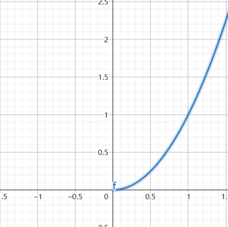
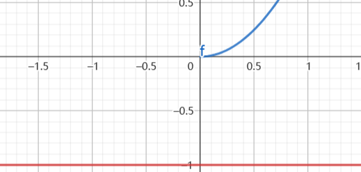
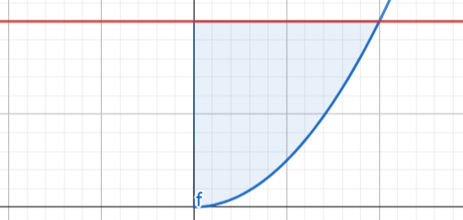
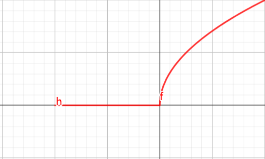
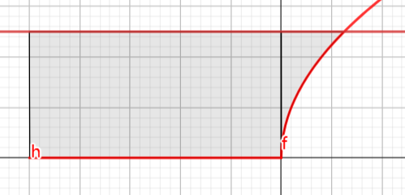
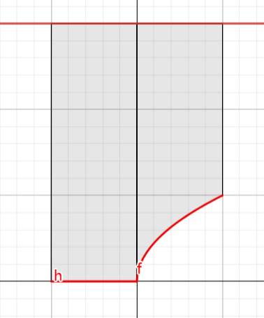

## 连续对连续

#### 1.单调性
随机变量 $X$ 的概率密度为 $f_X(x)$,则对于 $Y = g(X)$ 的概率密度求法为:

$$\begin{align}
    P\{Y\leq y_0\} = P\{g(X)\leq y_0\}
\end{align}$$

如果存在唯一的反函数使得 $x = h(y)$ ,并且 $g(x)$ 严格单调的,那么

$$\begin{align}
    f_{Y}(y) = f_X(h(y))|h'(y)|
\end{align}$$

其中积分区域和 $x$ 有关.

#### 2.复杂函数
如果 $g(x)$ 不是单调的,是一个复杂的函数,例如分段函数,则求法如下,因为

$$\begin{align}
    P\{Y\leq y_0\} = P\{g(X)\leq y_0\}
\end{align}$$

利用图形结合:
1.判断 $g(x)$ 的定义域($X$ 的**密度函数**不为 $0$ 的时候)
2.画出 $y = g(x)$ 的图像
3.画出 $y = y_0$ ,将 $g(x) \leq y_0$ 时的区域.
4.将面积区域的 $x$ 轴的范围作为积分区域.
注意:最后一步确定范围,只是利用**有意义的面积**投影到 $x$ 轴上的**长度区域**.同理对于二维随机变量,将**有意义的体积**投影到 $xoy$ 面的**二维面积区域**.

#### 例题
##### 1.设 $X$ 是指数分的随机变量,求 $Y = X^2$ 的分布函数和密度函数.
解:
因为:

$$\begin{align}
    f_X(x) = \begin{cases}
        \lambda e^{-\lambda x} , x\geq 0\\
        0 , x<0
    \end{cases}
\end{align}$$

$$\begin{align}
    P\{Y\leq y_0\} = P\{X^2\leq y_0\}
\end{align}$$

1.定义域 $x\geq 0 $
2.图像

3.讨论
3.1 $y<0$ 时 

无面积,故 $F_Y(y) = 0$
3.2 $0 \leq y< +\infty$ 时

将有意义的面积投影到 $x$ 轴上,此时 $x\in(0,\sqrt{y_0})$,则:

$$\begin{align}
    P\{X\leq \sqrt{y_0}\} &= \int^{\sqrt{y_0}}_0 \lambda e^{-\lambda x}dx \\
    &= 1 -e^{-\lambda \sqrt{y_0}}
\end{align}$$

则:

$$\begin{align}
    F_Y(y) = \begin{cases}
        0 , y<0 \\
        1 - e^{-\lambda \sqrt{y}} , y\geq 0 
    \end{cases} \rightarrow f_Y(y) = \begin{cases}
        \frac{1}{2\sqrt{y}}\lambda e^{-\lambda\sqrt{y}} , y \geq 0\\
        0 , else
    \end{cases}    
\end{align}$$

##### 2.已知 $X$ 是服从 $U[-1,1]$ 的随机变量, $y = g(x) = \begin{cases} \sqrt{x} , 0\leq x\leq 1 \\ 0 , -1 \leq x < 0\end{cases}$ ,求 $Y = G(X) $的分布函数.
解:
1.定义域 $x \in[-1,1]$
2.图像

3.分类讨论
3.1 $y<0$ 时, $F_Y(y) = 0$
3.2 $0 \leq y <1 $ 时

此时投影下来的 $x \in(-1,y^2)$ ,则

$$\begin{align}
    P_Y\{Y \leq y\} &= P\{-1 \leq X \leq 0\} + P\{0 \leq X \leq y^2\} \\
    &= \frac{1}{2} + \frac{y^2}{2} \\
    &= \frac{1 + y^2}{2}
\end{align}$$

3.3 $y \geq 1$ 时

可以看到,$x\in[-1,1]$ ,已经是将 $x$ 的投影区域填满了,故 $F_Y(y) = 1$ 
故:

$$\begin{align}
    F_Y(y) = \begin{cases}
        0 , y<0\\
        \frac{1 + y^2}{2},0 \leq y <1 \\
        1 , y\geq 1
    \end{cases}
\end{align}$$

总结:
1.对于单调函数,利用公式法
2.对于复杂函数,我们可以采用 求定义域,定区间,画面积,做投影区域的方式来计算.同时要强调,复杂函数我们关注的更多的是对 $x$ 的定义域和投影区间.
