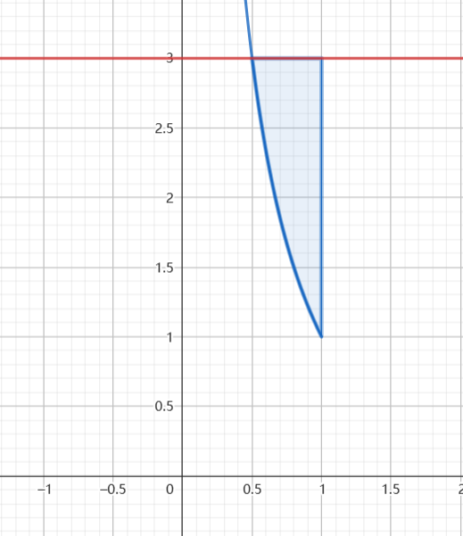
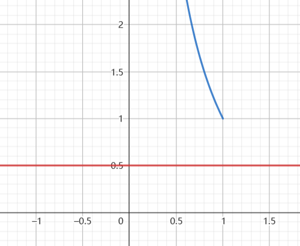

### 例题一
在 $[0,2]$ 上随机取一点,将该区间分为两段 ,较短的一段为 $X$ ,较长的一段为 $Y$ ,令 $Z = \frac{Y}{X}$ .
1.求 $X$ 的分布函数和概率密度
2.求 $Z$ 的分布函数
解:
1.
设随机取的点的坐标为 $V$ ,则 $V \thicksim U(0,2)$ ,则 $X = \min\left\{V,2-V\right\},Y = \max\left\{V,2-V\right\}$ ,同时 $x\in(0,1) , y\in(1,2)$

$$\begin{align}
    P\left\{X \leq x\right\} &= P\left\{\min\left\{V,2-V\right\} \leq x\right\}\\
    &= P\left\{V \leq x \cup 2 - V \leq x \right\} \\
    &= P\left\{V \leq x\right\} + P\left\{2 - V \leq x\right\} - P\left\{V \leq x , 2 - V \leq x\right\}\\
    &= P\left\{V \leq x\right\} + P\left\{2 - V \leq x\right\} - P\left\{V \leq x , V \geq 2 -  x\right\} \
\end{align}$$

注意: $x\in(0,1) , 2 - x \in(1,2)$ ,故 $\left\{V \leq x , V \geq 2 -  x\right\} = \varnothing$ ,得到:

$$\begin{align}
    &= P\left\{V \leq x\right\} + P\left\{2 - V \leq x\right\} \\
    &=\frac{1}{2}x + (2 - (2 -x)) \frac{1}{2} \\
    &= x
\end{align}$$

故

$$\begin{align}
    F_X(x) = \begin{cases}
        x , 0\leq x<1 \\
        0,else
    \end{cases}\rightarrow f_X(x) = \begin{cases}
        1 , 0\leq x<1 \\
        0,else
    \end{cases}
\end{align}$$

2.做法
因为 $X + Y = 2$ ,故 $Z = \frac{Y}{Z} = \frac{2}{X} - 1$ ,所以 $z = g(x)$ 是一个单调的函数,且存在唯一的反函数:

$$\begin{align}
    X = \frac{Z+1}{2}
\end{align}$$

所以

$$\begin{align}
    F_Z(z) &= P\left\{Z \leq z\right\}\\
    &=P\left\{\frac{2}{X} - 1 \leq z\right\} \\
\end{align}$$

如图:

  

看到:
1.$z<1$ 时 $F_Z(z) = 0$
2.$z\geq 1$ 时:,可以看到 $x\in(\frac{2}{1 + z},1)$

$$\begin{align}
    F_Z(z) &= \int^1_{\frac{2}{1 + z}} dx \\
    &=1 - \frac{2}{1+z}
\end{align}$$

则

$$\begin{align}
    F_X(x) = \begin{cases}
        1 - \frac{2}{1+z} , z \geq 1 \\
        0,else
    \end{cases}\rightarrow f_X(x) = \begin{cases}
        \frac{2}{(1+z)^2} , 1\geq z \\
        0,else
    \end{cases}
\end{align}$$

可以顺带将 $Y$ 的分布函数和密度函数求出来.

$$\begin{align}
    P\left\{Y \leq y\right\} &= P\left\{\max\left\{V,2-V\right\} \leq y\right\}\\
     &=P\left\{V\leq y , 2 - V \leq y\right\}
\end{align}$$

$y \in(1,2) , 2 - y \in(0,1)$ ,则:

$$\begin{align}
    P\left\{Y \leq y\right\} &= P\left\{\max\left\{V,2-V\right\} \leq y\right\}\\
    &=P\left\{ 2 - y\leq V\leq y \right\} \\
    &=\int^{y}_{2-y} \frac{1}{2} dy \\
    &= y - 1
\end{align}$$

值得注意的是:有些同学想利用多维积分的性质来计算 $Z$ 的分布 $f_{X,Y}(x,y) = f_X(x)f_Y(y)$ ,但是这是行不通的,因为 $X,Y$ 在原文中并不相互独立,所以只有一种做法.