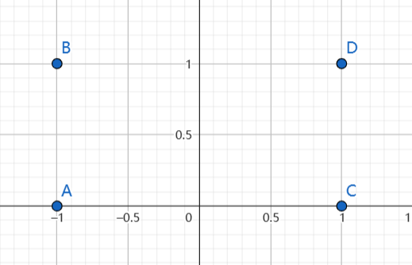
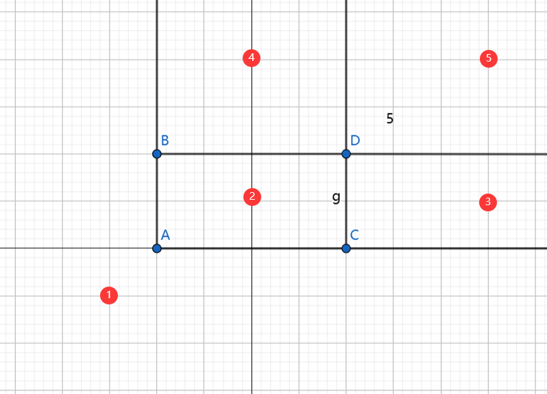
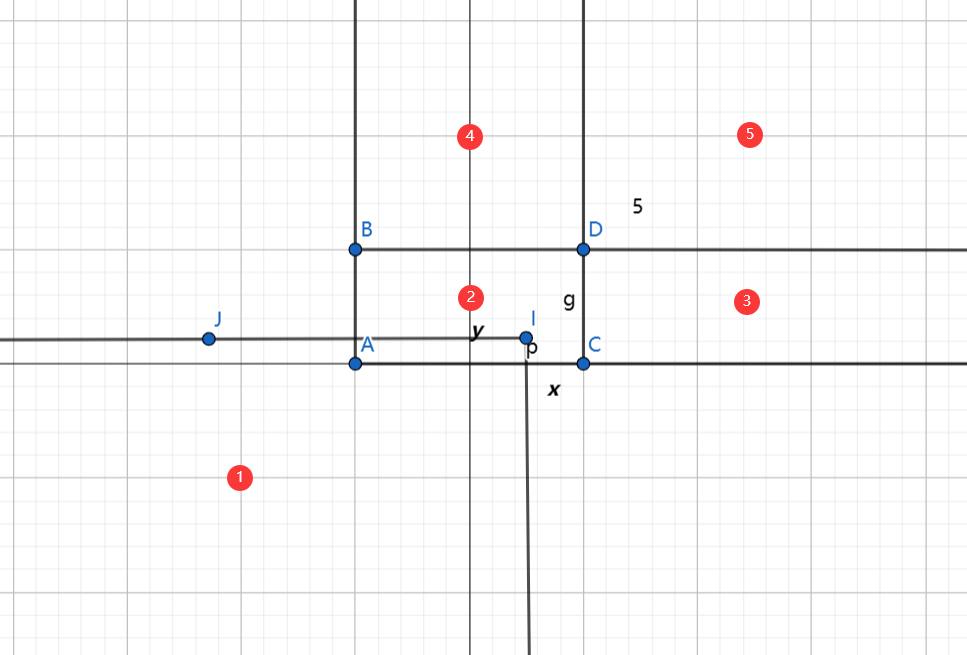
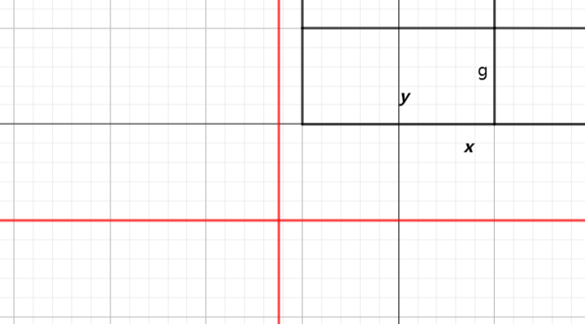
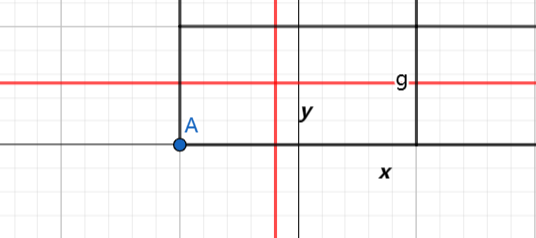
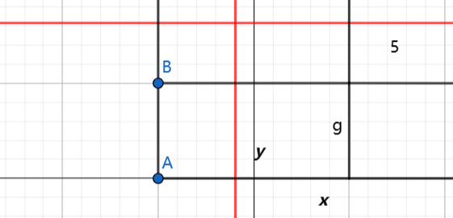
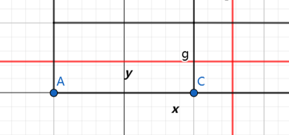
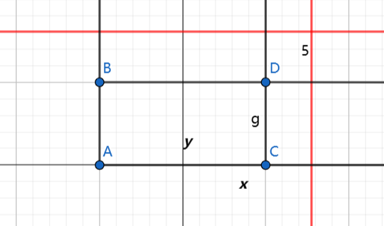

#### 
已知 $P\left\{X = x_i,Y = y_j\right\}$ ,求分布函数
* 画出 $xoy$ 面
* 画出 $P\left\{X = x_i,Y = y_j\right\}$ 不为零的点
* 将点的右上区域画出来,分成区域
* 将 $F_{X,Y}(x_0,y_0)$ 画成 $y = y_0,x = x_0$ ,此时在这个矩形左下区域包含的的非零概率点求和.

例如:
|X\Y|0|1|
|---|---|---|
|-1|$\frac{1}{3}$|$\frac{1}{12}$|
|1|$\frac{1}{4}$|$\frac{1}{3}$|

则有四个点的概率不为零 $(-1,0),(-1,1),(1,0),(1,1)$ .
1.画点

2.连边,画区域

3.画 $x\leq x_0,y \leq y_0$,

4.分类讨论
4.1 $x<-1 \;or\; y<0$ 时, $F_{X,Y}(x,y) = 0$

4.2 $-1 \leq x<1 ,0\leq y<1$ 时, 矩形框中包含 $(-1,0)$这个点 , $F_{X,Y}(x,y) = P\left\{X = -1,Y = 0\right\} = \frac{1}{3}$

4.3 $-1 \leq x<1 ,y\geq 1 $ 时, 矩形框中包含 $(-1,0),(-1,1)$ 两个点 , $F_{X,Y}(x,y) = P\left\{X = -1,Y = 0\right\}  + P\left\{X = -1,Y = 1\right\}= \frac{1}{3} + \frac{1}{12} = \frac{5}{12}$

4.4 $x \geq 1, 0\leq y <1 $ 时, 矩形框中包含 $(-1,0),(1,0)$ 两个点 , $F_{X,Y}(x,y) = P\left\{X = -1,Y = 0\right\}  + P\left\{X = 1,Y = 0\right\}= \frac{1}{3} + \frac{1}{4} = \frac{7}{12}$

4.5 $x \geq 1, y \geq 1 $ 时, 矩形框中包含 全部的四个点, $F_{X,Y}(x,y) = 1$

故有:

$$\begin{align}
    F_{X,Y}(x,y) = \begin{cases}
        0,x<-1 \;or\; y<0\\
        \frac{1}{3},-1 \leq x<1 ,0\leq y<1\\
        \frac{5}{12},-1 \leq x<1 ,y\geq 1 \\
        \frac{7}{12},x \geq 1, 0\leq y <1 \\
        1,x \geq 1, y \geq 1 
    \end{cases}
\end{align}$$

可以发现,这些区域正好就是我们开始分的区域.

