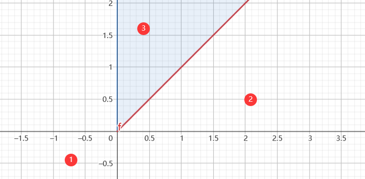
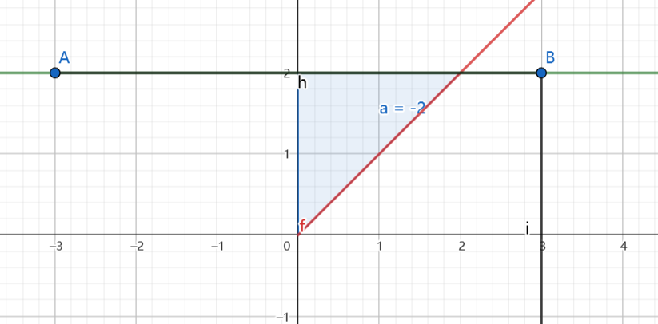

### 已知密度函数求分布函数
跟 $1.$ 相似,但是要将点转换为面积区域进行积分.
#### 步骤
* 将 $f_{X,Y}(x,y)$ 的非零区域的定义域画出来 $D_{xy}$ ,并且将 $x\rightarrow t , y \rightarrow s$
* 以边界区分各个区域,将各个区域的表达式写出来
* 画 $t = x, s = y $ 的两条垂线,将垂线左下方有意义的面积积分,即为分布函数.

#### 示例:
##### 二维随机变量 $X,Y$ 它具有密度函数

$$\begin{align}
    f_{X,Y}(x,y) = \begin{cases}
        2e^{-(x+y)} , 0 <x<y \\
        0, else 
    \end{cases}
\end{align}$$

##### 求它的分布函数.
解：
1.画可积区域
将 $0<x<y$ 转换为 $0<t<s$ ,如图

区域分别为:

$$\begin{cases}
    1. t<0 \cup s<0 \\
    2. 0\leq s<t \\
    3. 0\leq t <s
\end{cases}$$

注意,斜线是 $s = t$
2.分类讨论
2.1 $x<0\; or \; y<0$ 时 $F_{X,Y}(x,y) = 0$
2.2 $x>y\geq 0$ 时

此时面积区分别由 $s=y,t=s,t=0$ 围住 ,故积分为:

$$\begin{align}
    \int^{y}_0 dt \int^y_t2e^{-t-s} ds &=2\int^y_0e^{-t}-e^{-s}|^{y}_tdt\\
    &=2\int^y_0e^{-t}(e^{-t} - e^{-y}) dt \\
    &=2\int^y_0e^{-2t} dt- 2e^{-y} \int^y_0e^{-t}dt \\
    &=-e^{-2t}|^y_0 + 2e^{-y}e^{-t}|^y_0 \\
    &= e^{-2y} + 1 - 2 e^{-y}
\end{align}$$

2.3 $0\leq x \leq y$ 时:

此时面积区域由 $s = y,t=x,t=s,t=0$ 围住,故根据二重积分的原理有:

$$\begin{align}
    F_{X,Y}(x,y) &= \int^x_0 dt\int^y_t 2e^{-t-s}ds \\
    &=1-e^{-2x}-2e^{-y} + 2e^{-(x+y)}
\end{align}$$

故有:

$$\begin{align}
    F_{X,Y}(x,y) = \begin{cases}
        0 , x<0\; or \; y<0\\
        e^{-2y} + 1 - 2 e^{-y},0\leq x <y\\
        1-e^{-2x}-2e^{-y} + 2e^{-(x+y)},0\leq x \leq y
    \end{cases}
\end{align}$$

