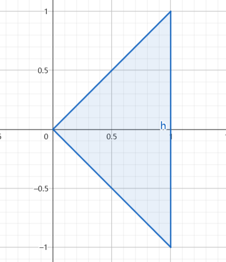
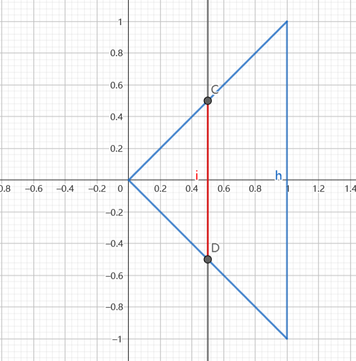
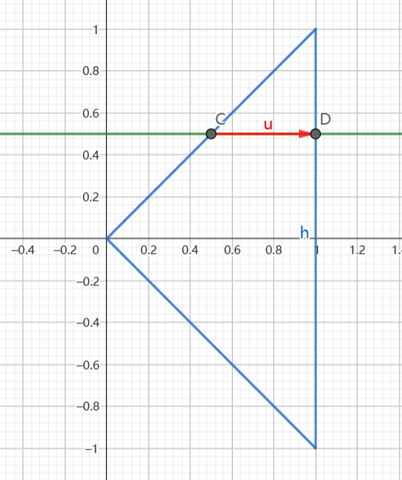
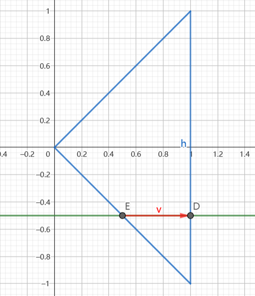

##### 已知 $f_{X,Y}(x,y)$ ,求 $f_X(x),f_Y(y)$, 经典法:

$$\begin{align}
    f_X(x) = \int^{+\infty}_{-\infty} f_{X,Y}(x,y) dy\\
    f_Y(y) = \int^{+\infty}_{-\infty} f_{X,Y}(x,y) dx
\end{align}$$

这个边缘分布就好说.之前的二位分布函数使用两条垂线划分区域,但是这个只需要一条线段即可.

步骤:
* 画出 $f_{X,Y}(x,y)$ 非零值的定义域 $D_{xy}$,并将 $x \rightarrow t,t\rightarrow s, D_{xy} \rightarrow D_{ts}$
* 将 $D_{ts}$ 分类讨论以 $x$ 为类比:
  *  画 $t = x$ 的直线
  *  看 $t = x$ 和 有效区域 $D_{st}$ 是否有交集,如果有交集,则积分,如果没交集则为0.  

注意:这里的边际密度函数其实就是将面积压缩到一个点上,分布列是离散值求和,而连续值则是有限增量积分.

#### 例题
已知 $(X,Y)$ 是服从 $(1,1),(0,0),(1,-1)$ 为边界点的均匀分布的随机变量,求它们的边际分布概率 $f_X(x),f_Y(y)$.
解:
1.先画区域

得到分布函数:

$$\begin{align}
    f_{X,Y}(x,y) = \begin{cases}
        1 , 0 \leq x\leq 1 , |y|\leq x \\
        0,else
    \end{cases}
\end{align}$$

2.1 画 $t = x$ 直线
2.1.1 $x<0$ 时 ,为 $f_X(x) = 0$
2.1.2 $0 \leq x \leq 1$ 时

$$\begin{align}
    f_X(x) &= \int^x_{-x}1dy \\
    &= 2x 
\end{align}$$

2.1.3 $x>1$ 时 ,$f_X(x) = 0$

$$\begin{align}
    f_X(x) = \begin{cases}
        2x , 1\leq x <0 \\
        0,else
    \end{cases}
\end{align}$$

2.2 画$ s = y$ 曲线
2.2.1 $y>1 \; or \; y<-1$ 时,直线与有效区域无交集,$f_Y(x) = 0$
2.2.2 $ 0 \leq y\leq 1$ 时

$$\begin{align}
    f_Y(y) = \int^1_y 1 dx = 1-y
\end{align}$$

2.2.3 $ -1 \leq y\leq 0$ 时

$$\begin{align}
    f_Y(y) = \int^1_{-y} 1 dx = 1 + y
\end{align}$$

故:

$$\begin{align}
    f_Y(y) = \begin{cases}
        0 ,y>1 \; or \; y<-1\\
        1-y,0 \leq y\leq 1\\
        1 + y,-1\leq y\leq 0
    \end{cases} = \begin{cases}
        0 ,y>1 \; or \; y<-1\\
        1-|y|,|y|\leq 1
    \end{cases}
\end{align}$$