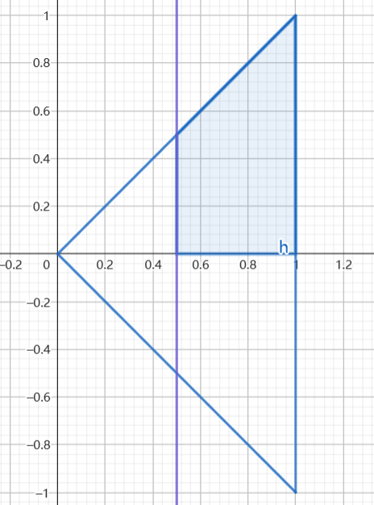
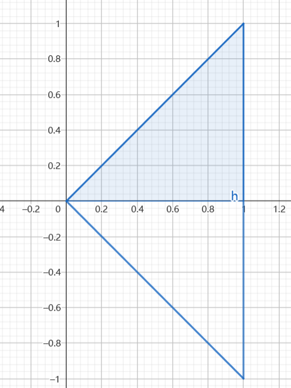

### 已知 $X,Y$ 的密度函数 $f_{X,Y}(x,y)$ ,求他们的条件密度函数 $f_{X|Y}(x|y) , f_{Y|X}(y|x)$.
经典法:

$$\begin{align}
    f_{X|Y}(x|y)&= \frac{f_{X,Y}(x,y)}{f_{X}(x)} \\
    f_{Y|X}(y|x)&=\frac{f_{X,Y}(x,y)}{f_{Y}(y)}
\end{align}$$

步骤:
* 先利用3.计算出边缘分布概率
* 利用式 $(1)$ $(2)$ 得到条件概率.
* 条件概率密度的积分区域为边缘分布概率和密度函数的积分区域的交集.

例题: $3.$ 中例题,现在求 $f_{X|Y}(x|y),f_{Y|X}(y|x) $,并且求 $P\{X>\frac{1}{2}|Y>0\} , P\{X>\frac{1}{2}|Y = \frac{1}{4} \}$
解:
1.
已知

$$\begin{align}
    f_X(x) &= \begin{cases}
        2x , 1\leq x <0 \\
        0,else
    \end{cases} \\
    f_Y(y) &=\begin{cases}
        1-|y|,|y|\leq 1 \\
        0,else
    \end{cases}
\end{align}$$

$$\begin{align}
    f_{X,Y}(x,y) = \begin{cases}
        1 , 0 \leq x\leq 1 , |y|\leq x \\
        0,else
    \end{cases}
\end{align}$$

所以有

$$\begin{align}
    f_{X|Y}(x|y)&=\frac{f_{X,Y}(x,y)}{f_Y(y)} = \begin{cases}
    \frac{1}{1 - |y|} , |y|<x <1 \\
    0,else
    \end{cases} \\
    f_{Y|X}(y|x) &= \frac{f_{X,Y}(x,y)}{f_X(x)}\begin{cases}
    \frac{1}{2x} , |y|<x <1 \\
    0,else
    \end{cases}
\end{align}$$

---
2.求:
2.1

$$\begin{align}
    P\{X>\frac{1}{2}|Y>0\} &= \frac{P\{X>\frac{1}{2},Y>0\}}{P\{Y>0\}} \\
\end{align}$$

分子的积分区域为:

$$\begin{align}
    t>\frac{1}{2} , s>0, D_{ts}
\end{align}$$

即:

分母的区域为:

$$\begin{align}
    s>0, D_{ts}
\end{align}$$

得到:

$$\begin{align}
    P\{X>\frac{1}{2}|Y>0\} &= \frac{P\{X>\frac{1}{2},Y>0\}}{P\{Y>0\}} \\
    &= \frac{\int^1_{0.5}dt\int^t_0ds}{\int^1_0dt\int^t_0ds} \\
    &= \frac{\frac{3}{8}}{0.5} \\
    &= \frac{3}{4}
\end{align}$$

2.2

$$\begin{align}
    P\{X>\frac{1}{2}|Y = \frac{1}{4} \} = \int^{+\infty}_{\frac{1}{2}} f_{X|Y}(x|y=\frac{1}{4}) dx
\end{align}$$

其中利用式 $6$:

$$\begin{align}
    f_{X|Y}(x|y=\frac{1}{4}) = \begin{cases}
        \frac{4}{3} , \frac{1}{4}<x<1 \\
        0,else
    \end{cases}
\end{align}$$

故有:

$$\begin{align}
    \int^{+\infty}_{\frac{1}{2}} f_{X|Y}(x|y=\frac{1}{4}) dx &= \int^{1}_{\frac{1}{2}} \frac{4}{3} dx \\
    &=\frac{2}{3}
\end{align}$$
