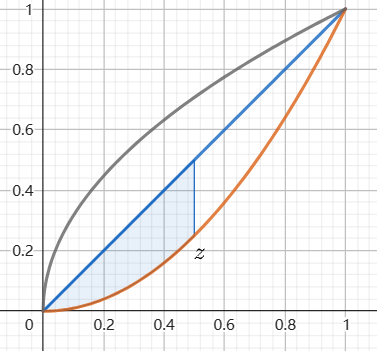
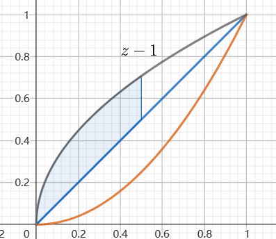

## 离散与连续混合型
### 1.总结
#### 1.1存在独立性
对于一个混合型的变量 $Z = X + Y$ ,设 $X$ 为连续型,$Y$ 为离散型,则 $Z$ 的分布函数

$$\begin{align}
    P\{g(X,Y) \leq z \} &= P\{g(X,Y) \leq z ,\bigcup_{i=1}^n(Y = Y_i)\} \\
    &= P\{g(X,Y) \leq z ,\bigcup_{i=1}^n(Y = Y_i)\} \\
    &=\sum_{i=1}^nP\{g(X,Y) \leq z ,Y = Y_i\} \\
    &=\sum_{i=1}^nP\{g(X,Y_i) \leq z ,Y = Y_i\} \\
\end{align}$$

对于 $X,Y$ 存在独立性的条件,那么上式可以化简为

$$\begin{align}
    P\{g(X,Y) \leq z \} &=\sum_{i=1}^nP\{Y = Y_i\}P\{g(X,Y_i) \leq z |Y = Y_i\} \\ 
    &=\sum_{i=1}^nP\{Y = Y_i\}P\{g(X,Y_i) \leq z \}
\end{align}$$

#### 1.2不存在独立性
如果 $X,Y$ 是两个相互独立的连续型变量,$U = h(X,Y)$ 是离散型的变量, 且 $U,X$ 不相互独立,如果求 $Z = Z(X,U)$ 的分布,

$$\begin{align}
    P\{Z(X,U) \leq z \} &=P\{Z(X,U) \leq z ,\bigcup_{i=1}^n(U = U_i)\} \\
    &= P\{Z(X,U) \leq z ,\bigcup_{i=1}^n(U = U_i)\} \\
    &=\sum_{i=1}^nP\{Z(X,U) \leq z ,U = U_i\} \\
    &=\sum_{i=1}^nP\{Z(X,U_i) \leq z ,U = U_i\} \\
\end{align}$$

通过将 $U = U_i$ **等价代换**为另一个事件.

---
### 2.有独立性
设 $X \thicksim p_i , Y \thicksim F_Y(y)$ , 利用全概率公式或者分布函数法求 $F_Z(z)$,话不说,直接上例题.

例题:
设随机变量 $X_1,X_2,X_3$ 相互独立,其中 $X_1,X_2\thicksim N(0,1) $ , $X_3$ 的概率分布为 $P\left\{X_3 = 0\right\} = P\left\{X_3 = 1\right\} = \frac{1}{2}$ , $Y = X_3X_1 + (1 - X_3)X_2$
(1)求二维随机变量 $(X_1,Y)$ 的分布函数,结果用标准正态分布函数 $\varPhi(x)$ 表示.
(2) 证明随机变量 $Y$ 服从标准正态分布.
解:
(1)

$$\begin{align}
    F(x,y) &= P\left\{X_1\leq x , Y\leq y\right\}\\
    &=P\left\{X_1\leq x , X_3X_1 + (1 - X_3)X_2\leq y\right\} \\
    &=P\left\{X_1\leq x , X_3X_1 + (1 - X_3)X_2\leq y , \Omega\right\}\\
    &=P\left\{X_1\leq x , X_3X_1 + (1 - X_3)X_2\leq y , (X_3 = 0)\cup(X_3 = 1)\right\} \\
\end{align}$$

全概率公式有:

$$\begin{align}
    F(x,y) &=P\left\{X_3 = 1\right\}P\left\{X_1\leq x , X_3X_1 + (1 - X_3)X_2\leq y |X_3 = 1\right\} \\
    &+ P\left\{X_3 = 0\right\}P\left\{X_1\leq x , X_3X_1 + (1 - X_3)X_2\leq y |X_3 = 0\right\} \\
\end{align}$$

由于 $X_1,X_2,X_3$ 相互独立.

$$\begin{align}
    F(x,y) &=P\left\{X_3 = 1\right\}P\left\{X_1\leq x , X_1\leq y \right\} + P\left\{X_3 = 0\right\}P\left\{X_1\leq x , X_2\leq y \right\} \\
    &=\frac{1}{2}P\left\{X_1\leq \min\left\{x,y\right\} \right\} + \frac{1}{2}P\left\{X_1\leq x , X_2\leq y \right\}\\
    &= \frac{1}{2}\varPhi(\min\left\{x,y\right\})  + \frac{1}{2}\varPhi(x)\varPhi(y)
\end{align}$$

(2)证明:

$$\begin{align}
    F_Y(y) &= \lim_{x\rightarrow +\infty} F(x,y)\\
    &= \lim_{x\rightarrow +\infty} \frac{1}{2}\varPhi(\min\left\{x,y\right\})  + \frac{1}{2}\varPhi(x)\varPhi(y) \\
    &= \varPhi(y)
\end{align}$$

故 $Y \thicksim N(0,1)$

---
### 3.无独立性
利用分布函数法或者等价事件.例如 $(X,Y) \sim f_{X,Y}(x,y)$

$$\begin{align}
    U = \begin{cases}
        1 &, X > Y \\
        0 &, X = Y \\
        -1&, X < Y
    \end{cases}
\end{align}$$

那么求 $Z = U + X$ 的概率密度函数.很明显 $Z,X$ 是相关的,那么

$$\begin{align}
    F_Z(z) &= P\{Z \leq z\} \\
    &=P\{U + X \leq z\} \\
    &=P\{U + X \leq z,,(U = 1)\cup(U = 0) \cup (U = -1)\} \\
    &=P\{U + X \leq z,U = 1\}+P\{U + X \leq z,U = 0\}+
    P\{U + X \leq z,U = -1\} \\
    &=P\{X \leq z - 1 ,U = 1\} + P\{X \leq z ,U = 0\} + P\{X \leq z + 1 ,U = -1\} \\
    &=P\{X \leq z - 1 ,X > Y\} + P\{X \leq z ,X = Y\} + P\{X \leq z + 1 ,X < Y\}
\end{align}$$

通过讨论区域对其进行积分,求出分布函数 $F_Z(z)$ ,对分布函数求导得到密度函数 $f_Z(z)$ .

例题:
设二维随机变量 $(X,Y) $ 在区域 $D = \{(x,y)| 0\leq x \leq 1,x^2 <y <\sqrt{x}\}$ 上服从均匀分布,且 $U = \begin{cases}
    1 , X\leq Y\\
    0 , X > Y
\end{cases}$ .
(1) 求 $(X,Y)$ 的概率密度
(2) 求 $U$ 是否与 $X$ 相互独立
(3) 求 $Z = U + X$ 的概率密度函数
(1)解:

$$\begin{align}
    f_{X,Y}(x,y) = \begin{cases}
        3 , (x,y) \in D\\
        0, else
    \end{cases}
\end{align}$$

(2) 不相互独立,对于

$$\begin{align}
    P\{X \leq x ,U \leq v\}
\end{align}$$

取 $v = 0.5$ 时, 

$$\begin{align}
    P\{X \leq x , U = 0\} \not ={P\{X \leq x \}P\{ U = 0\}}
\end{align}$$

(3)分布函数法和

$$\begin{align}
    P\{Z \leq z\} &= P\{U + X \leq z\} \\
    &=P\{U + X \leq z ,(U = 0)\cup (U = 1)\} \\
    &=P\{U + X \leq z , U = 0\} + P\{U + X \leq z , U = 1\} \\
    &=P\{X \leq z , U = 0\} + P\{X \leq z - 1 ,U = 1\}
\end{align}$$

(1)$z<0$ 时, $F_{Z}(z) = 0$
(2)$0 \leq z < 1$ ,得到

$$\begin{align}
    F_Z(z)  &=P\{X \leq z , U = 0\} \\
    &=P\{X \leq z , X \leq Y\} \\
\end{align}$$

积分区域

$$\begin{align}
    &= \int^z_0 dx \int^x_{x^2} 3 dy \\
    &=\frac{3}{2}z^2 - z^3
\end{align}$$

(3)$1\leq z<2$ 得到

$$\begin{align}
    F_Z(z)  &=P\{X \leq z , U = 0\} + P\{X \leq z - 1 ,U = 1\} \\
    &=P\{X \leq z , X \leq Y\} + P\{X \leq z - 1,X >Y\} \\
\end{align}$$

注意,在 $1 \leq z< 2 ,P\{X \leq z , X \leq Y\} = \frac{1}{2}$ ,而概率 $P\{X \leq z - 1,X >Y\}$ 的积分区域为

得到结果为

$$\begin{align}
    &= \frac{1}{2} + \int^{z-1}_0 dx \int^{\sqrt{x}}_x 3dy \\
    &=\frac{1}{2} + 2(z - 1)^{\frac{3}{2}} - \frac{3}{2}(z - 1)^2
\end{align}$$

(3)$2\leq z<3$ 得到 $F_Z(z) = 1$,求导得到 $f_Z(z)$.