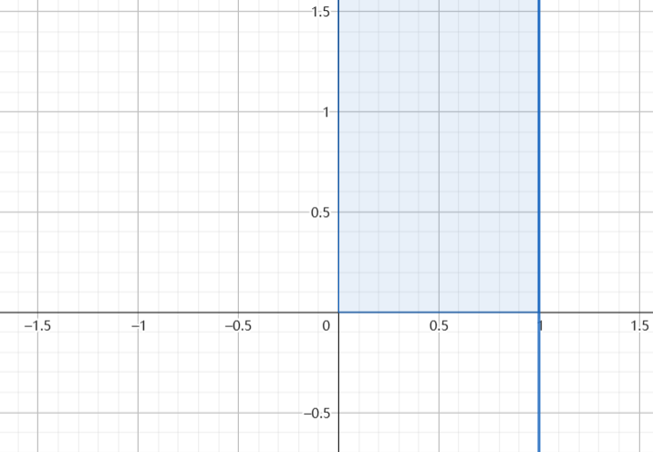
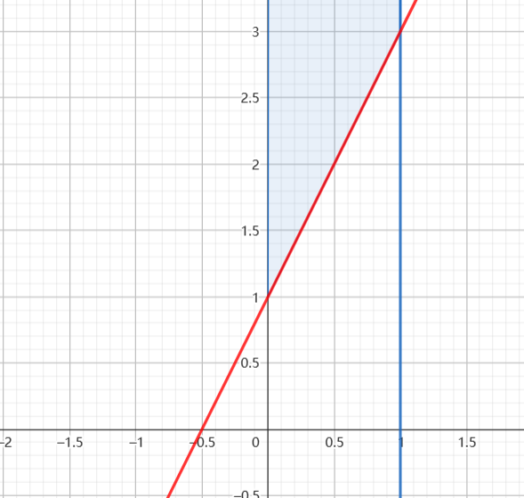
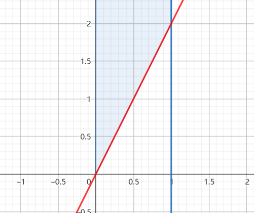
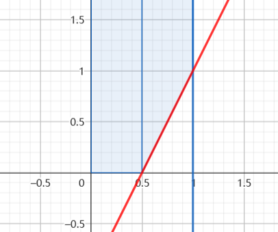

### 连续与连续
已知 $(X,Y)\thicksim f_{X,Y}(x,y)$ ,求 $Z = g(X,Y)$ 的分布函数.
步骤:
1.将 $(x,y) \rightarrow (t,s) \; or\; (\xi,\eta)$ ,并且将其定义域求得 $D_{ts}$
2.求 $z = g(t,s)$ 的范围
3.写

$$\begin{align}
    F_{Z}(z) = P\left\{Z \leq z\right\} &= P\left\{g(X,Y) \leq z\right\}
\end{align}$$

讨论 $z$ 的不同取值范围内的不同,分类讨论计算分布函数$F_{Z}(z)$;
4.对 $F_Z(z)$ 求导获得概率密度函数.

---
例题:
设随机变量 $X,Y$ 相互独立,且 $X$ 的概率密度函数维 $f_{X} =\begin{cases} 1 , 0<x<1 \\0,else\end{cases}$ ,$Y$ 的概率密度维 $f_Y(y) = \begin{cases}e^{ay} , y>0 \\ 0 , else\end{cases}$.
(1) 求 $a$
(2) $Z = 2X + aY$ 的概率密度函数
解:
(1) $a = -1$
(2) $Z = 2X - Y$ ,利用分布函数法有:
a.$(x,y) \rightarrow(\xi,\eta) $ 得到可积分区域:

$$\begin{align}
    D_{\xi\eta}=\left\{(\xi,\eta)|\xi \in(0,1) , \eta\in(0,+\infty)\right\}
\end{align}$$
如图:

(3) 知道有 $z\in(-\infty,2)$

$$\begin{align}
    F_Z(z) &= P\left\{Z \leq z \right\} \\
    &=P\left\{2X - Y \leq z \right\} \\
    &= P\left\{Y \geq 2X - z \right\}
\end{align}$$ 

(4)我们发现 $z = 0$ 处会产生不同:

讨论
1.$z\geq 2$,$F_Z(z) = 1$
2.$0\leq z<2$ 时:

$$\begin{align}
    F_Z(z) &= \int^{\frac{z}{2}}_{0} d\xi\int^{+\infty}_{0} e^{-\eta} d\eta + \int^{1}_{\frac{z}{2}}d\xi \int^{+\infty}_{2\xi - z} e^{-\eta} d\eta \\
    &= \frac{z}{2} + \frac{1}{2}[1-\frac{e^z}{e^2} ]
\end{align}$$ 
3.$z<0$ 时

$$\begin{align}
    F_Z(z) &=\int^{1}_0d\xi\int^{+\infty}_{2\xi - z} e^{-\eta} d\eta \\
    &= \int^1_0 e^{z - 2\xi} d\xi \\
    &=\frac{-1}{2} (e^{z-2} - e^z) \\
    &=\frac{1}{2}(e^z - e^{z-2})
\end{align}$$

得到:

$$\begin{align}
    f_Z(z) = \begin{cases}
        \frac{1}{2}(e^z - e^{z-2}),z<0 \\
        \frac{1}{2}(1 - e^{z-2}) , 0\leq z<2 \\
        0,else
    \end{cases}
\end{align}$$