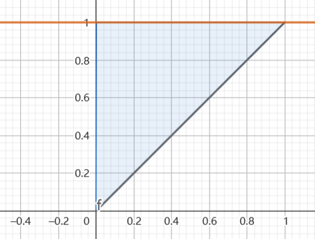
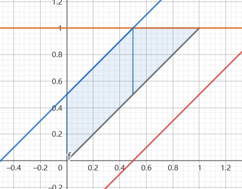

1.设 $X$ 服从密度函数 $f_X(x) = \begin{cases}2^{-x}\ln2 , x>0 \\ 0 , else\end{cases}$ ,对 $X$ 进行重复独立观测,直到第二个大于3的观测值出现时才停止.记 $Y$ 为观测的次数.
(1) 求 $Y$ 的分布
(2) 求 $E[Y]$
解:

$$\begin{align}
    P\{X \geq 3 \} &= \int^{+\infty}_3 2^{-x} \ln2 dx \\
    &= \frac{1}{8}
\end{align}$$

那么每次观测时 $X\geq 3$ 的概率为 $p = \frac{1}{8}$ ,则

$$\begin{align}
    P\{Y = k\} &= C^1_{k-1}pq^{k-2}p\\
    &=(k-1)p^2q^{k-2} , k =2,3,\cdots\\
    &=\frac{(k-1)7^{k-2}}{8^k}
\end{align}$$

(2)

$$\begin{align}
    E[Y] &= \sum_{k=2}^{+\infty} k(k-1)p^2q^{k-2} \\
    &=p^2  \sum_{k=2}^{+\infty} k(k-1)q^{k-2}
\end{align}$$

因为：

$$\begin{align}
    S(x) &= \sum_{k=2}^{+\infty} k(k-1)x^{k-2} \\
    S^{(-2)}(x) &= \sum_{k=2}x^k = \frac{x^2}{1 - x} \\ 
    S(x) &= \{\frac{x^2}{1 - x}\}''  
\end{align}$$

则:

$$\begin{align}
    E[Y] &= p^2S(\frac{7}{8}) \\
    &= \frac{1}{64} (16 * 64) \\
    &= 16
\end{align}$$ 

---
2.设随机变量 $X$ 在区间 $(0,1)$ 上服从均匀分布 ,当 $X$ 取到 $x(0<x<1)$时,随机变量 $Y$ 在 $(x,1)$ 上等可能的取值,求 $E[|X - Y|]$
解:
因为:

$$\begin{align}
    f_X(x) &= \begin{cases}
        1 , 0<x<1 \\
        0,else
    \end{cases} \\
    f_{Y|X}(y|x) &= \begin{cases}
        \frac{1}{1-x} , x<y<1 \\
        0,else
    \end{cases}
\end{align}$$

因为:

$$\begin{align}
    f_{X,Y}(x,y)=f_X(x)f_{Y|X}(y|x)
\end{align}$$

则:

$$\begin{align}
    f_{X,Y}(x,y) &= \begin{cases}
        \frac{1}{1-x} , x<y<1 , 0<x<1 \\
        0,else
    \end{cases}
\end{align}$$

得到:

记 $Z = |X - Y|$ ,得到:

$$\begin{align}
    P\{Z \leq z\} &= P\{|X - Y| \leq z\} \\ 
    &=P\{X - Y \leq z, X - Y\geq  - z\}
\end{align}$$ 

分类讨论
1.$z<0$ 时, $F_Z(z) = 0$
2.$1>z\geq 0$ 时, 

$$\begin{align}
    P\{Z \leq z\} &= \int^{1-z}_0 dx \int^{z+x}_{x} \frac{1}{1- x} dy + \int^{1}_{1-z} dx \int^{1}_x \frac{1}{1 - x} dy \\
    &= -z\ln z + z
\end{align}$$

3.$z\geq 1$ 时 $F_Z(z) = 1$ ,则有:

$$\begin{align}
    F_Z(z) = \begin{cases}
        0 , z<0 \\
        z - z \ln z ,0\leq z<1 \\
        1 , z\geq 1
    \end{cases} \rightarrow
    f_Z(z) = \begin{cases}
         -\ln z,0\leq z<1 \\
        1 , else
    \end{cases}
\end{align}$$

则:

$$\begin{align}
    E[|X - Y|] &= E[Z] \\
    &= \int^{1}_0 - z\ln z dz \\
    &= \frac{z^2}{4}|^1_0 \\
    &= \frac{1}{4}
\end{align}$$

---
3.设随机变量 $X$ 与 $Y$ 相互独立 , $X \sim N(1,2) , Y \sim N(1,4)$ ,求 $D[XY]$
解:

$$\begin{align}
    D[XY] &= E[X^2Y^2] - E^2[X]E^2[Y] \\
    &=E[X^2]E[Y^2] - 1 \\
    &=(D[x] + E^2[X])(D[Y] + E^2[Y]) - 1 \\
    &=3*5 - 1 \\
    &= 14
\end{align}$$

---
4.设实验 $E$ 有三个两两互不相容的实验 $A_1,A_2,A_3$ 且概率都为 $\frac{1}{3}$ ,先对其进行两次重复独立实验,设 $X$ 是 $A_1$ 发生的次数, $Y$ 是 $A_2$ 发生的次数,求 $X,Y$ 的相关系数 $Cov(X,Y)$.
做法一:
令 $Z$ 为 $A_3$ 的发生的次数,则 $X + Y + Z = 2$,得到:

$$\begin{align}
    X,Y,Z \sim B(2,\frac{1}{3}) \\
    X + Y = 2 - Z \sim B(2,\frac{2}{3})
\end{align}$$

则:

$$\begin{align}
    D[X + Y] &= D[X] + D[Y] + 2 Cov(X,Y) \\
    2*\frac{2}{9}&=\frac{4}{9} + \frac{4}{9} + 2Cov(X,Y) 
\end{align}$$

得到: $Cov(X,Y) = -\frac{2}{9}$ ,则:

$$\begin{align}
    \rho_{xy} &= \frac{Cov(X,Y)}{\sigma_x\sigma_y} \\
    &= \frac{-\frac{2}{9}}{\frac{4}{9}} \\
    &=-\frac{1}{2}
\end{align}$$

做法二:

$$\begin{align}
    Cov(X,Y) = E[XY] - E[X]E[Y]
\end{align}$$

令 $Z = XY $ ,又 $X + Y \leq 2$ ,得到 $XY = 0,1$ 
因为:

$$\begin{align}
    P\{XY = 1\} &= P\{X = 1,Y = 1\} \\
    &= A^2_2\frac{1}{3}\frac{1}{3} \\
    &= \frac{2}{9}
\end{align}$$

同时

$$\begin{align}
    P\{XY = 0\} &=1 - P\{XY = 1\} \\
    &= \frac{7}{9}
\end{align}$$

则 $E[XY] = \frac{2}{9}$ ,故 $Cov(X,Y) = \frac{2}{9} - \frac{4}{9} = -\frac{2}{9}$ .

做法三:
因为:

$$\begin{align}
    Cov(X,Y) = E[XY] - E[X]E[Y]
\end{align}$$

求 $T = XY$ 的分布列,这里 $XY = k$ 可以列次数 ,样本空间的所有样本有

$$\begin{align}
    (A_1,A_1) , (A_1,A_2) , (A_1,A_3) \\
    (A_2,A_1) , (A_2,A_2) , (A_2,A_3) \\
    (A_3,A_1) , (A_3,A_2) , (A_3,A_3) \\
\end{align}$$

转换为 $(X,Y,Z)$ 为

$$\begin{align}
    (2,0,0) , (1,1,0) , (1,0,1) \\
    (1,1,0) , (0,2,0) , (0,1,1) \\
    (1,0,1) , (0,1,1) , (0,0,2) \\
\end{align}$$

再转换为 $XY$ 有:

$$\begin{align}
    0,1,0 \\
    1,0,0\\
    0,0,0\\
\end{align}$$

用频数除以总数即为频率.故

$$\begin{align}
    P\{T = 0 \} = \frac{7}{9} \\
    P\{T = 1 \} = \frac{2}{9} 
\end{align}$$

$$\begin{align}
    Cov(X,Y) &= E[T] - E[X]E[Y] \\
    &=-\frac{2}{9}
\end{align}$$

附注:对于样本数较少的概率事件,全部列出来也是一种方法,只是效率比较低.

---
5.设随机变量 $X,Y$ 相互独立, $X$ 服从参数 $\lambda = 1$ 的指数分布,$Y$ 的概率分布为 $P\{Y = -1 \} = p,P\{Y = 1 \} = 1-  p$ 
(1) 求 $Z = XY$ 的概率分布
(2) 求 $p$ 为何值时 $Z,X$ 不相关
(3) $X,Z$ 是否相互独立.
解:
(1) $Y = -1,1 ; X \geq 0 ; Z = \in(-\infty,+\infty)$ ,则

$$\begin{align}
    P\{Z \leq z \} &= P\{XY \leq z \} \\
    &=P\{XY \leq z , \Omega\}\\
    &=P\{XY \leq z ,(Y = -1)\cup (Y = 1) \} \\
    &=P\{XY \leq z ,Y = -1\} + P\{XY \leq z ,Y = 1\} \\
    &=pP\{XY \leq z |Y = -1\} + (1 - p)P\{XY \leq z |Y = 1\} \\
    &=pP\{-X \leq z \} + (1 - p)P\{X \leq z \}
\end{align}$$

1.$z<0$ 时

$$\begin{align}
    pP\{-X \leq z \} + (1 - p)P\{X \leq z \} &= pP\{X \geq -z \} \\
    &=p(1 - F_X(-z)) \\
    &=pe^{z}
\end{align}$$

2.$z\geq 0$ 时

$$\begin{align}
    pP\{-X \leq z \} + (1 - p)P\{X \leq z \} &= p + (1 - p)P\{X \leq z \}\\
    &=p + (1 - p)(1-e^{-z}) \\
\end{align}$$

密度函数为:

$$\begin{align}
    f_Z(z) = \begin{cases}
        pe^z , z<0\\
        (1 - p)e^{-z} , z\geq 0
    \end{cases}
\end{align}$$

(2)
解

$$\begin{align}
    E[X] = 1 , E[Y] =  1 - 2p
\end{align}$$

又:

$$\begin{align}
    E[XY] &= E\{E[XY|Y ]\} \\
    &=E\{YE[X|Y]\} \\
    &=E\{YE[X]\} \\
    &=E[Y] \\
    &=1 - 2p
\end{align}$$

则有:

$$\begin{align}
    E[XZ] &= E[X^2Y] \\
    &=E\{E[X^2Y|Y ]\} \\
    &=E\{YE[X^2]\}\\
    &=E\{Y(D[X] + E^2[X])\} \\
    &=E\{2Y\} \\
    &=2 - 4p
\end{align}$$

则:

$$\begin{align}
    Cov(X,Z) &= E[XZ] - E[X]E[Z] \\
    &=2 - 4p - 1 +2p \\
    &=1 - 2p
\end{align}$$

$Z,X$ 不相关,则 $Cov(X,Z) = 0 \rightarrow p = \frac{1}{2}$.
总结:如果对于 $X,Y$ 相互独立, $Z = g(X,Y)$ 的时候,求 $X,Y$ 和 $Z$ 分别的协方差都可以用全期望公式会非常快.例如: $Z = Xe^{Y}$ 有:

$$\begin{align}
    E[XZ] &= E[X^2e^{Y}] \\
    &=E\{E[X^2e^{Y}|Y]\} \\
    &=E\{e^{Y}E[X^2]\} \\
    &=E\{2e^{Y}\} \\
    &=2pe^{-1} +2(1 - p)e
\end{align}$$

---
6.已知 $X,Y$ 独立同分布,且 $X$ 服从 $$\begin{align}f_X(x) = \begin{cases} \frac{2}{\sqrt{\pi}}e^{-x^2} ,x>0\\ 0 ,else\end{cases} \end{align}$$ ,求 $Z = \sqrt{X^2 + Y^2}$ 的方差.
解:

$$\begin{align}
    D[Z] = E[Z^2] - E^2[Z]
\end{align}$$

因为

$$\begin{align}
    E[Z^2] &= E[X^2] + E[Y^2] \\
    &= 2E[X^2] \\
    &= \frac{2}{\sqrt{\pi}}(2 \int^{+\infty}_0x^2 e^{-x^2} dx) \\
    &= \frac{2}{\sqrt{\pi}} \Gamma(\frac{3}{2}) \\
    &= \frac{2}{\sqrt{\pi}} \frac{1}{2} \Gamma(\frac{1}{2}) \\
    &= 1
\end{align}$$

又有:

$$\begin{align}
    E[\sqrt{X^2 + Y^2}] = \int^{+\infty}_{0}\int^{+\infty}_{0}\sqrt{x^2 + y^2}f_{X,Y}(x,y) dxdy
\end{align}$$

其中

$$\begin{align}
f_{X,Y}(x,y) = \begin{cases} \frac{4}{\pi}e^{-(x^2 + y^2)}  , x>0\\ 
0 ,else \end{cases} 
\end{align}$$

$$\begin{align}
    E[\sqrt{X^2 + Y^2}] &= \int^{+\infty}_{0}\int^{+\infty}_{0}\sqrt{x^2 + y^2}f_{X,Y}(x,y) dxdy \\
    &= \frac{4}{\pi}\int^{+\infty}_0 \int^{+\infty}_0 \sqrt{x^2 + y^2}e^{-(x^2 + y^2)} dxdy \\
    &=\frac{4}{\pi}\int^{\frac{\pi}{2}}_0 d\theta \int^{+\infty}_0r^2e^{-r^2} dr \\
    &=\frac{1}{\pi}(2\int^{+\infty}_0r^2e^{-r^2} dr) \\
    &= \frac{1}{\pi} \Gamma(\frac{3}{2}) \\
    &=\frac{1}{2\pi} \sqrt{\pi} \\
    &= \frac{\sqrt{\pi}}{2}
\end{align}$$

故有:

$$\begin{align}
    D[Z] &= E[Z^2] - E^2[Z] \\
    &= 1 - \frac{\pi}{4}
\end{align}$$

注意这里伽马函数的不同形式是非常重要的.

$$\begin{align}
    \Gamma(\lambda) = \int^{+\infty}_0 t^{\lambda-1}e^{-t}dt = 2 \int^{+\infty}_0t^{2\lambda - 1} e^{-t^2} dt
\end{align}$$

这里尤其要注意伽马函数在平方形式时有一个系数2.